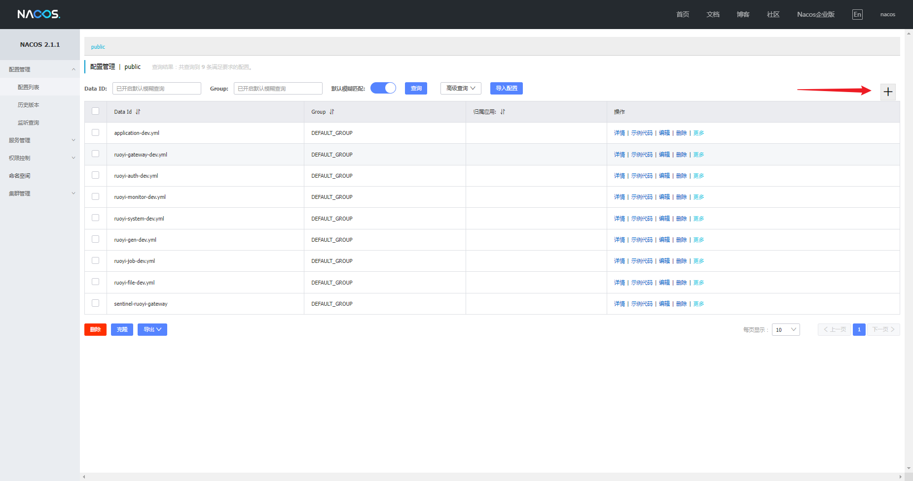
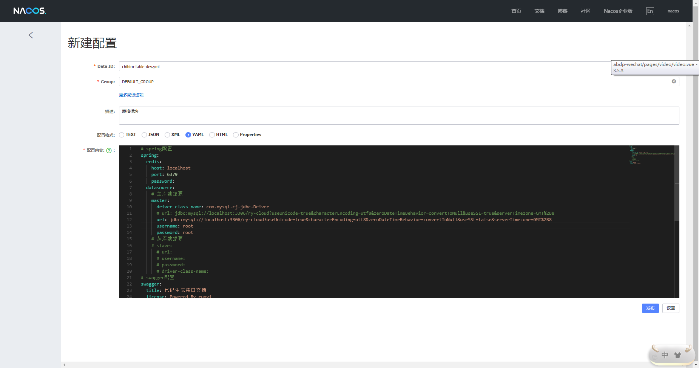

# RuoYi-Cloud新建子模块注意事项 新建过程

## 📔 千寻简笔记介绍

千寻简文库已开源，Gitee与GitHub搜索`chihiro-doc`，包含笔记源文件`.md`，以及PDF版本方便阅读，文库采用精美主题，阅读体验更佳，如果文章对你有帮助请帮我点一个`Star`～

更新：`支持在线阅读文章，根据发布日期分类。`

@[toc]

### 1 后端 

#### 1.1 新建子模块

Maven多模块下新建子模块流程案例。

1、在`ruoyi-modules`下新建业务模块目录，例如：`ruoyi-test`。

2、在`ruoyi-test`业务模块下新建`pom.xml`文件以及`src\main\java`，`src\main\resources`目录。

```xml
<?xml version="1.0" encoding="UTF-8"?>
<project xmlns:xsi="http://www.w3.org/2001/XMLSchema-instance"
         xmlns="http://maven.apache.org/POM/4.0.0"
         xsi:schemaLocation="http://maven.apache.org/POM/4.0.0 http://maven.apache.org/xsd/maven-4.0.0.xsd">
    <parent>
        <groupId>com.ruoyi</groupId>
        <artifactId>ruoyi-modules</artifactId>
        <version>x.x.x</version>
    </parent>
    <modelVersion>4.0.0</modelVersion>
	
    <artifactId>ruoyi-modules-test</artifactId>

    <description>
        ruoyi-modules-test系统模块
    </description>
	
    <dependencies>
    	
    	<!-- SpringCloud Alibaba Nacos -->
        <dependency>
            <groupId>com.alibaba.cloud</groupId>
            <artifactId>spring-cloud-starter-alibaba-nacos-discovery</artifactId>
        </dependency>
        
        <!-- SpringCloud Alibaba Nacos Config -->
        <dependency>
            <groupId>com.alibaba.cloud</groupId>
            <artifactId>spring-cloud-starter-alibaba-nacos-config</artifactId>
        </dependency>
        
    	<!-- SpringCloud Alibaba Sentinel -->
        <dependency>
            <groupId>com.alibaba.cloud</groupId>
            <artifactId>spring-cloud-starter-alibaba-sentinel</artifactId>
        </dependency>
        
    	<!-- SpringBoot Actuator -->
        <dependency>
            <groupId>org.springframework.boot</groupId>
            <artifactId>spring-boot-starter-actuator</artifactId>
        </dependency>
		
        <!-- Mysql Connector -->
        <dependency>
            <groupId>mysql</groupId>
            <artifactId>mysql-connector-java</artifactId>
        </dependency>
        
        <!-- Ruoyi Common Security -->
        <dependency>
            <groupId>com.ruoyi</groupId>
            <artifactId>ruoyi-common-security</artifactId>
        </dependency>
        
        <!-- Ruoyi Common Swagger -->
        <dependency>
            <groupId>com.ruoyi</groupId>
            <artifactId>ruoyi-common-swagger</artifactId>
        </dependency>
		
		<!-- RuoYi Common Log -->
        <dependency>
            <groupId>com.ruoyi</groupId>
            <artifactId>ruoyi-common-log</artifactId>
        </dependency>
        
    </dependencies>

    <build>
        <plugins>
            <plugin>
                <groupId>org.springframework.boot</groupId>
                <artifactId>spring-boot-maven-plugin</artifactId>
                <executions>
                    <execution>
                        <goals>
                            <goal>repackage</goal>
                        </goals>
                    </execution>
                </executions>
            </plugin>
        </plugins>
    </build>
   
</project>
```

3、在`ruoyi-modules`目录下`pom.xml`模块节点modules添加业务模块

```xml
<module>ruoyi-test</module>
```

4、`src/main/resources`添加`bootstrap.yml`文件

```yml
# Tomcat
server:
  port: 9301

# Spring
spring: 
  application:
    # 应用名称
    name: ruoyi-test
  profiles:
    # 环境配置
    active: dev
  cloud:
    nacos:
      discovery:
        # 服务注册地址
        server-addr: 127.0.0.1:8848
      config:
        # 配置中心地址
        server-addr: 127.0.0.1:8848
        # 配置文件格式
        file-extension: yml
        # 共享配置
        shared-configs:
          - application-${spring.profiles.active}.${spring.cloud.nacos.config.file-extension}
```

5、com.ruoyi.test包下添加启动类

```java
package com.chihiro.table;

import com.ruoyi.common.security.annotation.EnableCustomConfig;
import com.ruoyi.common.security.annotation.EnableRyFeignClients;
import com.ruoyi.common.swagger.annotation.EnableCustomSwagger2;
import org.springframework.boot.SpringApplication;
import org.springframework.boot.autoconfigure.SpringBootApplication;


/**
 * 表格模块
 *
 * @author ruoyi
 */
@EnableCustomConfig
@EnableCustomSwagger2
@EnableRyFeignClients
@SpringBootApplication
public class ChihiroTableApplication
{
    public static void main(String[] args)
    {
        SpringApplication.run(ChihiroTableApplication.class, args);
        System.out.println("(♥◠‿◠)ﾉﾞ  表格模块启动成功   ლ(´ڡ`ლ)ﾞ  \n" +
                " .-------.       ____     __        \n" +
                " |  _ _   \\      \\   \\   /  /    \n" +
                " | ( ' )  |       \\  _. /  '       \n" +
                " |(_ o _) /        _( )_ .'         \n" +
                " | (_,_).' __  ___(_ o _)'          \n" +
                " |  |\\ \\  |  ||   |(_,_)'         \n" +
                " |  | \\ `'   /|   `-'  /           \n" +
                " |  |  \\    /  \\      /           \n" +
                " ''-'   `'-'    `-..-'              ");
    }
}


```

#### 1.2 注意修改

不修改容易使404

##### 1.2.1 添加路由

> 1.登录上nacos,在 配置管理->配置列表 里找到 ruoyi-gateway-dev.yml ,点击 编辑
>
> 找到 routes 节点,参考写好的路由,增加自己子模块的路由
>
> 2.把 ruoyi-system-dev.yml 克隆一份,创建自己子模块的配置文件,修改里面的配置,特别注意 mybatis 节点的修改 

##### 1.2.2 添加扫描Mapper配置

自定义包名配置

@MapperScan 怎么扫描多个包

```yaml
@MapperScan({"com.myapp.**.mapper","com.ruoyi.**.mapper"})
```

### 2 nacos 新增一个配置文件

- 打开http://localhost:8848/nacos
- 点击添加



- 配置yml文件



```yml
# spring配置
spring: 
  redis:
    host: localhost
    port: 6379
    password: 
  datasource: 
    # 主库数据源
    master:
      driver-class-name: com.mysql.cj.jdbc.Driver
      # url: jdbc:mysql://localhost:3306/ry-cloud?useUnicode=true&characterEncoding=utf8&zeroDateTimeBehavior=convertToNull&useSSL=true&serverTimezone=GMT%2B8
      url: jdbc:mysql://localhost:3306/ry-cloud?useUnicode=true&characterEncoding=utf8&zeroDateTimeBehavior=convertToNull&useSSL=false&serverTimezone=GMT%2B8
      username: root
      password: root
    # 从库数据源
    # slave:
      # url: mongodb://localhost:27017/chihiro_table
      # username: 
      # password: 
      # driver-class-name: 
# swagger配置
swagger:
  title: 代码生成接口文档
  license: Powered By ruoyi
  licenseUrl: https://ruoyi.vip
```
