# 【推荐】【SQL】MySQL秘籍

## 📔 千寻简笔记介绍

千寻简笔记已开源，Gitee与GitHub搜索`chihiro-notes`，包含笔记源文件`.md`，以及PDF版本方便阅读，且是用了精美主题，阅读体验更佳，如果文章对你有帮助请帮我点一个`Star`～

@[toc]

## 版本

2023年6月29日：更新sql正则查询

# 初级篇

**SQL DML 和 DDL**

- 可以把 SQL 分为两个部分：数据操作语言 (DML) 和 数据定义语言 (DDL)。
- SQL (结构化查询语言)是用于执行查询的语法。
- 但是 SQL 语言也包含用于更新、插入和删除记录的语法。

## 应用题

### 表操作

- 创建表

#### 创建一个表

```mysql
DROP TABLE IF EXISTS key_value;
CREATE TABLE key_value(
    _key VARCHAR(255)    COMMENT '键' ,
    _value VARCHAR(255)    COMMENT '值' 
)  COMMENT = '键值对';
```

#### 增加表字段

ALTER TABLE

> 给表条件一个字段

```sql
ALTER TABLE 表名 ADD `字段名` VARCHAR ( 128 )   COMMENT '备注';
```

```sql
ALTER TABLE t_user ADD `user_name` VARCHAR ( 128 )   COMMENT '用户名称';
```

### 增删改

查询和更新指令构成了 SQL 的 DML 部分：

```java
SELECT - 从数据库表中获取数据
UPDATE - 更新数据库表中的数据
DELETE - 从数据库表中删除数据
INSERT INTO - 向数据库表中插入数据
```

#### 插入一条数据

#### 插入一条数据

INSERT INTO 语句

> INSERT INTO 语句用于向表格中插入新的行。

```sql
//语法：
INSERT INTO 表名称 VALUES (值1, 值2,....)
//我们也可以指定所要插入数据的列：
INSERT INTO table_name (列1, 列2,...) VALUES (值1, 值2,....)
```

```mysql
INSERT INTO key_value VALUES ("1","2222");
INSERT INTO key_value (_key,_value) VALUES ("2","键值对");
```

#### 删除一条数据

DELETE 语句

> DELETE 语句用于删除表中的行。

```sql
//语法:
DELETE FROM 表名称 WHERE 列名称 = 值
```

```mysql
DELETE FROM key_value WHERE _key = "2";
SELECT * FROM key_value;
```

#### 更新一条数据库

Update 语句

> Update 语句用于修改表中的数据。

```sql
语法：
UPDATE 表名称 SET 列名称 = 新值 WHERE 列名称 = 某值
```

```mysql
UPDATE key_value set _key = "我不想做主键" WHERE _key= "1";
SELECT * from key_value;
```

### 查询篇

#### 查询所有数据

> 现在我们希望从 "Persons" 表中选取所有的列。 请使用符号 * 取代列的名称，就像这样：

```sql
SELECT * FROM Persons
```

#### 条件查询： user_id = 123 的数据

```sql
SELECT
	tu.id,
	tu.user_name
FROM
	tu.t_user AS tu 
WHERE
	tu.user_id = 123;
```

#### 条件查询：查询 user_id = 123 或 456 的数据

```sql
SELECT
	tu.id,
	tu.user_name
FROM
	t_user AS tu 
WHERE
	tu.user_id = 123
	OR tu.user_id = 456;
```

#### 查询重复的数据sql

查询重复的数据可以使用SQL中的GROUP BY和HAVING子句。以下是一个示例查询，可以检查名为`table_name`的表中是否有重复的`column_name`列的值：

```sql
SELECT
	column_name,
	COUNT(*) 
FROM
	table_name 
GROUP BY
	column_name 
HAVING
	COUNT(*) > 1;
```

该查询将按照`column_name`列的值进行分组，并计算每个值的出现次数。然后使用HAVING子句过滤出现次数大于1的组，这些组中的行即为重复数据。

请注意，上述查询仅检查一个列的重复数据。如果您想要检查多个列的组合是否重复，请在GROUP BY子句中包含这些列的名称。例如：

```sql
SELECT
	column_name1,
	column_name2,
	COUNT(*) 
FROM
	table_name 
GROUP BY
	column_name1,
	column_name2 
HAVING
	COUNT(*) > 1;
```

该查询将按照`column_name1`和`column_name2`列的值进行分组，并计算每个组的出现次数。然后使用HAVING子句过滤出现次数大于1的组，这些组中的行即为重复数据。

#### 推荐 MySQL日期时间datetime格式查询数据方式

```sql
select * from od where date(create_time)='2021-02-25';
```

<hr>

### 应用题

问：你怎么快速找出两条相同的数据？字段为id 

```sql
SELECT
	cid.id,
	cid.id ,
	cid.name
FROM
	chihiro_id  AS cid
GROUP BY
	cid.id  HAVING COUNT(cid.id )>1
	;
```

验证是否正确：

```sql
SELECT
	cid.id,
	cid.id ,
	cid.name
FROM
	chihiro_id  AS cid
WHERE
	cid.id  = 34170
OR cid.id  = 15022
;
```

删除重复的id

```sql
DELETE FROM chihiro_id
WHERE
	id = 317021266123 OR id = 
	317021266123
;
```

# 中级篇

## 常用条件查询

#### 模糊查询

```mysql
select * from chihiro_area;
SELECT * FROM `chihiro_area` WHERE 1=1 and name LIKE '%北';
SELECT name,area_code FROM chihiro_area WHERE 1=1 and area_code LIKE '11%';
select * from chihiro_area where parent_code  LIKE '1100%';
select * from chihiro_area WHERE name LIKE '北京%';
```

#### 联查

```mysql
SELECT * from sys_user;
SELECT * from sys_dept;

select 
	su.dept_id,
	su.user_name,
	sd.dept_name,
	sd.email 
from sys_user AS su 
INNER JOIN sys_dept AS sd ON su.dept_id = sd.dept_id;
```

#### 关键字：UNION ALL 

多字段查询

```sql
-- 用于多字段查询
SELECT
	lc.id,
	lc.first_hearing_address AS hearingAddress
FROM
	t_layer_case AS lc 
WHERE
	lc.first_hearing_address != '' 
UNION ALL
SELECT
	lc.id,
	lc.second_hearing_address AS hearingAddress
FROM
	t_layer_case AS lc 
WHERE
	lc.second_hearing_address != '' 
UNION ALL
SELECT
	lc.id,
	lc.executive_court AS hearingAddress
FROM
	t_layer_case AS lc 
WHERE
	lc.executive_court != ''
```

Union all 查询完统计

```sql
select a,b,c from (
    select a, b, c from aa
    union all 
    select a1 as a, b1 as b, c1 as c from bb
) a group by c
```


#### 关键字：DISTINCT 

```sql
-- 去重手机号
SELECT 
	DISTINCT first_economics_officer_contact AS "economicsOfficerContact",
	first_economics_officer AS "economicsOfficer"
FROM
	t_layer_case
WHERE
	first_economics_officer_contact is not null
```

#### 【Java代码】xml 循环set数组

```sql
<if test="caseTypeSet != null">
    AND lc.case_type IN
    <foreach collection="caseTypeSet" item="item" open="(" separator="," close=")">
        #{item}
    </foreach>
</if>
```

#### 关键字：EXISTS

实际场景：查询表a中a.id,在表b中是否存在车辆；

```sql
AND EXISTS(SELECT tpc.types_of_property_clues FROM t_property_clues AS tpc WHERE tpc.types_of_property_clues = '车辆' AND tpc.case_id = lc.id)
-- 判断
SELECT
	COUNT(*) AS number,
	hearingAddress 
FROM
	(
	SELECT
		lc.id,
		lc.first_hearing_address AS hearingAddress 
	FROM
		t_layer_case AS lc
		LEFT JOIN t_entrusted_client AS ec ON ec.id = lc.entrusted_client_id
		LEFT JOIN t_upcoming AS tu ON tu.case_id = lc.id
	WHERE
		1 = 1 
		AND lc.first_hearing_address != '' 
		AND EXISTS(SELECT tpc.types_of_property_clues FROM t_property_clues AS tpc WHERE tpc.types_of_property_clues = '车辆' AND tpc.case_id = lc.id)
	UNION ALL
	SELECT
		lc.id,
		lc.second_hearing_address AS hearingAddress 
	FROM
		t_layer_case AS lc
		LEFT JOIN t_entrusted_client AS ec ON ec.id = lc.entrusted_client_id
		LEFT JOIN t_upcoming AS tu ON tu.case_id = lc.id
	WHERE
		1 = 1 
		AND lc.second_hearing_address != '' 
		AND EXISTS(SELECT tpc.types_of_property_clues FROM t_property_clues AS tpc WHERE tpc.types_of_property_clues = '车辆' AND tpc.case_id = lc.id)
		UNION ALL
	SELECT
		lc.id,
		lc.executive_court AS hearingAddress 
	FROM
		t_layer_case AS lc
		LEFT JOIN t_entrusted_client AS ec ON ec.id = lc.entrusted_client_id
		LEFT JOIN t_upcoming AS tu ON tu.case_id = lc.id
		LEFT JOIN ( SELECT id, case_id, types_of_property_clues FROM t_property_clues WHERE types_of_property_clues = '车辆' GROUP BY case_id ) AS tpc ON tpc.case_id = lc.id 
	WHERE
		1 = 1 
		AND lc.executive_court != '' 
		AND EXISTS(SELECT tpc.types_of_property_clues FROM t_property_clues AS tpc WHERE tpc.types_of_property_clues = '车辆' AND tpc.case_id = lc.id)
	) table1 
GROUP BY
	hearingAddress 
ORDER BY
	COUNT(*) DESC 
	LIMIT 10
```

#### 关键字：CASE WHEN

查询结果等于0 就返回一1 ，其他返回0

```sql
SELECT
	tfm.id AS id,
	(CASE WHEN SUM(trs.repayment_amount_instalment * (lawyer_fee_proportion/100))-SUM(trs.repayment_amount* (lawyer_fee_proportion/100)) = 0 THEN 1 ELSE 0 END) AS fee_clear,
FROM
	t_financial_management AS tfm
```


## 存储过程

#### 利用生成假数据

##### 创建存储过程

```mysql
delimiter //
create procedure batchInsert()
begin
    declare num int; 
    set num=1;
    while num<=1000000 do
        insert into key_value(`username`,
    `password`) values(concat('测试用户', num),
        '123456');
        set num=num+1;
    end while;
end
// 
delimiter ; #恢复;表示结束
```

##### 调用存储过程

写好了存储过程就可以进行调用了，可以通过命令调用：

```mysql
CALL batchInsert;
```

也可以在数据库工具的中Functions的栏目下，找到刚刚创建的存储过程直接执行。

##### 删除存储过程

```mysql
drop procedure batchInsert; 
```

## 应用题

#### 有关时间的语句

```sql
--  改成日期的时间戳
SELECT NOW();
SELECT UNIX_TIMESTAMP(NOW());
SELECT UNIX_TIMESTAMP('2022-12-27');
```

#### x日期 - y日期 小于等于 40天

```sql
-- 	当前时间大于开庭时间，代表已开庭 
SELECT 
	tlc.first_hearing_time AS courtDate,
	CASE WHEN NOW()> tlc.first_hearing_time THEN "1" ELSE "0" END AS isOpenACourtSession
FROM 
	t_layer_case  AS tlc
WHERE
	tlc.first_hearing_time IS NOT NULL
AND
	ABS(DATEDIFF(first_hearing_time,"2022-12-27 16:56:13" )) <=40;

```

#### 计算两个时间相差的天数

```sql
ABS(DATEDIFF(tpc.appeal_time_of_closure_and_registration,NOW())) AS "累计查封时间",
```

#### sql如何计算一个日期某个周期后的日期

```sql
--  查询x日期，y年后的日期
SELECT DATE_ADD(NOW(),INTERVAL 3 YEAR);
```

#### select语句查询近一周的数据

```sql
select * from table  where 
DATE_SUB(CURDATE(), INTERVAL 7 DAY) <= date(column_time);
```

#### SQL利用Case When Then多条件判断

> CASE
>   WHEN 条件1 THEN 结果1
>   WHEN 条件2 THEN 结果2
>   WHEN 条件3 THEN 结果3
>   WHEN 条件4 THEN 结果4
> .........
>   WHEN 条件N THEN 结果N
>   ELSE 结果X
> END
>
> Case具有两种格式。简单Case函数和Case搜索函数。
> --简单Case函数
> CASE sex
>      WHEN '1' THEN '男'
>      WHEN '2' THEN '女'
> ELSE '其他' END
> --Case搜索函数
> CASE WHEN sex = '1' THEN '男'
>      WHEN sex = '2' THEN '女'
> ELSE '其他' END

```sql
CASE 
	WHEN bn.endDay < 60 THEN 1
	WHEN bn.endDay < 30 THEN 2
	WHEN bn.endDay < 15 THEN 3
	ELSE
		"不提醒"
	END AS "level",
```

#### MySQL内连接（INNER JOIN）

```sql
SELECT
	tpc.id,
	tpc.case_id,
	tpc.entrusted_client_id,
	tpc.types_of_property_clues,
	tpc.property_clue_information,
	CASE 
	WHEN bn.endDay < 60 THEN 1
	WHEN bn.endDay < 30 THEN 2
	WHEN bn.endDay < 15 THEN 3
	ELSE
		"不提醒"
	END AS "level",
	tlc.defendant_name,
	tlc.first_case_number,
	tlc.second_case_number,
	tlc.execution_case_number
FROM
	t_property_clues AS tpc
INNER JOIN(
	SELECT
		tpcc.id AS id,
		DATE_ADD(tpcc.appeal_time_of_closure_and_registration,INTERVAL tpcc.appeal_legal_time_of_closure YEAR) AS endTime,
		ABS(DATEDIFF(DATE_ADD(tpcc.appeal_time_of_closure_and_registration,INTERVAL tpcc.appeal_legal_time_of_closure YEAR),NOW())) AS endDay
	FROM
		t_property_clues AS tpcc
)AS bn ON bn.id = tpc.id
LEFT JOIN
	t_layer_case AS tlc ON tlc.id = tpc.case_id
WHERE
	1=1
AND ABS(DATEDIFF(bn.endTime,NOW())) < 60
;
```

#### between

between value1 and value2 (筛选出的条件中包括value1,但是不包括vaule2，也就是说

## 索引-理论篇

### 存储方式区分

- MySQL 索引可以从存储方式、逻辑角度和实际使用的角度来进行分类。
- 根据存储方式的不同，MySQL 中常用的索引在物理上分为 B-树索引和HASH索引两类，两种不同类型的索引各有其不同的适用范围。

#### B-树索引：BTREE

- B-树索引又称为 BTREE 索引，目前大部分的索引都是采用 B-树索引来存储的。

- B-树索引是一个典型的数据结构，其包含的组件主要有以下几个。

> 叶子节点：包含的条目直接指向表里的数据行。叶子节点之间彼此相连，一个叶子节点有一个指向下一个叶子节点的指针。
>
> 分支节点：包含的条目指向索引里其他的分支节点或者叶子节点。
>
> 根节点：一个 B-树索引只有一个根节点，实际上就是位于树的最顶端的分支节点。

基于这种树形数据结构，表中的每一行都会在索引上有一个对应值。因此，在表中进行数据查询时，可以根据索引值一步一步定位到数据所在的行。

B-树索引可以进行全键值、键值范围和键值前缀查询，也可以对查询结果进行 ORDER BY 排序。但 B-树索引必须遵循左边前缀原则，要考虑以下几点约束：

1. 查询必须从索引的最左边的列开始。 
2. 查询不能跳过某一索引列，必须按照从左到右的顺序进行匹配。 
3. 存储引擎不能使用索引中范围条件右边的列。

#### 哈希索引：Hash

- 哈希（Hash）一般翻译为“散列”，也有直接音译成“哈希”的，就是把任意长度的输入（又叫作预映射，pre-image）通过散列算法变换成固定长度的输出，该输出就是散列值。

- 哈希索引也称为散列索引或 HASH 索引。MySQL 目前仅有 MEMORY 存储引擎和 HEAP 存储引擎支持这类索引。其中，MEMORY 存储引擎可以支持 B-树索引和 HASH 索引，且将 HASH 当成默认索引。

- HASH 索引不是基于树形的数据结构查找数据，而是根据索引列对应的哈希值的方法获取表的记录行。哈希索引的最大特点是访问速度快，但也存在下面的一些缺点：

> 1. MySQL 需要读取表中索引列的值来参与散列计算，散列计算是一个比较耗时的操作。也就是说，相对于 B-树索引来说，建立哈希索引会耗费更多的时间。
> 2. 不能使用 HASH 索引排序。
> 3. HASH 索引只支持等值比较，如“=”“IN()”或“<=>”。
> 4. HASH 索引不支持键的部分匹配，因为在计算 HASH 值的时候是通过整个索引值来计算的。

### 逻辑区分

根据索引的具体用途，MySQL 中的索引在逻辑上分为以下五类

- 普通索引：INDEX
- 唯一索引：UNIQUE
- 主键索引：PRIMARY KEY
- 空间索引：SPATIAL
- 全文索引：FULLTEXT

#### 普通索引：INDEX

1. 普通索引是 MySQL 中最基本的索引类型，它没有任何限制，唯一任务就是加快系统对数据的访问速度。
2. 普通索引允许在定义索引的列中插入重复值和空值。
3. 创建普通索引时，通常使用的关键字是 INDEX 或 KEY。

基本语法如下：

```sql
CREATE INDEX index_id 
ON my_chihiro(id);
```

#### 唯一索引：UNIQUE

1. 唯一索引与普通索引类似，不同的是唯一索引不仅用于提高性能，而且还用于数据完整性，唯一索引不允许将任何重复的值插入表中

2. 唯一索引列的值必须唯一，允许有空值。
3. 如果是组合索引，则列值的组合必须唯一。
4. 创建唯一索引通常使用 UNIQUE 关键字。

基本语法如下：

```sql
CREATE UNIQUE INDEX index_id 
ON my_chihiro(id);
```

#### 主键索引：PRIMARY KEY

1. 主键索引就是专门为主键字段创建的索引，也属于索引的一种。
2. 主键索引是一种特殊的唯一索引，不允许值重复或者值为空。
3. 创建主键索引通常使用 PRIMARY KEY 关键字。**不能使用** CREATE INDEX 语句创建主键索引。

#### 空间索引：SPATIAL

1. 空间索引是对空间数据类型的字段建立的索引，使用 SPATIAL 关键字进行扩展。
2. 创建空间索引的列必须将其声明为 NOT NULL，空间索引只能在存储引擎为 MyISAM 的表中创建。
3. 空间索引主要用于地理空间数据类型 GEOMETRY。

基本语法如下：my_chihiro 表的存储引擎必须是 MyISAM，line 字段必须为空间数据类型，而且是非空的。

```sql
CREATE SPATIAL INDEX index_line
ON my_chihiro(line);
```

#### 全文索引：FULLTEXT

1. 全文索引主要用来查找文本中的关键字，只能在 CHAR、VARCHAR 或 TEXT 类型的列上创建。在 MySQL 中只有 MyISAM 存储引擎支持全文索引。
2. 全文索引允许在索引列中插入重复值和空值。
3. 不过对于大容量的数据表，生成全文索引非常消耗时间和硬盘空间。

基本语法如下：`index_info` 的存储引擎必须是 MyISAM，info 字段必须是 CHAR、VARCHAR 和 TEXT。

```sql
CREATE FULLTEXT INDEX index_info
ON my_chihiro(info);
```

### 实际使用

在实际应用中，索引通常分为

- 单列索引
- 复合索引/多列索引/组合索引

#### 单列索引

1. 单列索引就是索引只包含原表的一个列。在表中的单个字段上创建索引，单列索引只根据该字段进行索引。
2. 单列索引可以是普通索引，也可以是唯一性索引，还可以是全文索引。只要保证该索引只对应一个字段即可。

基本语法如下：`address` 字段的数据类型为 VARCHAR(20)，索引的数据类型为 CHAR(6)，查询时可以只查询 `address` 字段的前 6 个字符，而不需要全部查询。

```sql
CREATE INDEX index_addr 
ON my_chihiro(address(6));
```

#### 多列索引/复合索引

1. 组合索引也称为**复合索引或多列索引**。
2. 相对于单列索引来说，组合索引是将原表的多个列共同组成一个索引。
3. 多列索引是在表的多个字段上创建一个索引。该索引指向创建时对应的多个字段，可以通过这几个字段进行查询。
4. 注意只有查询条件中使用了这些字段中**第一个**字段时，索引才会被使用。

基本语法如下：索引创建好了以后，查询条件中必须有 `name` 字段才能使用索引

```sql
CREATE INDEX index_na 
ON tb_student(name,address);
```

> ​	无论是创建单列索引还是复合索引，都应考虑在查询的WHERE子句中可能经常使用的列作为过滤条件。
> ​	如果仅使用一列，则应选择单列索引，如果在WHERE子句中经常使用两个或多个列作为过滤器，则复合索引将是最佳选择。
>
> ​	一个表可以有多个单列索引，但这些索引不是组合索引。
>
> ​	一个组合索引实质上为表的查询提供了多个索引，以此来加快查询速度。比如，在一个表中创建了一个组合索引(c1，c2，c3)，在实际查询中，系统用来实际加速的索引有三个：单个索引(c1)、双列索引(c1，c2)和多列索引(c1，c2，c3)。

#### 删除索引

DROP INDEX命令， 可以使用SQL DROP 命令删除索引，删除索引时应小心，因为性能可能会降低或提高。

基本语法如下：

```sql
DROP INDEX index_name;
```

<hr>

## 索引-实践篇

### 增删查

#### 添加索引

```mysql
alter table chihiro_member_info add index idx_name (name);
```

#### 查看索引

```mysql
SHOW INDEX FROM chihiro_member_info;
```

####  删除索引

```mysql
DROP INDEX <索引名> ON <表名>
DROP INDEX idx_name ON chihiro_member_info;
```

### 索引失效

> 有时候我们明明加了索引了，但是索引却不生效。在哪些场景，索引会不生效呢？主要有以下十大经典场景：

#### 一、隐式的类型转换，索引失效

我们有一个索引，字段（name）类型为`varchar`字符串类型，如果查询条件传了一个`数字`去，会导致索引失效。

```mysql
EXPLAIN SELECT *	FROM chihiro_member_info WHERE name = 1;
```

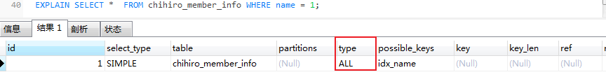

如果给数字加上''，也就是说，传的是一个字符串，就正常走索引。

```mysql
EXPLAIN SELECT *	FROM chihiro_member_info WHERE name = 1;
```

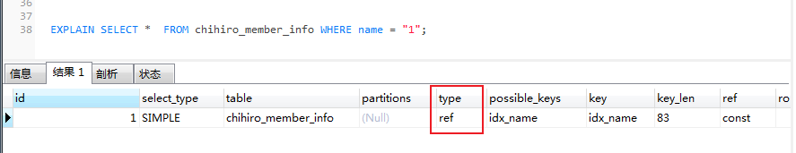

> 分析：为什么第一条语句未加单引号就不走索引了呢？这是因为不加单引号时，是字符串跟数字的比较，它们类型不匹配，MySQL会做**隐式的类型转换**，把它们转换为浮点数再做比较。隐式的类型转换，索引会失效。


#### 二、查询条件包含or，可能导致索引失效

我们在来看一条sql语句，`name`添加了索引，但是`openid`没有添加索引。我们使用`or`，下面的sql是不走索引的。

```mysql
EXPLAIN SELECT *	FROM chihiro_member_info WHERE name = "123" or openid = "123";
```

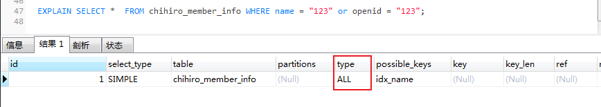

> 分析：对于 `or`+没有索引的`openid`这种情况，假设它走 `name`的索引，但是走到 `openid`查询条件时，它还得全表扫描，也就是需要三步过程： `全表扫描+索引扫描+合并`。如果它一开始就走**全表扫描**，直接一遍扫描就完事。Mysql优化器处于效率与成本考虑，遇到 `or`条件，让索引失效。

当 `name`和`role`都是索引时，使用一张表中的多个索引时，mysql会将多个索引合并在一起。

```mysql
EXPLAIN SELECT * FROM chihiro_member_info WHERE name = "123" or role = "123";
```

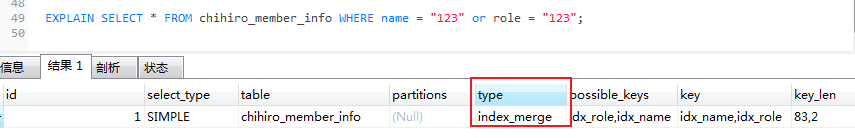

> 注意：如果`or`条件的列都加了索引，**索引可能会走也可能不走，**大家可以自己试一试哈。但是平时大家使用的时候，还是要注意一下这个or，学会用explain分析。遇到不走索引的时候，考虑拆开两条SQL。


#### 三、like通配符可能导致索引失效

并不是用了 `like`通配符索引一定会失效，而是 `like`查询是以 `%`开头，才会导致索引失效。

```mysql
EXPLAIN SELECT * FROM chihiro_member_info WHERE name LIKE '%陈';
```


把 `%`放到后面，索引还是正常走的。

```mysql
EXPLAIN SELECT * FROM chihiro_member_info WHERE name LIKE '陈%';
```

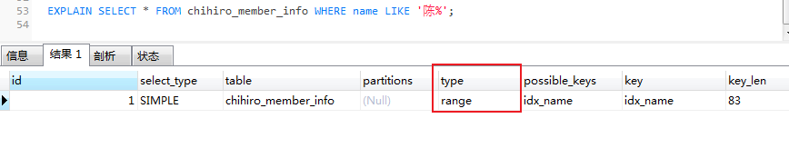

> 分析：既然 `like`查询以 `%`开头，会导致索引失效。我们如何优化？
>
> 1. 使用覆盖索。
> 2. 把 `%`放后面。


#### 四、查询条件不满足联合索引的最左匹配原则

Mysql建立联合索引时，会遵循左前缀匹配原则，既最左优先。如果你建立一个（a,b,c）的联合索引，相当于简历了(a)、(a,b)、(a,b,c)。

我们先添加一个`联合索引`：

```mysql
alter table chihiro_member_info add index idx_name_role_openid (name,role,openid);
```

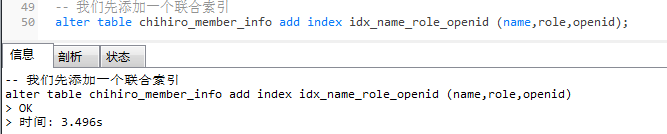

查看表的索引：

```mysql
SHOW INDEX FROM chihiro_member_info;
```

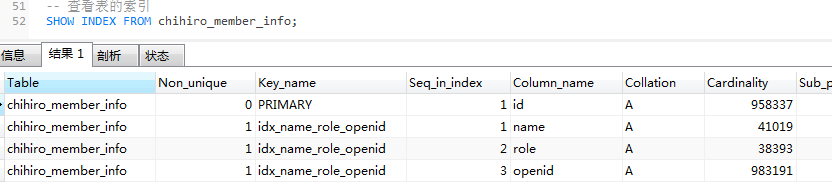

有一个联合索引`idx_name_role_openid`，我们执行这个SQL，查询条件是`role`，索引是无效：

```mysql
EXPLAIN SELECT * FROM chihiro_member_info WHERE role = 0;
```

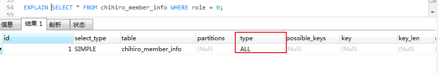

在`联合索引`中，查询条件满足最左匹配原则时，索引才正常生效。

```mysql
EXPLAIN SELECT * FROM chihiro_member_info WHERE name = "刘";
```

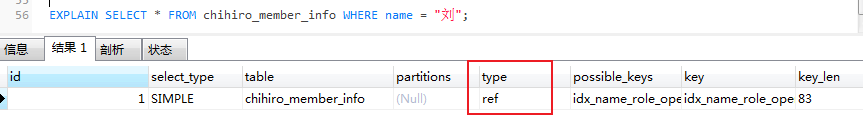


#### 五、在索引列上使用mysql的内置函数

我们先给创建时间添加一个索引。

```mysql
ALTER TABLE chihiro_member_info ADD INDEX idx_create_time(create_time);
```

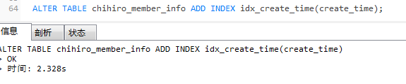

虽然`create_time`加了索引，但是因为使用了mysql的内置函数`DATE_ADD()`，导致直接全表扫描了。

```mysql
EXPLAIN SELECT * FROM chihiro_member_info WHERE DATE_ADD(create_time,INTERVAL 1 DAY) = '2022-10-10 00:00:00';
```

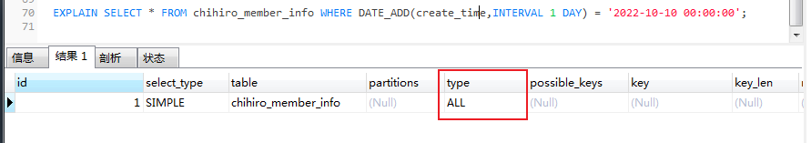

> 分析：一般这种情况怎么优化呢？可以把**内置函数的逻辑转移到右边，**如下：

```mysql
EXPLAIN SELECT * FROM chihiro_member_info WHERE create_time = DATE_ADD('2022-10-10 00:00:00',INTERVAL -1 DAY);
```

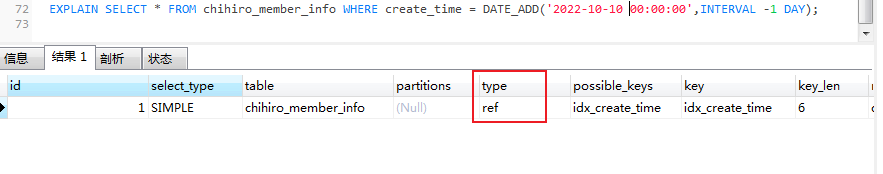

#### 六、对索引进行列运算（如，+、-、*、/）,索引不生效

给 `role`字段（`tinyint`）添加一个索引。

```mysql
-- 添加索引
ALTER TABLE chihiro_member_info ADD INDEX idex_role(role);
```

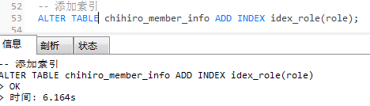

虽然`role`加了索引，但是因为它进行运算，索引直接迷路了。如图：

```mysql
EXPLAIN SELECT * FROM chihiro_member_info WHERE role+1 = 1;
```

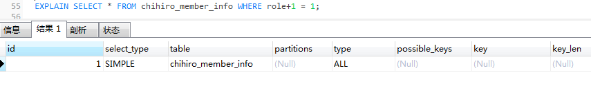

> 分析：**不可以对索引列进行运算，可以在代码处理好，再传参进去。**


#### 七、索引字段上使用（！= 或者 < >），索引可能失效

给 `role`字段（`tinyint`）添加一个索引。

```mysql
-- 添加索引
ALTER TABLE chihiro_member_info ADD INDEX idex_role(role);
```


> 注意：我在mysql 5.7.26测试，测试结果有所不同，可以根据mysql版本去测试。

查看mysql版本

```mysql
SELECT VERSION() FROM DUAL;
```

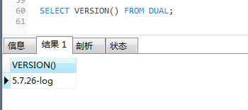

`!=`：正常走的索引。

```mysql
EXPLAIN SELECT * FROM chihiro_member_info WHERE role != 2;
```

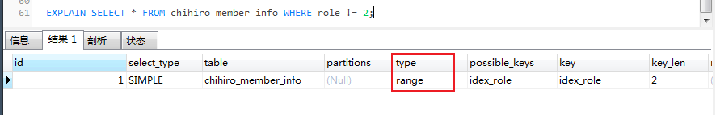

`<>`：正常走的索引。

```mysql
EXPLAIN SELECT * FROM chihiro_member_info WHERE role <> 2;
```

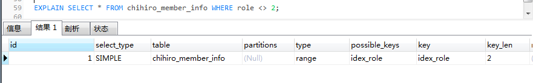

> 分析：其实这个也是跟mySQL优化器有关，如果优化器觉得即使走了索引，还是需要扫描很多很多行的哈，它觉得不划算，**不如直接不走索引。**平时我们用`！=` 或者`< >`，`not in`的时候，可以先使用 `EXPLAIN`去看看索引是否生效。


#### 八、索引字段上使用is null， is not null，索引可能失效

给 `role`字段（`tinyint`）添加一个索引和 `name`字段（`varchar`）添加索引。

```mysql
-- 添加索引
ALTER TABLE chihiro_member_info ADD INDEX idex_role(role);
ALTER TABLE chihiro_member_info ADD INDEX idex_name(name);
```


单个字段 `role`字段加上索引，查询 `role` 为空的语句，会走索引：

```mysql
EXPLAIN SELECT * FROM chihiro_member_info WHERE role is not null;
```

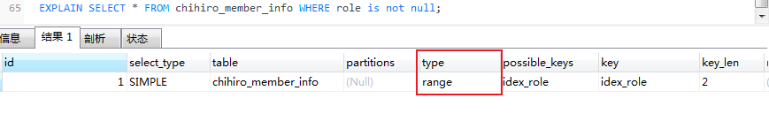

两字字段用 `or`链接起来，索引就失效了。


> 分析：很多时候，也是因为数据量问题，导致了MySQL优化器放弃走索引。同时，平时我们用`explain`分析SQL的时候，如果type=`range`，需要注意一下，因为这个可能因为数据量问题，导致索引无效。


#### 九、左右连接，关联的字段编码格式不一样

新建两个表，一个`user`，一个`user_job`：

```mysql
CREATE TABLE `user` (
  `id` int(11) NOT NULL AUTO_INCREMENT,
  `name` varchar(255) CHARACTER SET utf8mb4 DEFAULT NULL,
  `age` int(11) NOT NULL,
  PRIMARY KEY (`id`),
  KEY `idx_name` (`name`) USING BTREE
) ENGINE=InnoDB AUTO_INCREMENT=2 DEFAULT CHARSET=utf8;

CREATE TABLE `user_job` (
  `id` int(11) NOT NULL,
  `userId` int(11) NOT NULL,
  `job` varchar(255) DEFAULT NULL,
  `name` varchar(255) DEFAULT NULL,
  PRIMARY KEY (`id`),
  KEY `idx_name` (`name`) USING BTREE
) ENGINE=InnoDB DEFAULT CHARSET=utf8;
```

`user`表的`name`字段编码是`utf8mb4`，而`user_job`表的`name`字段编码为utf8。


执行左外连接查询，`user_job`表还是走全表扫描。

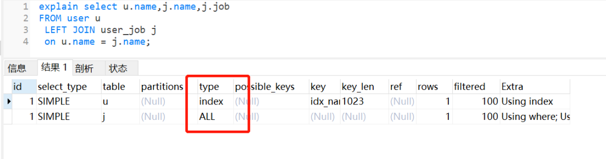

如果把它们的`name`字段改为编码一致，相同的SQL，还是会走索引。


> 分析：所以大家在做表关联时，注意一下**关联字段的编码问题**。

#### 十、优化器选错了索引

MySQL 中一张表是可以支持多个索引的。你写SQL语句的时候，没有主动指定使用哪个索引的话，用哪个索引是由MySQL来确定的。

我们日常开发中，不断地删除历史数据和新增数据的场景，有可能会导致MySQL选错索引。那么有哪些解决方案呢？

- 使用force index 强行选择某个索引；
- 修改你的SQl，引导它使用我们期望的索引；
- 优化你的业务逻辑；
- 优化你的索引，新建一个更合适的索引，或者删除误用的索引。

### 3.3 索引速度对比

测试数据量量400万，字段包含：id、username、password

```mysql
-- 数据量量400万，字段包含：id、username、password

-- 没有索引下查询
SELECT * FROM key_value;

select * from key_value WHERE username = '测试用户388888'
-- > OK
-- > 时间: 1.496s

select * from key_value WHERE username = '测试用户388888'
-- > OK
-- > 时间: 1.503s

select * from key_value WHERE username = '测试用户388888'
-- > OK
-- > 时间: 1.475s

-- 创建索引后：
SELECT * from key_value WHERE username = '测试用户388888';

SELECT * from key_value WHERE username = '测试用户388888'
-- > OK
-- > 时间: 0.005s

SELECT * from key_value WHERE username = '测试用户3588828';
-- > OK
-- > 时间: 0.005s

-- 测试查找主键id 
-- 主键也是有索引的是，所以非常快
SELECT * from key_value WHERE id = 123333;
-- > OK
-- > 时间: 0.004s
```


# 高级篇

## 应用篇

#### 应用场景：

- 业务需要查询文章标签为2的内容，请写出对应的sql

#### 文章表数据库内容参考：

| id(主键)bigint | tag_id（标签id）varchar |
| -------------- | ----------------------- |
| 9              | 2,3,6,4,10,13           |
| 10             | 4,12                    |
| 11             | 2                       |
| 35             | 10                      |
| 36             | 3,10                    |
| 38             | 10                      |
| 39             | 10                      |
| 40             | 12                      |
| 41             | 2,3,10                  |

#### 参考答案1：

注意：使用正则查询不走索引，不建议数据量大时使用该方法。

```sql
SELECT
	id,
	tag_uid 
FROM
	t_article 
WHERE
	tag_uid REGEXP '[[:<:]]2[[:>:]]'
```

#### Java代码

```java
    /**
     * 批量删除标签
     * 
     * @param ids 需要删除的标签主键
     * @return 结果
     */
    @Override
    public int deleteTagByIds(Long[] ids)
    {
        for (Long id : ids) {
            // 删除前校验是否有文章使用到了标签
            QueryWrapper<Article> articleQueryWrapper = new QueryWrapper<>();
            // 正则表达式校验是否存在文章
            String sql = "and tag_uid REGEXP '[[:<:]]"+id+"[[:>:]]'";
            articleQueryWrapper.last(sql);
            int count = iArticleService.count(articleQueryWrapper);
            if (count > 0) {
                throw new ServiceException("该标签下有文章，无法删除");
            }
        }
        return baseMapper.deleteTagByIds(ids);
    }
```

#### 参考答案2：

搜索包含2或者4的数据。

注意：使用`FIND_IN_SET`查询不走索引，不建议数据量大时使用该方法。

```sql
SELECT
	* 
FROM
	t_article 
WHERE
	FIND_IN_SET( '2', tag_uid ) > 0 
	OR FIND_IN_SET( '4', tag_uid ) > 0;
```

## SQL字段常量

```java
package com.XXXXX.project.global;


/**
 * SQL字段常量
 */
public final class SQLConf {

    /**
     * 主键id
     */
    public final static String ID = "id";
    /**
     * 删除标志
     */
    public final static String DEL_FLAG = "del_flag";
    
}1
```


