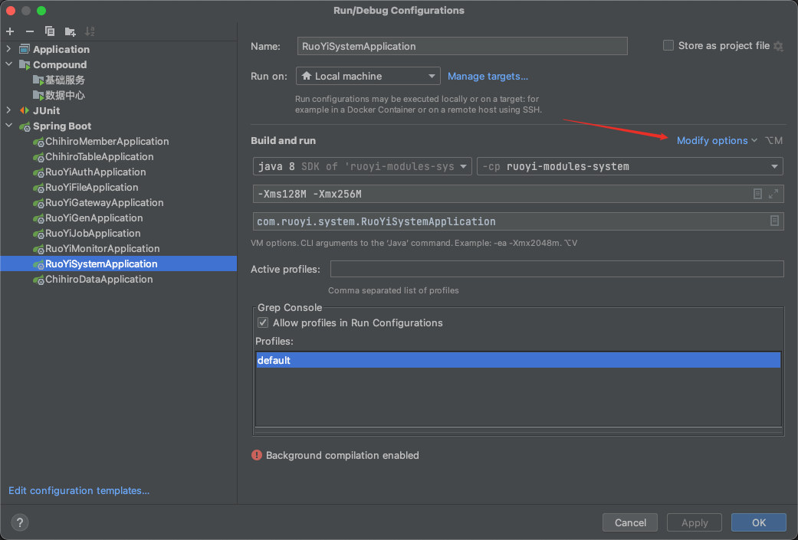
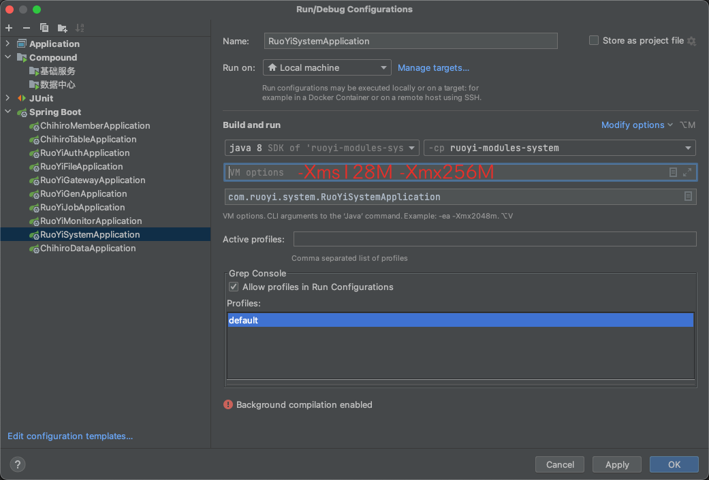

# 【若依优化】调整JVM启动内存

## 📔 千寻简笔记介绍

千寻简文库已开源，Gitee与GitHub搜索`chihiro-doc`，包含笔记源文件`.md`，以及PDF版本方便阅读，文库采用精美主题，阅读体验更佳，如果文章对你有帮助请帮我点一个`Star`～

更新：`支持在线阅读文章，根据发布日期分类。`

@[toc]

## 解决方案

问题：在微服务中，一个服务就需要1GB的内存，多几个服务启动，电脑的内存就不够，我们需要去调整一下Java虚拟机的启动内存。

限制 Java 虚拟机 (JVM) 的选项可以通过在启动应用程序时传递适当的参数来实现。以下是一些选项：

1. -Xmx：用于设置 JVM 最大可用内存。例如，-Xmx512m 将最大内存限制为 512MB。
2. -Xms：用于设置 JVM 的初始堆大小。例如，-Xms256m 将初始堆大小设置为 256MB。
3. -XX:MaxPermSize：用于设置永久代的最大大小。例如，-XX:MaxPermSize=256m 将最大永久代大小设置为 256MB。
4. -XX:MaxDirectMemorySize：用于设置直接内存的最大大小。例如，-XX:MaxDirectMemorySize=1g 将最大直接内存大小设置为 1GB。
5. -XX:ReservedCodeCacheSize：用于设置代码缓存的大小。例如，-XX:ReservedCodeCacheSize=256m 将代码缓存大小设置为 256MB。

要限制某个特定选项的值，只需在命令行中设置其最大值即可。例如，要限制堆大小为 256MB，请使用以下命令行：

```
java -Xmx256m myapp
```

这将使 JVM 在运行 myapp 应用程序时最多只能使用 256MB 的内存。类似地，要限制永久代大小为 128MB，请使用以下命令行：

```
java -XX:MaxPermSize=128m myapp
```

这将使 JVM 在运行 myapp 应用程序时最多只能使用 128MB 的永久代。

图解：Modify options --> Add VM options --> 在VM options中输入 `-Xms128M -Xmx256M` --> 保存重新启动服务




