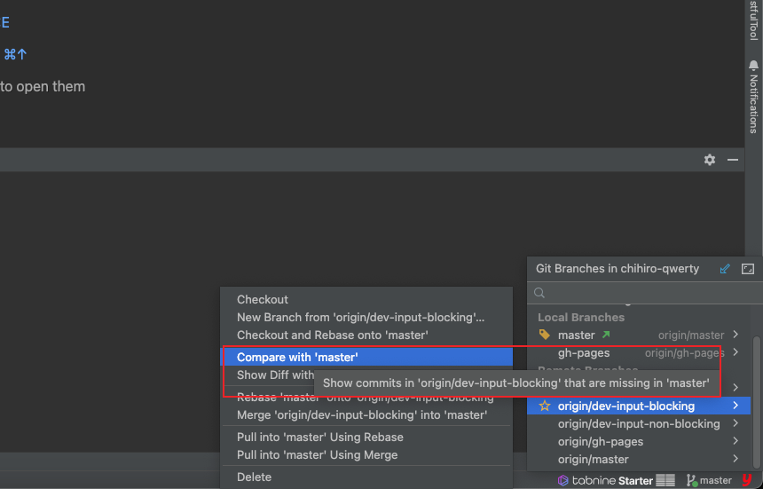
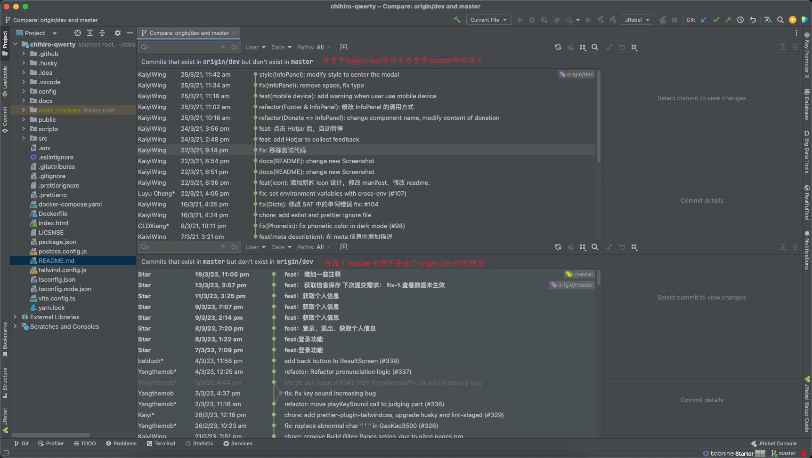
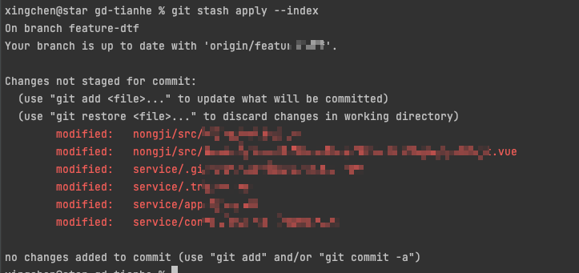

# 【GIT】 查看、合并、缓存分支

## 📔 千寻简笔记介绍

千寻简文库已开源，Gitee与GitHub搜索`chihiro-doc`，包含笔记源文件`.md`，以及PDF版本方便阅读，文库采用精美主题，阅读体验更佳，如果文章对你有帮助请帮我点一个`Star`～

更新：`支持在线阅读文章，根据发布日期分类。`

@[toc]


## 1 查看分支

### 1.1 列出本地已经存在的分支，并且当前分支会用*标记

```sh
git branch
```

### 1.2 查看远程版本库的分支列表

```sh
git branch -r 
```

### 1.3 查看所有分支列表（包括本地和远程，remotes/开头的表示远程分支）

```sh
git branch -a
```

### 1.4 查看一个分支的最后一次提交

```sh
git branch -v 
```

### 1.5 查看哪些分支已经合并到当前分支

```sh
git branch --merged
```

### 1.6 查看所有未合并工作的分支

```sh
git branch --no-merged
```

## 2 合并分支

### 2.1 首先切换到master分支上

```sh
git checkout master
```

### 2.2 确保master代码是最新的代码

```sh
git pull origin master
```

### 2.3 然后我们把dev分支的代码合并到master上

```sh
git merge dev
```

### 2.4 然后查看状态及执行提交命令

```sh
git status
```

```sh
On branch master
Your branch is ahead of ‘origin/master’ by 12 commits.
(use “git push” to publish your local commits)
nothing to commit, working tree clean
```

- 上面的意思就是你有12个commit，需要push


### 2.5 执行将刚才合并的代码，提交到master

```sh
git push origin master
```

### 2.6 扩展 比较分支

- 在合并分支之前，我们可以去比较两个分支的内容





### 2.7 idea 界面合并分支

- 合并分支


## 3 切换分支

### 3.1 切换分支的条件

- 当前的代码与已提交的代码保持一致。

### 3.2 使用场景

- 你正在修改 A 分支的代码，而此时此刻 B 分支有紧急任务。这时，你需要切换到 B 分支先执行紧急任务。但是，你的 A 分支代码又修改了一半。那该怎么做呢？

  - A：直接抛弃当前修改，rest --hard

  - B：匆忙提交当前代码

  - C：先将当前修改缓存下来，然后再切换分支


选 A 属于病急乱投医，选 B 会让你的 git 凌乱不堪，C 才是最优雅的方案。

### 3.3 解决方案：

#### 3.3.1 运行 git stash 命令，git 会将当前代码以栈的形式缓存

```sh
git stash
```

####   3.3.2 查看已缓存的代码信息

- git stash list 命令可以查看已缓存的代码信息：


```sh
git stash list
```

#### 3.3.3 恢复缓存的代码

- git stash apply stash@{n} 命令可恢复对应索引的缓存代码，n 为缓存索引号。

```sh
git stash apply stash@{n}
```

- 如果只有一个缓存，也可以用 git stash apply --index 命令。




#### 3.3.4 删除缓存

- 恢复缓存后，缓存不会自动删除，需要我们手动清理。
- 使用命令 git stash drop stash@{n} ，删除对应索引的缓存代码，n 为缓存索引号。

```sh
git stash drop stash@{n}
```


