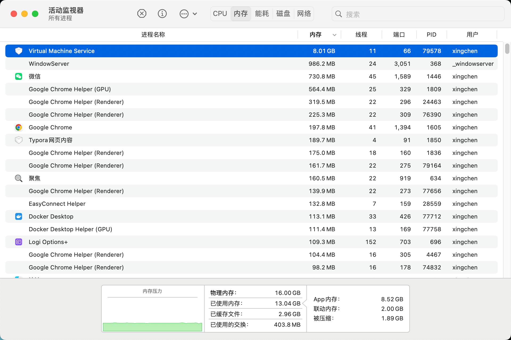
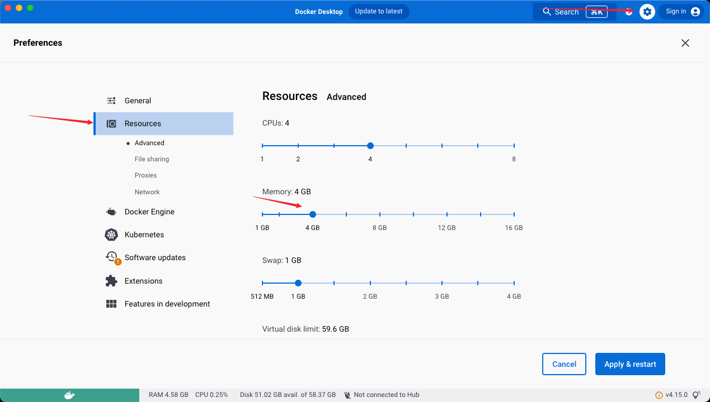
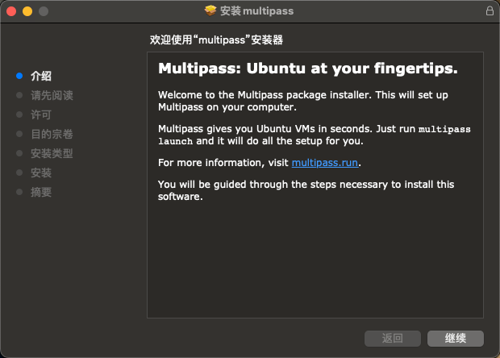
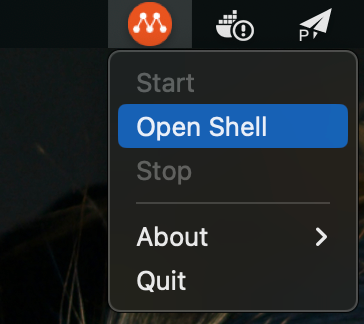
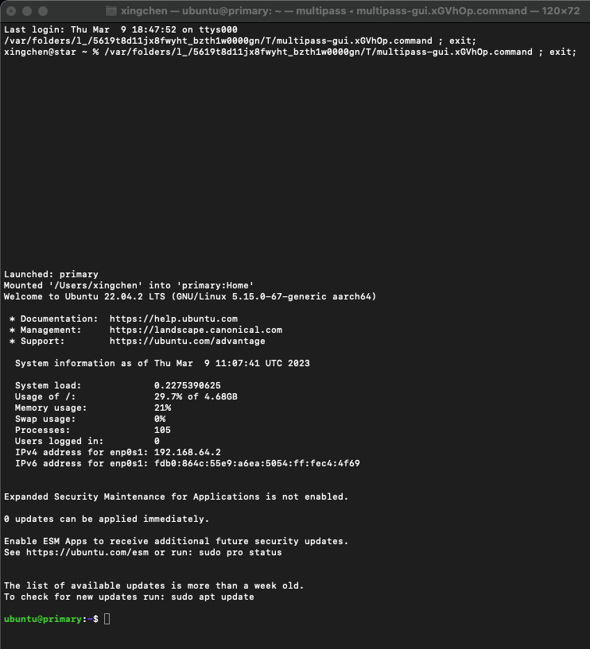

# 【手把手教程】MacOS安装Multipass轻量级虚拟机

## 📔 千寻简笔记介绍

千寻简文库已开源，Gitee与GitHub搜索`chihiro-doc`，包含笔记源文件`.md`，以及PDF版本方便阅读，文库采用精美主题，阅读体验更佳，如果文章对你有帮助请帮我点一个`Star`～

更新：`支持在线阅读文章，根据发布日期分类。`

@[toc]


## 简介

由于在mac上使用docker，创建了两个容器之后内存占用就非常高，总结两套解决方案。



方案一： 在docke 中调整内存大小。



方案二：创建一个轻量的虚拟机，在虚拟机上运行docker，

### 本文关键词

`安装`、`启动`、`扩展命令`、`Multipass`

## 创建一个轻量的虚拟机

下载网址：https://multipass.run/

### 1 安装

- 继续 -> 继续 -> 同意 -> 继续 -> 安装（输入密码）-> 关闭（完成安装）



### 2 启动

- 启动Multipass -> 点击头顶的橙色图标 Open Shell -> 等待获取镜像文件、安装虚拟机实例



- 虚拟机安装完成自动进入虚拟机实例



### 3 本地终端命令

#### 3.1 查看 multipass 当前支持的虚拟机系统版本

```sh
multipass find
```

```sh
xingchen@star ~ % multipass find
Image                       Aliases           Version          Description
18.04                       bionic            20230303         Ubuntu 18.04 LTS
20.04                       focal             20230209         Ubuntu 20.04 LTS
22.04                       jammy,lts         20230302         Ubuntu 22.04 LTS
22.10                       kinetic           20230302         Ubuntu 22.10
anbox-cloud-appliance                         latest           Anbox Cloud Appliance
charm-dev                                     latest           A development and testing environment for charmers
docker                                        0.4              A Docker environment with Portainer and related tools
jellyfin                                      latest           Jellyfin is a Free Software Media System that puts you in control of managing and streaming your media.
minikube                                      latest           minikube is local Kubernetes
ros-noetic                                    0.1              A development and testing environment for ROS Noetic.
ros2-humble                                   0.1              A development and testing environment for ROS 2 Humble.
xingchen@star ~ % 
```

#### 3.2 查看本机安装的虚拟机实例

```sh
multipass list
```

```sh
xingchen@star ~ % multipass list
Name                    State             IPv4             Image
primary                 Running           192.168.64.2     Ubuntu 22.04 LTS
xingchen@star ~ % 
```

#### 3.3 进入虚拟机实例

```sh
multipass shell [虚拟机实例的名字]
```

```sh
# 查看虚拟机的Name
xingchen@star ~ % multipass list
Name                    State             IPv4             Image
primary                 Running           192.168.64.2     Ubuntu 22.04 LTS
# primary 默认的Name
xingchen@star ~ % multipass shell primary
Welcome to Ubuntu 22.04.2 LTS (GNU/Linux 5.15.0-67-generic aarch64)

 * Documentation:  https://help.ubuntu.com
 * Management:     https://landscape.canonical.com
 * Support:        https://ubuntu.com/advantage

  System information as of Thu Mar  9 19:20:44 CST 2023

  System load:             0.0
  Usage of /:              30.1% of 4.68GB
  Memory usage:            19%
  Swap usage:              0%
  Processes:               93
  Users logged in:         1
  IPv4 address for enp0s1: 192.168.64.2
  IPv6 address for enp0s1: fdb0:864c:55e9:a6ea:5054:ff:fec4:4f69


 * Introducing Expanded Security Maintenance for Applications.
   Receive updates to over 25,000 software packages with your
   Ubuntu Pro subscription. Free for personal use.

     https://ubuntu.com/pro

Expanded Security Maintenance for Applications is not enabled.

0 updates can be applied immediately.

Enable ESM Apps to receive additional future security updates.
See https://ubuntu.com/esm or run: sudo pro status


The list of available updates is more than a week old.
To check for new updates run: sudo apt update

Last login: Thu Mar  9 19:08:00 2023 from 192.168.64.1
ubuntu@primary:~$ 
```

#### 3.4 关闭/开启实例

- 关闭实例

  ```
  multipass stop primary
  ```

- 开启实例

  ```
  multipass start primary
  ```

#### 3.5 创建指定版本的虚拟机实例

```
multipass launch -n [实例名称] -c [核数] -d [磁盘大小] -m [内存大小] [image 版本]
```

```sh
-n 实例名称
-c cpu核数 
-m 内存大小
-d 磁盘大小
## 查看更多安装相关的参数
multipass launch --help 
```

#### 3.6 卸载命令

```sh
sudo sh "/Library/Application Support/com.canonical.multipass/uninstall.sh"
```

#### 3.7 设置root 密码

```sh
sudo passwd
```

```sh
ubuntu@primary:/$ sudo passwd
New password: 
Retype new password: 
passwd: password updated successfully
```

#### 3.8 其他命令

```sh
multipass help
```

```sh
xingchen@star ~ % multipass help

Usage: multipass [options] <command>
Create, control and connect to Ubuntu instances.

This is a command line utility for multipass, a
service that manages Ubuntu instances.

Options:
  -h, --help     Displays help on commandline options
  -v, --verbose  Increase logging verbosity. Repeat the 'v' in the short option
                 for more detail. Maximum verbosity is obtained with 4 (or more)
                 v's, i.e. -vvvv.

Available commands:
  alias         Create an alias
  aliases       List available aliases
  authenticate  Authenticate client
  delete        Delete instances
  exec          Run a command on an instance
  find          Display available images to create instances from
  get           Get a configuration setting
  help          Display help about a command
  info          Display information about instances
  launch        Create and start an Ubuntu instance
  list          List all available instances
  mount         Mount a local directory in the instance
  networks      List available network interfaces
  purge         Purge all deleted instances permanently
  recover       Recover deleted instances
  restart       Restart instances
  set           Set a configuration setting
  shell         Open a shell on a running instance
  start         Start instances
  stop          Stop running instances
  suspend       Suspend running instances
  transfer      Transfer files between the host and instances
  umount        Unmount a directory from an instance
  unalias       Remove aliases
  version       Show version details
xingchen@star ~ % 
```

### 4 扩展命令

#### 4.1 启动一个新的虚拟机

- 指定镜像与名字

```sh
multipass launch --name=test1 --cpus=1 --mem=2048MiB
multipass launch appliance:[Image] -n [name]
```

还可以使用以下参数自定义虚拟机的配置：

- --name：指定虚拟机的名称。
- --cpus：指定虚拟机使用的 CPU 核数。
- --mem：指定虚拟机使用的内存大

#### 4.2 修改内存

- 官方文档有说明https://multipass.run/docs/modify-an-instance
  自测可用 multipass1.10.1版本，qemu，主机macbookairM1 11.6.8系统 ubuntu22.04

```sh
# 想修改CPU 硬盘内存的话可以这样用 
multipass set local.实例名.(cpus|disk|memory)=(4|50G|5G)
# 举例：要修改实例名为acc的虚拟机的内存为5G，在关机状态下控制台输入
multipass set local.acc.memory=5G   
# 再开机就行啦
```

#### 4.3 调整cpu

```sh
multipass set local.mysql-master.cpus=2
# 这个可以调cpu。 更多配置multipass get --keys可以看到。也就是cpu mem disk
```


