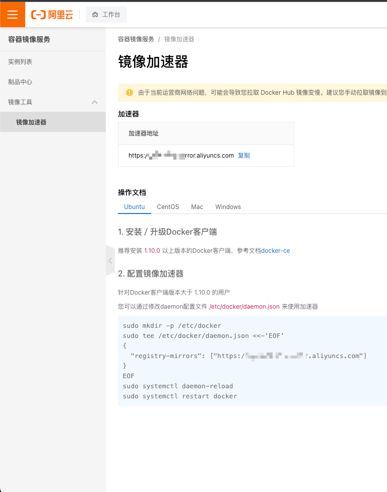

# 【手把手教程】Ubuntu安装Docker与DockerCompose

## 📔 千寻简笔记介绍

千寻简文库已开源，Gitee与GitHub搜索`chihiro-doc`，包含笔记源文件`.md`，以及PDF版本方便阅读，文库采用精美主题，阅读体验更佳，如果文章对你有帮助请帮我点一个`Star`～

更新：`支持在线阅读文章，根据发布日期分类。`

@[toc]


## 1 环境介绍

- 我是在Multipass上安装了一个虚拟机，下面的操作基于这个虚拟机进行，线上也一样操作，Liunx版本我出过详细教程，参考主页中的《[【手把手教程】若依微服务版服务器部署](https://blog.csdn.net/IUTStar/article/details/127671293?spm=1001.2014.3001.5501)》中的第五章，与第六章。
- Mac安装虚拟机的教程，主页搜索《[【手把手教程】MacOS 安装Multipass轻量级虚拟机](https://blog.csdn.net/IUTStar/article/details/129673780)》和《[【续篇】Multipass扩展教程](https://blog.csdn.net/IUTStar/article/details/129694130)》
- 虚拟机Ubuntu配置为：2G内存

```sh
Name          State       IPv4       Image
primary         Running      192.168.64.2   Ubuntu 22.04 LTS
```

## 2 docker

- 从Docker存储库里面安装
- 参考文章：https://code84.com/304797.html
- 参考文章：【Docker】ubuntu下安装Docker和Docker-Composehttps://blog.csdn.net/zeye5731/article/details/125433257

### 2.1 更新apt包索引和安装包

```sh
sudo apt-get update
```

```sh
sudo apt-get install \
   ca-certificates \
   curl \
   gnupg \
   lsb-release
```

### 2.2 添加Docker 的官方 GPG 密钥

```sh
sudo mkdir -p /etc/apt/keyrings
```

```sh
curl -fsSL https://download.docker.com/linux/ubuntu/gpg | sudo gpg --dearmor -o /etc/apt/keyrings/docker.gpg
```

### 2.3 设置存储库

```sh
 echo \
  "deb [arch=$(dpkg --print-architecture) signed-by=/etc/apt/keyrings/docker.gpg] https://download.docker.com/linux/ubuntu \
  $(lsb_release -cs) stable" | sudo tee /etc/apt/sources.list.d/docker.list > /dev/null
```

### 2.4 安装最新版Docker引擎

```sh
# 更新并安装 Docker-CE
sudo apt-get update
```

```sh
# 下载较慢，请耐心等待。或则想办法加速
sudo apt-get install docker-ce docker-ce-cli containerd.io docker-compose-plugin
```

### 2.5 成功后查看docker版本

```sh
root@primary:~# docker -v
Docker version 23.0.1, build a5ee5b1
root@primary:~# 
```

## 3 docker-compose

### 3.1 安装

```sh
 sudo apt-get update
```

```sh
 sudo apt-get install docker-compose-plugin
```

- 成功提示

```sh
docker compose version
```

```sh
root@primary:~# docker compose version
Docker Compose version v2.16.0
```

### 3.2 配置镜像加速器

- 在阿里云中获取加速地址
- 网址：https://cr.console.aliyun.com/cn-hangzhou/instances/mirrors

```
直接复制阿里云提供的代码：
sudo mkdir -p /etc/docker
sudo tee /etc/docker/daemon.json <<-'EOF'
{
  "registry-mirrors": ["https://x x x x x.mirror.aliyuncs.com"]
}
EOF
sudo systemctl daemon-reload
sudo systemctl restart docker
```




