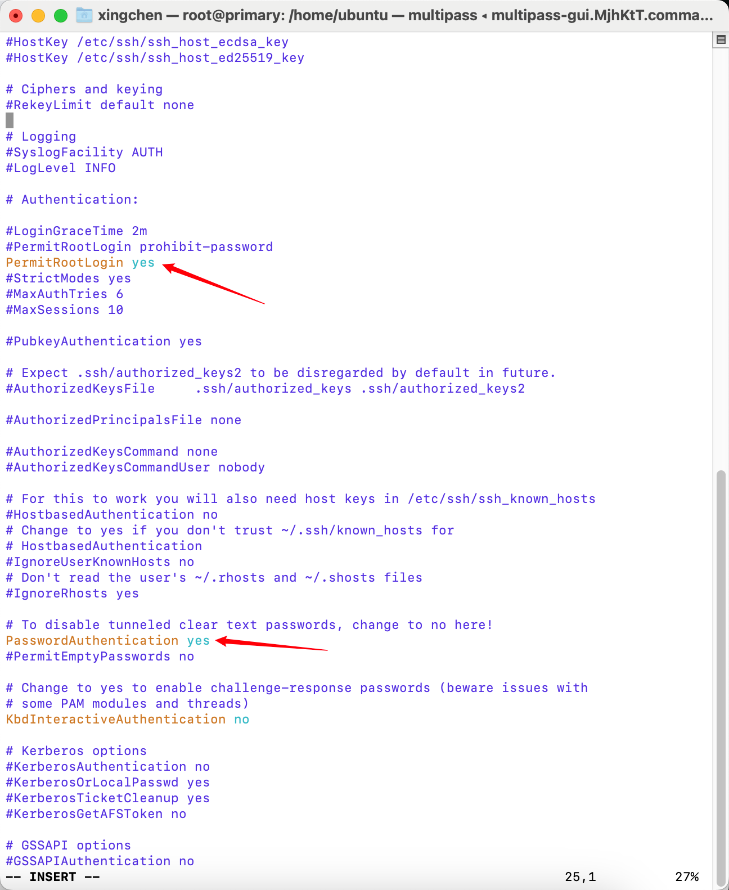
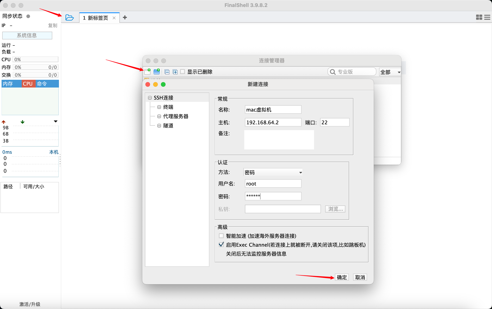
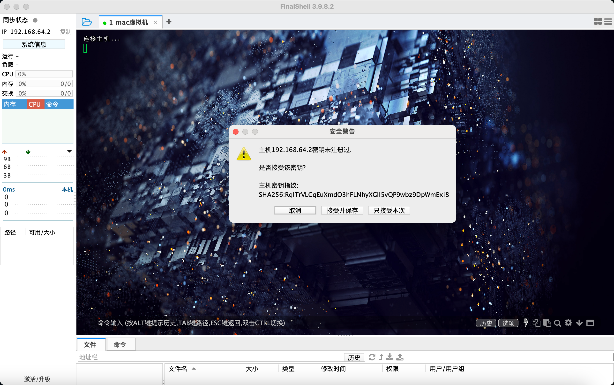
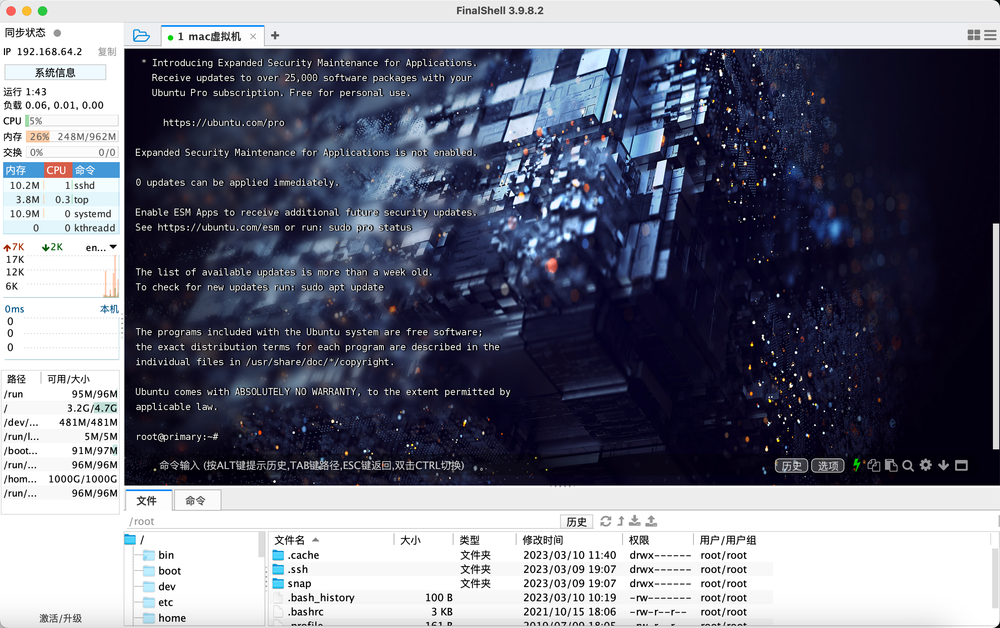

# 【续篇】Multipass扩展教程

## 📔 千寻简笔记介绍

千寻简文库已开源，Gitee与GitHub搜索`chihiro-doc`，包含笔记源文件`.md`，以及PDF版本方便阅读，文库采用精美主题，阅读体验更佳，如果文章对你有帮助请帮我点一个`Star`～

更新：`支持在线阅读文章，根据发布日期分类。`

@[toc]

## 一 系统应用篇

### 1 FinalShell 连接虚拟机

- 虚拟机可以在终端进入`(本文第3.3章节)`，也可以使用我们的ssh软件连接，已我常用的FinalShell举例。

#### 1.1 查看ip

- 打开终端，进入虚拟机，查看`enp0s1`网卡中的`inet`中获取虚拟机的ip地址 192.168.64.2

```sh
ip addr
```

```cmd
root@primary:/service# ip addr
1: lo: <LOOPBACK,UP,LOWER_UP> mtu 65536 qdisc noqueue state UNKNOWN group default qlen 1000
    link/loopback 00:00:00:00:00:00 brd 00:00:00:00:00:00
    inet 127.0.0.1/8 scope host lo
       valid_lft forever preferred_lft forever
    inet6 ::1/128 scope host 
       valid_lft forever preferred_lft forever
2: enp0s1: <BROADCAST,MULTICAST,UP,LOWER_UP> mtu 1500 qdisc fq_codel state UP group default qlen 1000
    link/ether 52:54:00:c4:4f:69 brd ff:ff:ff:ff:ff:ff
    inet 192.168.64.2/24 metric 100 brd 192.168.64.255 scope global dynamic enp0s1
       valid_lft 85426sec preferred_lft 85426sec
    inet6 fdb0:864c:55e9:a6ea:5054:ff:fec4:4f69/64 scope global dynamic mngtmpaddr noprefixroute 
       valid_lft 2591985sec preferred_lft 604785sec
    inet6 fe80::5054:ff:fec4:4f69/64 scope link 
       valid_lft forever preferred_lft forever
root@primary:/service# 
```

#### 1.2 修改SSH 配置

- 切换root账号，由于默认是没有root密码，使用 `sudo passwd` 设置root 密码

```sh
sudo passwd
```

```sh
ubuntu@primary:/$ sudo passwd
New password: 
Retype new password: 
passwd: password updated successfully
```

- 默认的SSH是没有开启的

```sh
vim /etc/ssh/sshd_config
```

- 在 `   vim`   使用 `?PermitRootLogin` 即可查找

> 查找下一个之前，先按 `Enter`键
>
> n – 寻找下一个匹配结果N – 寻找上一个匹配结果

```sh
# 修改以下配置
PermitRootLogin yes
PasswordAuthentication yes
```



- 重启SSH 服务

```sh
systemctl restart ssh
```

#### 1.3 打开FinalShell

- 左上角点击文件夹图标 -> 点击页面加号图标 -> SSH连接(Liunx) -> 输入名称、主机、端口、用户名、密码 -> 点击确定



- 进入ssh链接 -> 接受并保存



- 成功进入画面



## 二 虚拟机应用篇

### 2 tmux

#### 2.1 安装命令

```sh
apt install tmux
```

#### 2.2 session 会话控制

- 开启tmux，会自动进入tmux窗口，此时只分一个窗口

```sh
tmux
```

- 分割窗口，根据自己需求划分多个，我通常分四个进行操作
- 垂直分割关键字 `%`

```sh
Ctrl + b
%
```

- 水平分割关键字 `"`

```sh
Ctrl + b
"
```

- 上下左右切换窗口

```sh
Ctrl + b
+上下左右方向键
```

- 查看到当前在运行的所有`tmux sessions`

```sh
tmux new -s session_name
```

- 进入之前的会话

```sh
tmux a
```

- 创建一个会话并赋予名字

```sh
tmux new -s 会话名字
```

- 为session赋予一个新的名字

```sh
tmux rename-session -t 旧的会话名字 新的会话名字
```

[^tmux详细操作参考文章]: https://blog.csdn.net/qq_41554005/article/details/93904075

### 3 Git

#### 3.1 安装

```SH
sudo apt-get install git
```

- 查看安装是否成功

```sh
git --version
```

#### 3.2 Liunx 扩展

```sh
# 下载网络链接
wget https://www.kernel.org/pub/software/scm/git/git-2.39.2.tar.gz
# 解压安装包
tar -zxvf git-2.39.2.tar.gz
# 安装编译环境
yum install curl-devel expat-devel openssl-devel zlib-devel gcc-c++ 
yum install perl-ExtUtils-MakeMaker automake autoconf libtool make
# 编译安装 Git
cd git-2.39.2
make configure
./configure --prefix=/usr/local/git
make profix=/usr/local/git
make install
#将 git 加入环境变量中，修改 /etc/profile 文件，在 profile 文件末尾追加配置内容

#编辑配置文件
vim /etc/profile
# 末尾追加
export GIT_HOME=/usr/local/git
export PATH=$PATH:$GIT_HOME/bin
# 刷新 profile 配置文件
source /etc/profile
```

### 4 apt

参考资料：https://blog.csdn.net/Neutionwei/article/details/125626561

#### 4.1 备份

- 备份原来的ubuntu官方源

```bash
sudo cp /etc/apt/sources.list /etc/apt/sources.list.bak
```

#### 4.2 切换国内镜像源

- 用`sed -i`命令直接替换（例如华为源）

```sh
sudo sed -i "s@http://.*archive.ubuntu.com@http://repo.huaweicloud.com@g" /etc/apt/sources.list
sudo sed -i "s@http://.*security.ubuntu.com@http://repo.huaweicloud.com@g" /etc/apt/sources.list
```

#### 4.3 更新源列表

```sh
sudo apt-get update
```

#### 4.4 国内镜像源

- 华为云

  ```sh
  http://repo.huaweicloud.com/ubuntu/
  ```

- 阿里云

  ```
  http://mirrors.aliyun.com/ubuntu/
  ```

- 清华大学

  ```
  https://mirrors.tuna.tsinghua.edu.cn/ubuntu/
  ```

- 中科大

  ```
  https://mirrors.ustc.edu.cn/ubuntu/
  ```

- 163

  ```
  http://mirrors.163.com/ubuntu/
  ```


