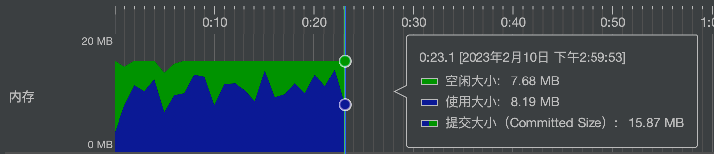

# 【Java】EasyExecl数据导入

## 📔 千寻简笔记介绍

千寻简笔记已开源，Gitee与GitHub搜索`chihiro-notes`，包含笔记源文件`.md`，以及PDF版本方便阅读，且是用了精美主题，阅读体验更佳，如果文章对你有帮助请帮我点一个`Star`～

@[toc]

## EasyExcel介绍



Java解析、生成Excel比较有名的框架有Apache poi、jxl。但他们都存在一个严重的问题就是非常的耗内存，poi有一套SAX模式的API可以一定程度的解决一些内存溢出的问题，但POI还是有一些缺陷，比如07版Excel解压缩以及解压后存储都是在内存中完成的，内存消耗依然很大。
easyexcel重写了poi对07版Excel的解析，一个3M的excel用POI sax解析依然需要100M左右内存，改用easyexcel可以降低到几M，并且再大的excel也不会出现内存溢出；03版依赖POI的sax模式，在上层做了模型转换的封装，让使用者更加简单方便

## 为什么使用EasyExcel


EasyExcel 是一个基于 Java 的简单、高效的 Excel 文件读写框架。它提供了易于使用的 API，可以快速读取和写入 Excel 文件，支持大数据量的处理，并且具有良好的性能。

1. 简单易用：EasyExcel 提供了简洁而直观的 API，使得读写 Excel 文件变得简单易用，无需繁琐的操作和复杂的配置。
2. 高性能：EasyExcel 使用了流式读写的方式，能够高效地处理大规模的 Excel 文件，提供了优秀的性能和内存管理。
3. 支持多种数据源：EasyExcel 可以与多种数据源进行集成，包括 Java 对象、数据库查询结果、XML、JSON 等，方便灵活地读写各种数据格式。
4. 大数据量支持：EasyExcel 对于大规模数据的读写具有优势，能够快速处理大量的数据，同时提供了灵活的数据导入导出选项。
5. 导入导出功能：EasyExcel 提供了丰富的导入和导出功能，可以方便地读取和写入 Excel 文件，支持自定义转换器、监听器等扩展功能。
6. 跨平台兼容：EasyExcel 可以在 Windows、Linux、Mac 等多个操作系统上运行，并且与 Java 应用程序完美集成，具有良好的跨平台兼容性。

总的来说，EasyExcel 提供了简单、高效、灵活的 Excel 文件读写解决方案，使开发者能够轻松处理 Excel 数据，节省开发时间和资源，提高工作效率。无论是数据导入、导出、数据分析还是报表生成，EasyExcel 都是一个强大的选择。

## 实现思路

1. 引入 EasyExcel 依赖：在项目的 Maven 配置文件中，添加 EasyExcel 的依赖项。
2. 创建 Excel 写入器：通过 `EasyExcel.write()` 方法创建一个 Excel 写入器，指定要生成的 Excel 文件路径或输出流。
3. 定义 Excel 数据模型：创建一个 Java 类，用于表示 Excel 中的数据行，通过在类上添加注解，指定 Excel 列和数据的映射关系。
4. 写入 Excel 数据：通过 `write(List<? extends T> data, Class<? extends T> clazz)` 方法，将数据集合和数据模型类传递给 Excel 写入器，执行数据写入操作。
5. 创建 Excel 读取器：通过 `EasyExcel.read()` 方法创建一个 Excel 读取器，指定要读取的 Excel 文件路径或输入流。
6. 定义 Excel 读取监听器：创建一个 Java 类，继承 `AnalysisEventListener<T>`，重写 `invoke()` 方法，用于处理每行读取的 Excel 数据。
7. 读取 Excel 数据：通过 `read(Class<? extends T> clazz, AnalysisEventListener<T> eventListener)` 方法，将数据模型类和监听器传递给 Excel 读取器，执行数据读取操作。
8. 使用转换器：如果需要对 Excel 数据进行自定义转换，可以实现自定义的转换器，并在数据模型的注解中指定使用的转换器。
9. 处理异常：在读取 Excel 数据和写入 Excel 数据的过程中，可能会出现异常情况，可以通过捕获和处理异常，进行相应的错误处理和日志记录。
10. 其他功能：EasyExcel 还提供了更多功能，如数据筛选、条件格式、合并单元格、Sheet 切换等，可以根据需求灵活应用。

## 实现代码

### **ImprotListener

> 核心代码
>
> *有个很重要的点 ImprotListener不能被spring管理，要每次读取excel都要new,然后里面用到spring可以构造方法传进去*

```java
package com.ruoyi.project.excel;

import com.alibaba.excel.context.AnalysisContext;
import com.alibaba.excel.event.AnalysisEventListener;
import com.alibaba.fastjson.JSON;
import com.ruoyi.common.exception.CustomException;
import com.ruoyi.common.utils.StringUtils;
import com.ruoyi.common.utils.bean.BeanUtils;
import com.ruoyi.project.domain.ImportDemo;
import lombok.extern.slf4j.Slf4j;
import org.slf4j.Logger;
import org.slf4j.LoggerFactory;
import org.springframework.util.CollectionUtils;

import javax.validation.ConstraintViolation;
import javax.validation.Validation;
import javax.validation.Validator;
import java.util.ArrayList;
import java.util.Date;
import java.util.List;
import java.util.Set;
/**
 * 导入监听器
 *
 * @author star
 * @date 2023-05-16
 */
@Slf4j
public class ImprotListener extends AnalysisEventListener<ImprotExcelVo> {

    private Logger logger = LoggerFactory.getLogger(BriefingListener.class);

    private static final int BATCH_COUNT = 100;

    // 不方便直接注入，通过构造函数引入
    private IImportService iImportService;

    // 这里方便演示理解，这里保存的日志的列表，实际中用于保存其他业务数据
    private List<Log> logList = new ArrayList<>();


    public ImprotListener(IImportService iImportService) {
        this.iImportService = iImportService;
    }
	@Override
    public void onException(Exception exception, AnalysisContext context) throws Exception {
        log.info("导入错误：："+"错误行数{"+(context.getCurrentRowNum().longValue()+1)+
                "}检查内容{"+context.getCurrentRowAnalysisResult()+
                "}错误提示："+exception.getMessage()+"}");
        throw new CustomException(
                "错误行数（"+(context.getCurrentRowNum().longValue()+1)+
                        "）错误提示："+exception.getMessage()+"}");
    }
    @Override
    public void invoke(ImprotExcelVo improtExcelVo, AnalysisContext analysisContext) {
        // 校验数据
        Validator validator = Validation.buildDefaultValidatorFactory().getValidator();
        List<String> errorList = new ArrayList<>();

        Set<ConstraintViolation<ImprotExcelVo>> violations = validator.validate(improtExcelVo);
        if (!violations.isEmpty()) {
            for (ConstraintViolation<ImprotExcelVo> violation : violations) {
                errorList.add(violation.getMessage());
            }
        }

        // 如果校验不通过，则返回错误信息
        if (!errorList.isEmpty()) {
            logger.info("数据校验不通过，", errorList);
            throw new CustomException("数据校验不通过，"+ errorList);
        }

        logger.info("解析到一条数据", improtExcelVo.toString());
        logger.info("解析到的客户{}", improtExcelVo.getClient());

        if (StringUtils.isEmpty(improtExcelVo.getClient()) || "null".equals(improtExcelVo.getClient())) {
            return;
        }

        // 模拟业务操作，查找客户信息
        Client client = iImportService.findClientByName(improtExcelVo.getClient());
        logger.info("查询是否有对应的客户,{}", JSON.toJSONString(client));

        // 错误处理
        if (client == null) {
            logger.info("错误记录的案件标识{},{}", improtExcelVo.getXxxxNumber(), improtExcelVo.getExternalNumber());
            throw new CustomException("客户信息不存或错误");
        }
        // 将查询到的客户id保存到Vo中
        improtExcelVo.setClientId(client.getId());

        ImportDemo importDemo = new ImportDemo();
        importDemo.setXxxxNumber(improtExcelVo.getXxxxNumber());
        importDemo.setExternalNumber(improtExcelVo.getExternalNumber());
        List<ImportDemo> importDemoList = iImportService.queryList(importDemo);
        if (!CollectionUtils.isEmpty(importDemoList)) {
            importDemo = importDemoList.get(0);
        } else {
            importDemo = null;
        }

        // 等于空，为新增
        if (importDemo == null) {
            importDemo = new ImportDemo();
            BeanUtils.copyProperties(improtExcelVo, importDemo);

            // 业务操作，设置状态，对数据进行

            importDemo.setCreateTime(new Date());
            importDemo.setUpdateTime(new Date());
            iImportService.save(importDemo);
        } else {
            // 不为空新增
            Date createTime = importDemo.getCreateTime();
            log.info("打印execl导入的参数======:"+improtExcelVo);
            BeanUtils.copyProperties(improtExcelVo, importDemo);

            importDemo.setCreateTime(createTime);
            importDemo.setUpdateTime(new Date());
            log.info("打印更新数据的参数======:"+importDemo);
            // 根据主键id去更新数据
            iImportService.updateById(importDemo);
        }
        
        //模拟还有业务逻辑，接着操作数据，如果单一业务，可以删除下面部分-star
        Log log = new Log();
        log.setImportDemoId(importDemo.getId());
        log.setMsg("这是一个信息，用于记录导入信息");
        Log.setCreateTime(new Date());
        Log.setUpdateTime(new Date());
        logList.add(Log);
        
        if (logList.size() >= BATCH_COUNT) {
            saveData();
            // 存储完成清理 list
            logList.clear();
        }
        //模拟还有业务逻辑，接着操作数据，如果单一业务，可以删除下面部分-end
    }


    @Override
    public void doAfterAllAnalysed(AnalysisContext analysisContext) {
        saveData();
        logger.info("所有数据解析完成！");
    }

    private void saveData() {
        logger.info("{}条数据，开始存储数据库！", logList.size());
        iLongService.saveBatch(logList);
        logger.info("存储数据库成功！");
    }
}
```

### ImportController

```java
package com.ruoyi.project.controller;

import com.ruoyi.common.annotation.Log;
import com.ruoyi.common.core.controller.BaseController;
import com.ruoyi.common.core.domain.AjaxResult;
import com.ruoyi.common.enums.BusinessType;
import io.swagger.annotations.Api;
import io.swagger.annotations.ApiOperation;
import lombok.RequiredArgsConstructor;
import lombok.extern.slf4j.Slf4j;
import org.springframework.beans.factory.annotation.Autowired;
import org.springframework.web.bind.annotation.PostMapping;
import org.springframework.web.bind.annotation.RequestMapping;
import org.springframework.web.bind.annotation.RequestParam;
import org.springframework.web.bind.annotation.RestController;
import org.springframework.web.multipart.MultipartFile;

import java.io.IOException;

/**
 * 导入接口Controller
 *
 * @author star
 * @date 2023-05-16
 */
@Slf4j
@Api(description = "导入接口")
@RequiredArgsConstructor(onConstructor_ = @Autowired)
@RestController
@RequestMapping("/import")
public class ImportController extends BaseController {

    private final IImportService iImportService;


    @ApiOperation("导入ExeclDemo")
    @Log(title = "导入ExeclDemo", businessType = BusinessType.IMPORT)
    @PostMapping("/importExeclDemo")
    public AjaxResult importCase(@RequestParam("file") MultipartFile file) throws IOException {
        // iImportService 做为参数传递方便后续使用，传入相关 Service
        iImportService.importExecl(file.getInputStream(), ImprotExcelVo.class, new ImprotListener(iImportService));
        return toAjax(1);
    }
}
```

### service

> `@Transactional` 注解被应用于 `importExecl` 方法上，表示该方法需要在一个事务中执行。事务是数据库操作的基本单位，它要么全部成功提交，要么全部回滚，以保证数据的一致性和完整性。
>
> 通过将 `@Transactional` 注解应用于该方法，可以确保在执行导入操作期间，如果出现异常或错误，数据库的状态会被回滚到导入前的状态，以避免数据不一致的情况发生。

```java
package com.ruoyi.project.service.impl;

import com.ruoyi.project.util.EasyExcelUtils;
import lombok.extern.slf4j.Slf4j;
import org.springframework.stereotype.Service;
import org.springframework.transaction.annotation.Transactional;

import java.io.InputStream;

/**
 * 导入Service业务层处理
 *
 * @author star
 * @date 2023-05-16
 */
@Slf4j
@Service
public class ImportServiceImpl implements IImportService {

    @Override
    @Transactional
    public void importExecl(InputStream inputStream, Class<ImprotExcelVo> improtExcelVoClass, ImprotListener improtListener) {
        EasyExcelUtils.doRead(inputStream, improtExcelVoClass, improtListener, 1);
    }
}
```

### ImportDemo

> 导入Demo对象 c_import_demo

```java
package com.ruoyi.project.domain;

import com.baomidou.mybatisplus.annotation.TableId;
import com.baomidou.mybatisplus.annotation.TableName;
import lombok.Data;
import lombok.NoArgsConstructor;
import lombok.experimental.Accessors;

import java.io.Serializable;
import java.util.Date;

/**
 * 导入Demo对象 c_import_demo
 *
 * @author star
 * @date 2023-05-16
 */
@Data
@NoArgsConstructor
@Accessors(chain = true)
@TableName("c_import_demo")
public class ImportDemo implements Serializable {

    private static final long serialVersionUID = 1L;

    /**
     * id
     */
    @TableId(value = "id")
    private Long id;

    /**
     * 时间
     * */
    private Date xxxxxTime;

    /**
     * 单号
     * */
    private String xxxxNumber;

    /**
     *外部单号
     * */
    private String externalNumber;

    /**
     *客户
     * */
    private String client;

    /**
     *标识
     * */
    private String identification;

    /**
     *姓名
     * */
    private String name;

    /**
     *证件号
     * */
    private String defendantId;

    /**
     *身份证过期情况
     * */
    private String idCardExpiration;

    /**
     *手机号码
     * */
    private String phone;

    /**
     *户籍地地址
     * */
    private String defendantAddress;

    /**
     *地址
     * */
    private String address;
}
```


### ImprotExcelVo

> 导入实体类：
>
> - `xxxxxTime`: 时间字段，对应Excel中的第一列，使用自定义的日期转换器 `DateConverter` 进行转换。
> - `xxxxNumber`: 单号字段，对应Excel中的第二列。
> - `externalNumber`: 外部单号字段，对应Excel中的第三列。
> - `client`: 客户字段，对应Excel中的第四列。
> - `identification`: 标识字段，对应Excel中的第五列。
> - `name`: 姓名字段，对应Excel中的第六列，长度不能超过64。
> - `defendantId`: 证件号字段，对应Excel中的第七列，长度不能超过64。
> - `idCardExpiration`: 身份证过期情况字段，对应Excel中的第八列。
> - `phone`: 手机号码字段，对应Excel中的第九列，长度不能超过11。
> - `defendantAddress`: 户籍地地址字段，对应Excel中的第十列，长度不能超过64。
> - `address`: 地址字段，对应Excel中的第十一列。
>
> 
>
> `@Length` 是 Hibernate Validator 提供的注解，用于限制字符串字段的长度。
>
> `@Length` 注解有以下参数可用：
>
> - `min`：指定字符串的最小长度，默认值为 0。
> - `max`：指定字符串的最大长度，默认值为 `Integer.MAX_VALUE`。
> - `message`：指定验证失败时的错误消息，默认值为一个预定义的错误消息。

```java
package com.ruoyi.project.domain.vo;

import com.alibaba.excel.annotation.ExcelProperty;
import com.ruoyi.project.converter.DateConverter;
import lombok.Data;
import lombok.ToString;
import org.hibernate.validator.constraints.Length;

import java.io.Serializable;
import java.util.Date;

@Data
@ToString
public class ImprotExcelVo implements Serializable {

    private static final long serialVersionUID = 1L;

    @ExcelProperty(value = "时间" , index = 0,converter = DateConverter.class)
    private Date xxxxxTime;

    @ExcelProperty(value = "单号", index = 1)
    private String xxxxNumber;

    @ExcelProperty(value = "外部单号", index = 2)
    private String externalNumber;

    @ExcelProperty(value = "客户", index = 3)
    private String client;

    @ExcelProperty(value = "标识", index = 4)
    private String identification;

    @ExcelProperty(value = "姓名", index = 5)
    @Length(max = 64, message = "姓名过长")
    private String name;

    @ExcelProperty(value = "证件号", index = 6)
    @Length(max = 64, message = "证件号过长")
    private String defendantId;

    @ExcelProperty(value = "身份证过期情况", index = 7)
    private String idCardExpiration;

    @ExcelProperty(value = "手机号码", index = 8)
    @Length(max = 11, message = "请输入正确的手机号码")
    private String phone;

    @ExcelProperty(value = "户籍地地址", index = 9)
    @Length(max = 64, message = "户籍地地址过长")
    private String defendantAddress;

    @ExcelProperty(value = "地址",index = 10)
    private String address;
}
```

### DateConverter

> 这是一个实现了`Converter`接口的日期转换器类`DateConverter`。它用于在Excel的导入和导出操作中转换日期值。
>
> 下面是`DateConverter`类中方法的说明：
>
> 1. `supportJavaTypeKey()`方法：返回转换器支持的Java数据类型。在这里，返回`null`，表示转换器支持任意Java数据类型。
> 2. `supportExcelTypeKey()`方法：返回转换器支持的Excel数据类型。同样返回`null`，表示转换器支持任意Excel数据类型。
> 3. `convertToJavaData()`方法：将Excel单元格数据转换为Java对象。通过`cellData.getStringValue()`获取单元格的字符串值，如果字符串值非空，则使用`DateUtils.dateTime()`方法将其转换为日期类型（使用指定的日期格式）。最后，返回转换后的日期对象。
> 4. `convertToExcelData()`方法：将Java对象转换为Excel单元格数据。在此处返回`null`，表示不进行Excel到Java数据的转换。

```java
package com.ruoyi.project.converter;

import com.alibaba.excel.converters.Converter;
import com.alibaba.excel.enums.CellDataTypeEnum;
import com.alibaba.excel.metadata.CellData;
import com.alibaba.excel.metadata.GlobalConfiguration;
import com.alibaba.excel.metadata.property.ExcelContentProperty;
import com.ruoyi.common.utils.DateUtils;
import com.ruoyi.common.utils.StringUtils;
import java.util.Date;

public class DateConverter implements Converter {
    @Override
    public Class<?> supportJavaTypeKey() {
        return null; // 支持任意Java数据类型
    }

    @Override
    public CellDataTypeEnum supportExcelTypeKey() {
        return null; // 支持任意Excel数据类型
    }

    @Override
    public Object convertToJavaData(CellData<?> cellData, ExcelContentProperty contentProperty, GlobalConfiguration globalConfiguration) throws Exception {
        String stringValue = cellData.getStringValue(); // 获取单元格的字符串值
        if (StringUtils.isNotEmpty(stringValue)) { // 检查字符串值是否非空
            return DateUtils.dateTime(DateUtils.YYYY_MM_DD_HH_MM_SS, stringValue + " 00:00:00"); // 将字符串值转换为日期类型
        }
        return null;
    }

    @Override
    public CellData<?> convertToExcelData(Object value, ExcelContentProperty contentProperty, GlobalConfiguration globalConfiguration) throws Exception {
        return null; // 不进行Excel到Java数据的转换
    }
}

```

### EasyExcelUtils

> EasyExcelUtils 是一个工具类，用于简化使用 EasyExcel 库进行 Excel 文件读写操作。通过调用 EasyExcelUtils 类的 `doRead` 方法实现了读取 Excel 文件的功能。

```java
package com.ruoyi.project.util;

import com.alibaba.excel.EasyExcel;
import com.alibaba.excel.ExcelWriter;
import com.alibaba.excel.event.AnalysisEventListener;
import com.alibaba.excel.support.ExcelTypeEnum;
import com.alibaba.excel.write.metadata.WriteSheet;
import com.ruoyi.common.exception.CustomException;
import org.springframework.web.multipart.MultipartFile;

import javax.servlet.http.HttpServletResponse;
import java.io.IOException;
import java.io.InputStream;
import java.io.OutputStream;
import java.util.List;

/**
 * 使用EasyExcel导出Excel封装的工具类
 */
public class EasyExcelUtils {

    /**
     * 导出数据的高级封装
     * @param response
     * @param fileName
     * @param list
     */
    public static void doWriter(HttpServletResponse response, String fileName, List list){
        if(list==null||list.size()<=0){
            throw new CustomException("导出数据不能为空");
        }
        response.setContentType("application/vnd.ms-excel");
        response.setCharacterEncoding("utf-8");
        try {
            response.setHeader("Content-Disposition", "attachment;filename=" + new String((fileName + ".xlsx").getBytes(), "ISO8859-1"));
            EasyExcel.write(response.getOutputStream(), list.get(0).getClass()).sheet(fileName).doWrite(list);
        } catch (IOException e) {
            e.printStackTrace();
        }
    }

    /**
     * 导出数据的高级封装
     * @param response
     * @param fileName
     * @param list
     */
    public static void doWriter(HttpServletResponse response, String fileName, String sheetName, List list){
        if(list==null||list.size()<=0){
            throw new CustomException("导出数据不能为空");
        }
        response.setContentType("application/vnd.ms-excel");
        response.setCharacterEncoding("utf-8");
        try {
            response.setHeader("Content-Disposition", "attachment;filename=" + new String((fileName + ".xlsx").getBytes(), "ISO8859-1"));
            EasyExcel.write(response.getOutputStream(), list.get(0).getClass()).sheet(sheetName).doWrite(list);
        } catch (IOException e) {
            e.printStackTrace();
        }
    }

    /**
     * 导出Excel文件的初级版本
     * @param response
     * @param fileName
     * @param list
     */
    public static void doExportExcelV1(HttpServletResponse response, String fileName, List list){
        if(list==null||list.size()<=0){
            throw new CustomException("导出数据不能为空");
        }
        //进行导出文件操作
        OutputStream out=null;
        ExcelWriter writer=null;
        try {
            out = response.getOutputStream();
            //获取ExcelWriter对象，自定义表头信息
            writer = EasyExcel.write(out, list.get(0).getClass()).excelType(ExcelTypeEnum.XLSX).build();
            WriteSheet writeSheet = new WriteSheet();
            writeSheet.setSheetName(fileName);
            writer.write(list, writeSheet);
            response.setCharacterEncoding("utf-8");
            response.setContentType("application/vnd.ms-excel;charset=utf-8");
            response.setHeader("Content-Disposition", "attachment;filename=" + new String((fileName+ ".xlsx").getBytes(), "ISO8859-1"));
            out.flush();
        }catch (Exception e){
            e.printStackTrace();
        }finally {
            if (writer != null) {
                writer.finish();
            }
            if (out != null) {
                try {
                    out.close();
                } catch (Exception e) {
                    e.printStackTrace();
                }
            }
        }
    }


    //################################################上传Excel文件相关的接口###########################################

    /**
     * 上传Excel文件功能
     * @param multipartFile
     * @param t
     * @param listener  进行自定义，主要的数据保存操作在listener当中操作，支持异步和同步操作
     * @param <T>
     */
    public static <T> void doRead(MultipartFile multipartFile, T t, AnalysisEventListener listener){
        try {
            EasyExcel.read(multipartFile.getInputStream(), t.getClass(), listener).sheet().doRead();
        } catch (IOException e) {
            e.printStackTrace();
        }
    }


    /**
     * 读或上传Excel文件的高级封装
     * @param multipartFile
     * @param clz
     * @param listener  主要的数据保存操作在listener当中操作，支持异步和同步操作
     */
    public static void doRead(MultipartFile multipartFile, Class clz, AnalysisEventListener listener,Integer headRowNumber){
        try {
            EasyExcel.read(multipartFile.getInputStream(), clz, listener).sheet().headRowNumber(headRowNumber).doRead();
        } catch (IOException e) {
            e.printStackTrace();
        }
    }


    public static void doRead(InputStream inputStream, Class clz, AnalysisEventListener listener,Integer headRowNumber){
       try {
            EasyExcel.read(inputStream, clz, listener).sheet()
                    .headRowNumber(headRowNumber).doRead();
        } catch (CustomException e) {
           throw new CustomException(e.getMessage());
        }
    }

}
```

### BeanUtils

> `BeanUtils` 是一个工具类，用于在Java对象之间进行属性拷贝。它提供了一系列静态方法，可以方便地进行对象之间的属性复制，无需手动逐个设置属性。

```java
package com.ruoyi.common.utils.bean;

import java.lang.reflect.Method;
import java.util.ArrayList;
import java.util.List;
import java.util.regex.Matcher;
import java.util.regex.Pattern;

/**
 * Bean 工具类
 * 
 * @author ruoyi
 */
public class BeanUtils extends org.springframework.beans.BeanUtils
{
    /** Bean方法名中属性名开始的下标 */
    private static final int BEAN_METHOD_PROP_INDEX = 3;

    /** * 匹配getter方法的正则表达式 */
    private static final Pattern GET_PATTERN = Pattern.compile("get(\\p{javaUpperCase}\\w*)");

    /** * 匹配setter方法的正则表达式 */
    private static final Pattern SET_PATTERN = Pattern.compile("set(\\p{javaUpperCase}\\w*)");

    /**
     * Bean属性复制工具方法。
     * 
     * @param dest 目标对象
     * @param src 源对象
     */
    public static void copyBeanProp(Object dest, Object src)
    {
        try
        {
            copyProperties(src, dest);
        }
        catch (Exception e)
        {
            e.printStackTrace();
        }
    }

    /**
     * 获取对象的setter方法。
     * 
     * @param obj 对象
     * @return 对象的setter方法列表
     */
    public static List<Method> getSetterMethods(Object obj)
    {
        // setter方法列表
        List<Method> setterMethods = new ArrayList<Method>();

        // 获取所有方法
        Method[] methods = obj.getClass().getMethods();

        // 查找setter方法

        for (Method method : methods)
        {
            Matcher m = SET_PATTERN.matcher(method.getName());
            if (m.matches() && (method.getParameterTypes().length == 1))
            {
                setterMethods.add(method);
            }
        }
        // 返回setter方法列表
        return setterMethods;
    }

    /**
     * 获取对象的getter方法。
     * 
     * @param obj 对象
     * @return 对象的getter方法列表
     */

    public static List<Method> getGetterMethods(Object obj)
    {
        // getter方法列表
        List<Method> getterMethods = new ArrayList<Method>();
        // 获取所有方法
        Method[] methods = obj.getClass().getMethods();
        // 查找getter方法
        for (Method method : methods)
        {
            Matcher m = GET_PATTERN.matcher(method.getName());
            if (m.matches() && (method.getParameterTypes().length == 0))
            {
                getterMethods.add(method);
            }
        }
        // 返回getter方法列表
        return getterMethods;
    }

    /**
     * 检查Bean方法名中的属性名是否相等。<br>
     * 如getName()和setName()属性名一样，getName()和setAge()属性名不一样。
     * 
     * @param m1 方法名1
     * @param m2 方法名2
     * @return 属性名一样返回true，否则返回false
     */

    public static boolean isMethodPropEquals(String m1, String m2)
    {
        return m1.substring(BEAN_METHOD_PROP_INDEX).equals(m2.substring(BEAN_METHOD_PROP_INDEX));
    }
}
```

