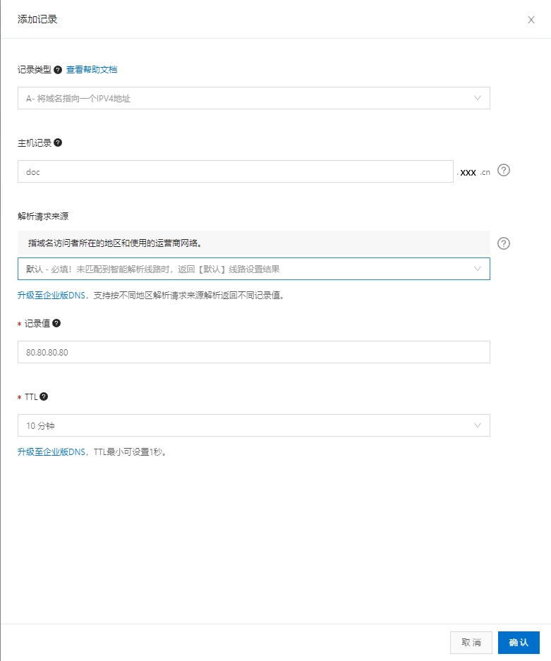
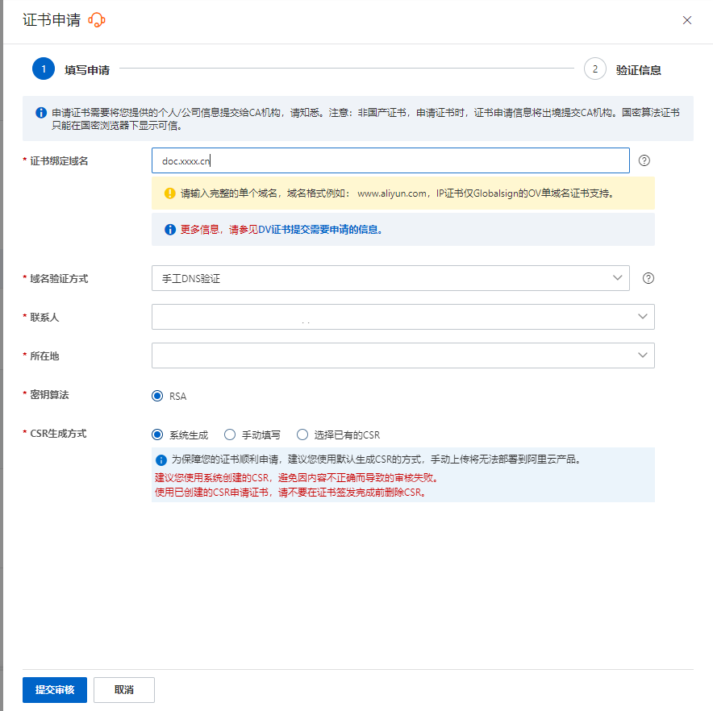
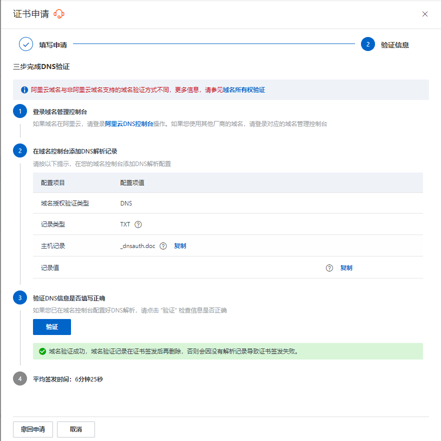
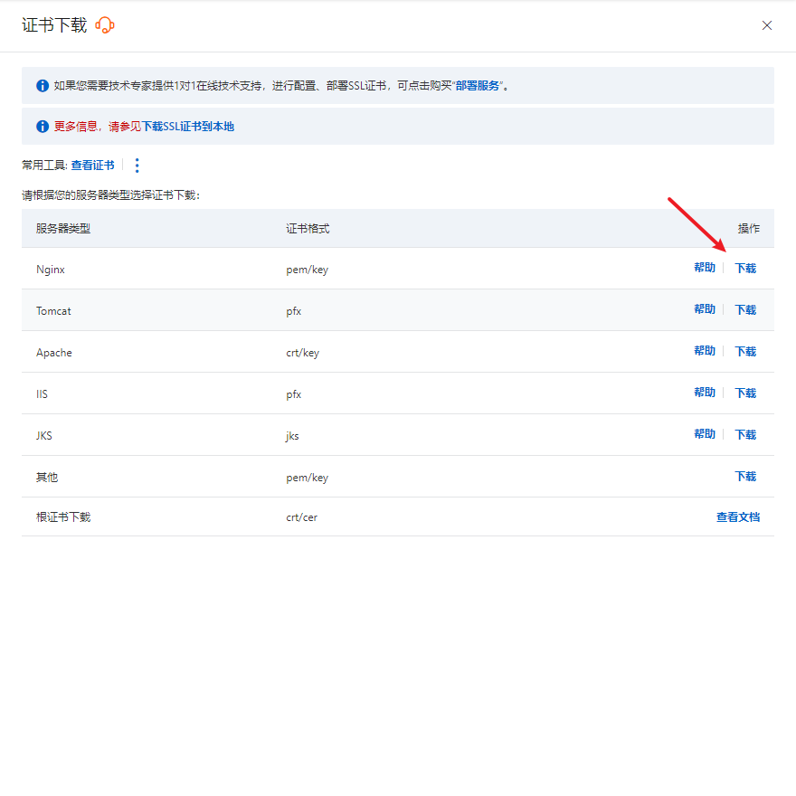

# 若依微服务docker-compose部署vuepress

## 📔 千寻简笔记介绍

千寻简文库已开源，Gitee与GitHub搜索`chihiro-doc`，包含笔记源文件`.md`，以及PDF版本方便阅读，文库采用精美主题，阅读体验更佳，如果文章对你有帮助请帮我点一个`Star`～

更新：`支持在线阅读文章，根据发布日期分类。`

@[toc]

## 简介

### 项目路径介绍

```yacas
chihiro-doc [项目名称]
	-docs
		-.vuepress	# 配置文件
			-dist	# build后的部署文件
			-public	# 公共文件，用于存放图片
			-config.js	# 配置文件，重点！
		-202304XXXX	# .md文件
	-package.json	# 依赖文件，运行命令在这里修改
	-README.md		# 项目介绍文件
```

## 解决方案

### 1 build项目上传文件

`\chihiro-doc\package.json`

```json
{
  "name": "chihiro-utils",
  "version": "1.0.0",
  "description": "",
  "main": "index.js",
  "scripts": {
    "dev": "vuepress dev docs",
    "build": "vuepress build docs"
  },
  "keywords": [],
  "author": "",
  "license": "ISC",
  "devDependencies": {
    "vuepress": "^1.9.9"
  }
}
```

`\chihiro-doc\docs\.vuepress\config.js`

```js
module.exports = {
    // 配置参考：https://blog.csdn.net/xiaoxianer321/article/details/119548202
    // 网站的一些基本配置
    // base:配置部署站点的基础路径，后续再介绍
    title: '千寻简', // 网站的标题
    description: '千寻简文库', // 网站的描述，它将会以 <meta> 标签渲染到当前页面的 HTML 中。
    head: [
        ['link', {rel: 'icon', href: '/logo.jpg'}] // 需要被注入到当前页面的 HTML <head> 中的标签
    ],
    // 修改dev启动端口号
    port: 8000,
    themeConfig: {
        // 禁用导航栏
        // navbar: true,
        // 设置自动生成侧边栏
        // sidebar: 'auto',
        // 设置深度，使用了sidebar: 'auto'的话只有设置0才会生效，否则默认2
        // sidebarDepth: 0,
        sidebar: [
            {
                title: '202306自强不息',   // 必要的
                sidebarDepth: 3, // 设置深度，使用了sidebar: 'auto'的话只有设置0才会生效，否则默认2
                initialOpenGroupIndex: 2, // 可选的,初始开放组索引, 默认值是 0
                children: [
                    '/202306自强不息/Java乐观锁实现文章点击量、收藏计数、点赞计数.md',
                    '/202306自强不息/Java对象空指针校验工具类.md',
                    '/202306自强不息/Maven国内镜像源.md',
                    '/202306自强不息/RuoYi前后端分离版部署流程.md',
                    '/202306自强不息/RuoYi-Cloud新建子模块注意事项、新建过程.md',
                    '/202306自强不息/Windows端口冲突停止Jar包.md',
                ]
            },
        ],
    }
}


```

打包项目

```sh
npm run build
```

打包完成的项目文件在`\chihiro-doc\docs\.vuepress\dist`，上传到服务器指定目录，作者上传到服务器的`/aService/docker-prod/chihiro/doc/dist`

### 2 配置域名

进入域名中心，选择域名解析，点击域名，添加记录



成功后获取到该域名：`doc.xxxx.cn`

### 3 配置https

#### 3.1 访问域名服务商

访问域名服务商，搜索ssl证书，申请免费证书额度（阿里云免费20个），填写域名`doc.xxxx.cn`



####  3.2 校验域名参数



#### 3.3 下载域名证书，选择nginx证书，



#### 3.4 解压上传

下载解压得到两个文件`doc.xxxx.cn.pem`、`doc.xxxx.cn.key`

上传到服务器的Nginx路径下的`nginx/cert`

### 4 配置nginx

#### 4.1 修改`docker-compose.yml`

由于作者是用docker-compose部署的，部署方式参考[【手把手教程】若依微服务版服务器部署](http://t.csdn.cn/AfmXu)，这里只需要添加一条文件映射的配置。`./chihiro/doc/dist/:/home/chihiro/projects/doc/dist`

```yaml
  ruoyi-nginx:
    container_name: ruoyi-nginx
    image: nginx
    build:
      context: ./nginx
    ports:
      - "80:80"
      - "8001:8001"
      - "443:443"
    volumes:
      - ./nginx/html/dist:/home/ruoyi/projects/ruoyi-ui
      - ./chihiro/doc/dist/:/home/chihiro/projects/doc/dist
      - ./nginx/conf/nginx.conf:/etc/nginx/nginx.conf
      - ./nginx/logs:/var/log/nginx
      - ./nginx/conf.d:/etc/nginx/conf.d
      - ./nginx/cert/:/etc/nginx/cert
    depends_on:
      - ruoyi-gateway
    links:
      - ruoyi-gateway
```

#### 4.2 修改`nginx.conf`

```yaml
worker_processes  1;

events {
    worker_connections  1024;
}

http {
    include       mime.types;
    default_type  application/octet-stream;
    sendfile        on;
    keepalive_timeout  65;

    server {
        listen 80;
        server_name doc.xxxx.cn www.doc.xxxx.cn;
        charset utf-8;
        location / {
            # 修改路径
            root   /home/chihiro/projects/doc/dist;
            # 修前端访问路径
            try_files $uri $uri/ /index.html;
            index  index.html index.htm;
        }
    }

    #以下属性中，以ssl开头的属性表示与证书配置有关。
    server {
        listen 443 ssl;
        #配置HTTPS的默认访问端口为443。
        #如果未在此处配置HTTPS的默认访问端口，可能会造成Nginx无法启动。
        #如果您使用Nginx 1.15.0及以上版本，请使用listen 443 ssl代替listen 443和ssl on。
        server_name doc.xxxx.cn www.doc.xxxx.cn;
        ssl_certificate cert/doc.xxxx.cn.pem;
        ssl_certificate_key cert/www.doc.xxxx.cn.key;
        ssl_session_timeout 5m;
        ssl_ciphers ECDHE-RSA-AES128-GCM-SHA256:ECDHE:ECDH:AES:HIGH:!NULL:!aNULL:!MD5:!ADH:!RC4;
        #表示使用的加密套件的类型。
        ssl_protocols TLSv1.1 TLSv1.2 TLSv1.3; #表示使用的TLS协议的类型，您需要自行评估是否配置TLSv1.1协议。
        ssl_prefer_server_ciphers on;
        # 项目路径
        root html;
        index index.html index.htm;
        location / {
            # 修改路径
            root   /home/chihiro/projects/doc/dist;
            # 修前端访问路径
            try_files $uri $uri/ /index.html;
            index  index.html index.htm;
        }
    }
}

```

#### 4.3 Nginx重新加载配置文件

```sh
# 进入nginx容器
# docker exec -it [容器名称] bash
docker exec -it ruoyi-nginx bash

#  重新加载配置文件此过成不用重启nginx容器
nginx -s reload

# exit 退出容器
exit 
```


