# IDEA中连接虚拟机、管理Docker

## 📔 千寻简笔记介绍

千寻简文库已开源，Gitee与GitHub搜索`chihiro-doc`，包含笔记源文件`.md`，以及PDF版本方便阅读，文库采用精美主题，阅读体验更佳，如果文章对你有帮助请帮我点一个`Star`～

更新：`支持在线阅读文章，根据发布日期分类。`

@[toc]

## 简介

教程截取至：[RuoYi-Cloud-Plus-Docker部署](https://juejin.cn/post/7220613829586976824#heading-9)

### 本文关键词

`IDEA中连接虚拟机`、`IDEA中SFTP连接`、`IDEA中连接Docker`

## 实现步骤

### 1 IDEA中连接虚拟机

- 配置完成后可以在IDEA中操作虚拟机

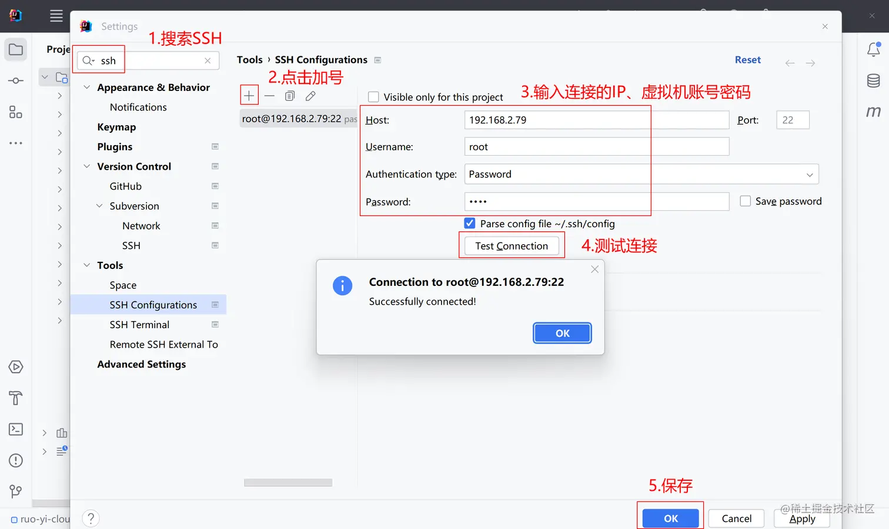

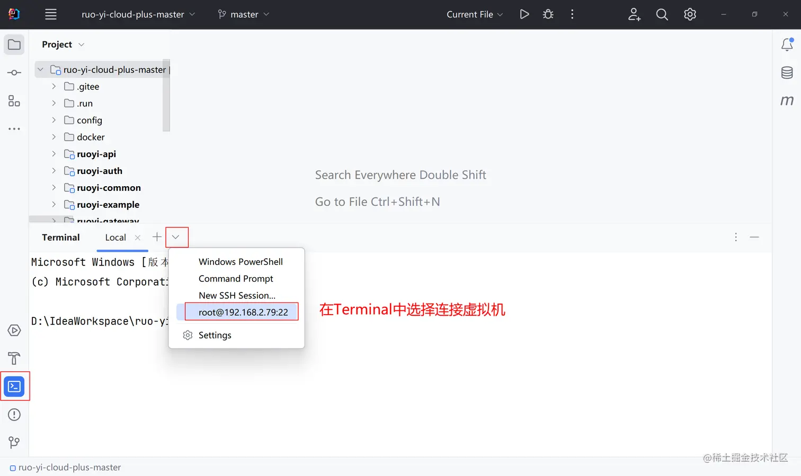

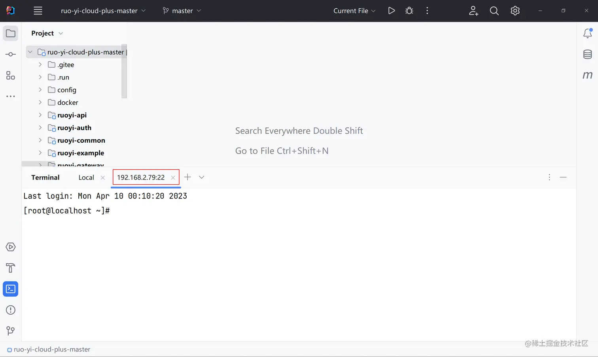

### 2 IDEA中SFTP连接

- 配置完成后可以在IDEA中上传文件到虚拟机中

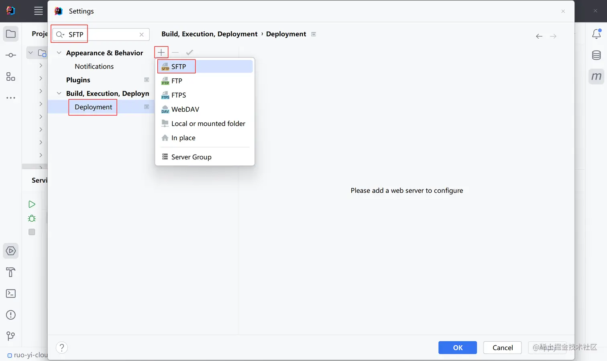

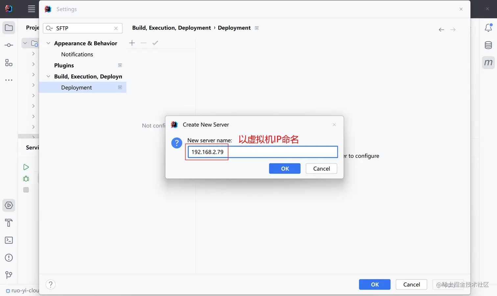

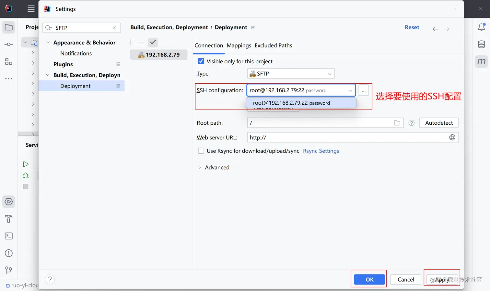

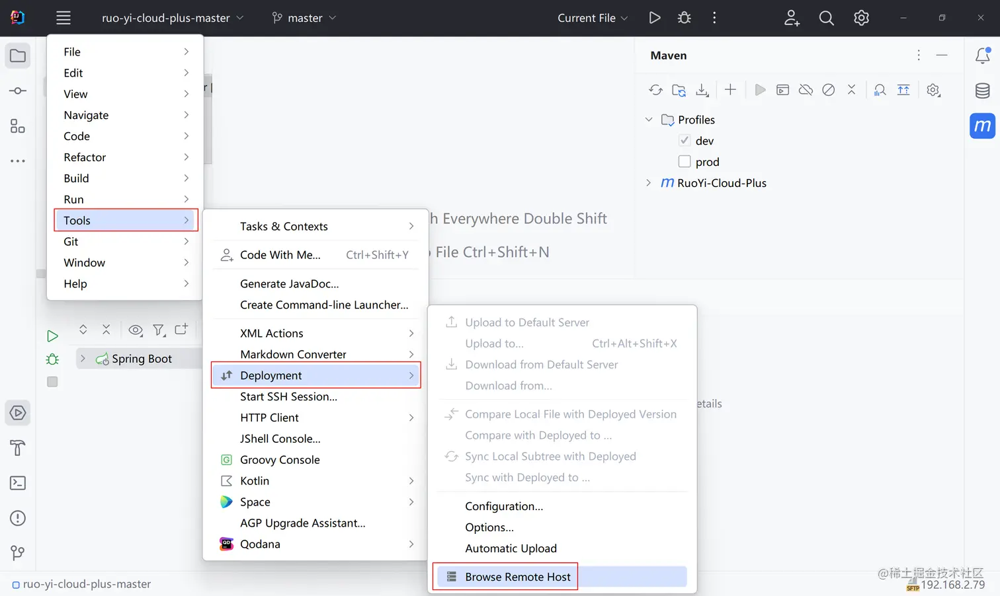

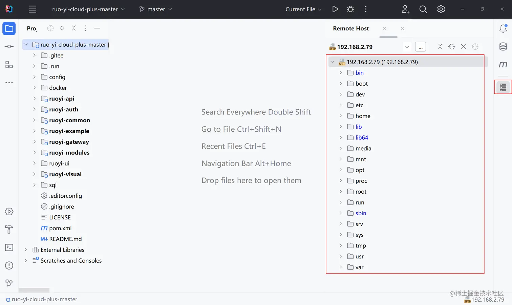

#### 修正：

settings -> `Build, Execution, Deployment` -> 右键`SFTP`

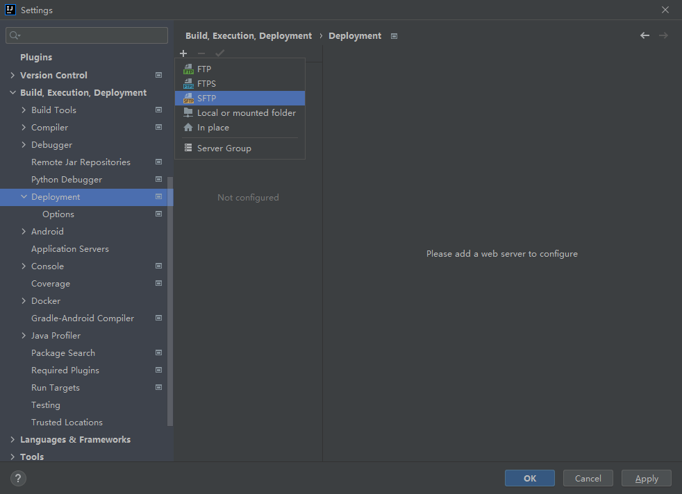

### 3 IDEA中连接Docker

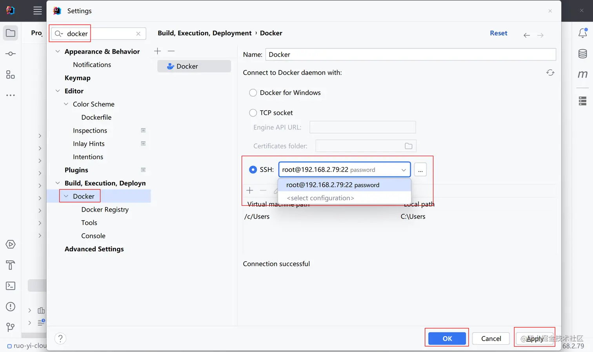

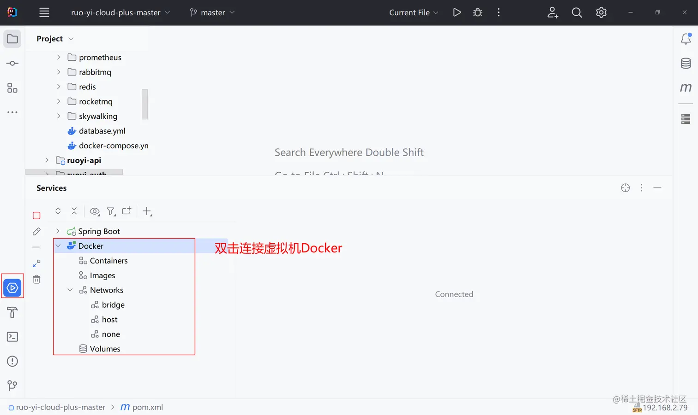
