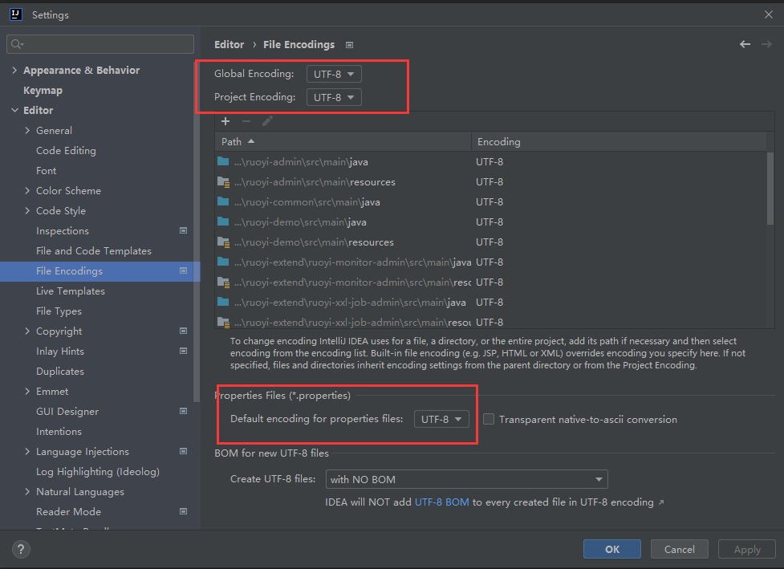
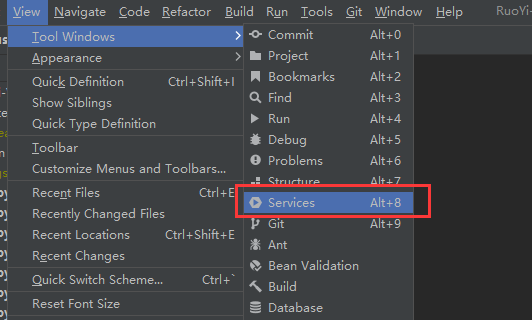
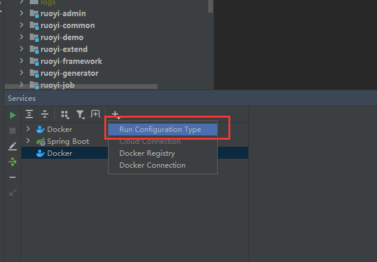
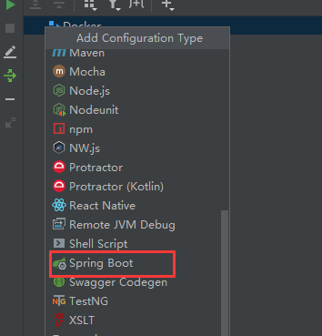
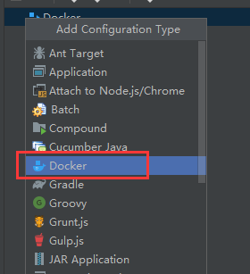
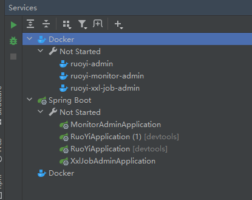
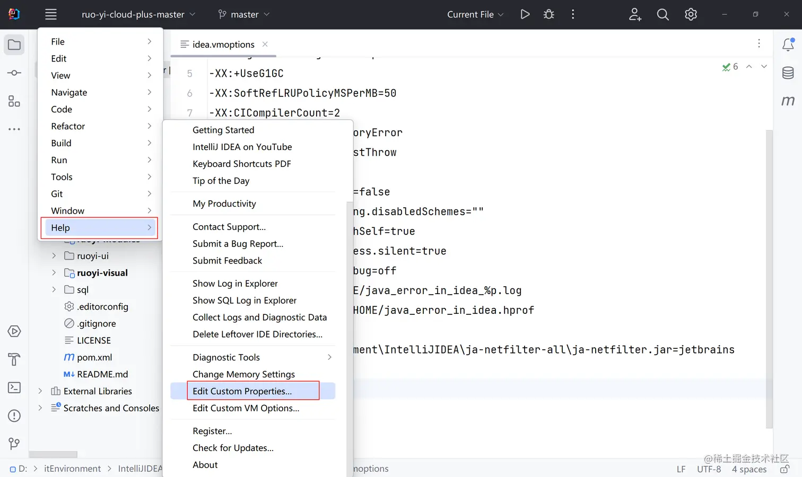
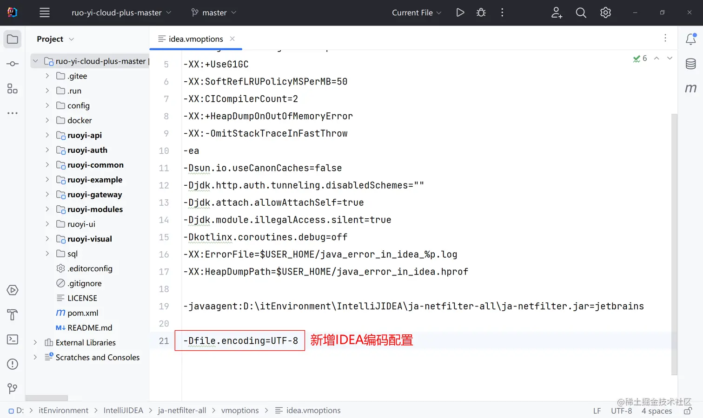
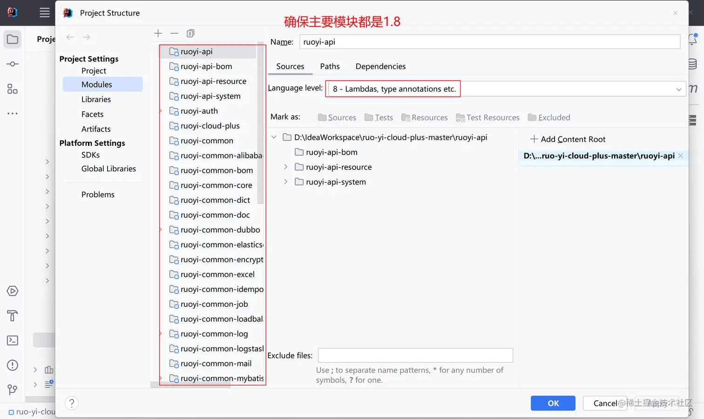
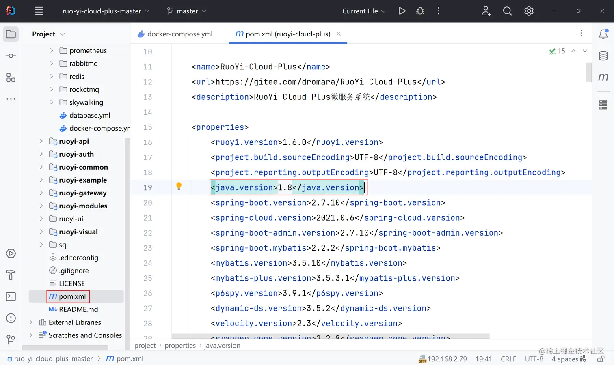

# Idea项目初始化配置

## 📔 千寻简笔记介绍

千寻简文库已开源，Gitee与GitHub搜索`chihiro-doc`，包含笔记源文件`.md`，以及PDF版本方便阅读，文库采用精美主题，阅读体验更佳，如果文章对你有帮助请帮我点一个`Star`～

更新：`支持在线阅读文章，根据发布日期分类。`

@[toc]

## 简介

当我们拉取一个项目的时候，初始化的配置，根据项目不同进行调整，以下仅作参考。

- 配置项目编码
-  配置运行看板
- 配置spring与docker看板
-  新增IDEA编码配置，解决控制台中文乱码
-  统一JDK版本

## 步骤

### 1 配置项目编码



### 2 配置运行看板



### 3 配置spring与docker看板

   

### 4 新增IDEA编码配置，解决控制台中文乱码



```
-Dfile.encoding=UTF-8
```



### 5 统一JDK版本




