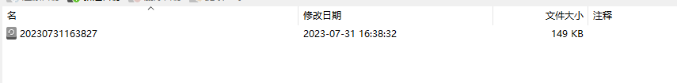

# 【迁移】Mysql数据库备份 迁移

## 📔 千寻简笔记介绍

千寻简文库已开源，Gitee与GitHub搜索`chihiro-doc`，包含笔记源文件`.md`，以及PDF版本方便阅读，文库采用精美主题，阅读体验更佳，如果文章对你有帮助请帮我点一个`Star`～

更新：`支持在线阅读文章，根据发布日期分类。`

@[toc]

## 简介

### 环境

- Navicat Premium 15

### 本文关键词

`备份数据`，`新建库`，`导入数据`，`恢复备份`

## 实现步骤

### 1 备份数据

流程：转储SQL文件 -> 结构和数据

### 2 新建库

流程：新建数据库 -> 输入数据库名称，字符集使用`utf8mb4`，排序规则使用`utf8mb4_general_ci`。

### 3 导入数据

流程：选择数据库右键 -> 运行sql -> 选择第一步导出的sql

### 4 备份数据

可以选择第一步的导出所有数据，下面是另外一种方式。

流程：菜单栏点击备份 -> 新建备份 -> 选择备份的位置 -> 点击备份开始备份。

### 5 恢复备份

流程：通过第四步的备份生成备份的文件，右击可以选择还原备份

