# 支付宝消息订阅

## 📔 千寻简笔记介绍

千寻简文库已开源，Gitee与GitHub搜索`chihiro-doc`，包含笔记源文件`.md`，以及PDF版本方便阅读，文库采用精美主题，阅读体验更佳，如果文章对你有帮助请帮我点一个`Star`～

更新：`支持在线阅读文章，根据发布日期分类。`

@[toc]

接入指南：https://opendocs.alipay.com/mini/api/requestSubscribeMessage

## 简介

**my.requestSubscribeMessage** 唤起客户端小程序消息订阅界面。

订阅界面是根据当前小程序在 [商家平台](https://mrchportalweb.alipay.com/operation/console/apps) 配置的消息模板 id 来展示对应消息的订阅选项（参考接入流程第 4 步）。

消息订阅分为一次性和长期性：
**一次性**：使用一次性消息模板订阅，每次向用户发送消息都需要用户在订阅界面点击同意后才可以发送。
**长期性**：使用长期性消息模板订阅，用户同意订阅后，可以多次向订阅用户发送消息。

## 申请流程

### 1 开发设置（开放平台）

**是否必须：** 是。

使用 **主账号** 登录 [开放平台](https://open.alipay.com/develop/manage) ，选择当前开发的小程序，根据下面的说明进行相关开发配置：

- 接口加签方式：必填
- 应用网关：必填
- 支付宝网关：必填
- 接口内容加密方式：选填，建议配置
- 服务器IP白名单：选填，涉及到敏感操作时建议配置

具体可参考文档 [开发设置](https://opendocs.alipay.com/mini/01rqd3#开发设置)。


### 2 配置主营行业（开放平台）

**是否必须：** 是。

使用 **主账号** 登录 [开放平台](https://open.alipay.com/develop/manage) ，选择当前开发的小程序，在 “小程序信息” 中配置主营行业，选择的主营行业不同，在配置消息模版（第 4 步）时，接入订阅消息模板列表展示的模板不同，具体可参考文档 [配置小程序主营行业](https://opendocs.alipay.com/mini/01rqd3#配置小程序主营行业)。


### 3 绑定产品（开放平台）

**是否必须：** 是。

消息订阅不是小程序的基础 API ，需要在 [开放平台](https://open.alipay.com/develop/manage) 绑定产品的列表中，给产品 **小程序** 绑定 **消息** 权限。具体可参考文档 [产品绑定](https://opendocs.alipay.com/mini/01rqd3#产品绑定)。


### 4 配置消息模板（商家平台）

**是否必须：** 是。

使用 **主账号** 登录 [商家平台](https://mrchportalweb.alipay.com/operation/console/apps)，选择当前开发的小程序进行配置，具体可参考文档 [领用订阅消息模板](https://opendocs.alipay.com/mini/01rnqx#第一步：领用订阅消息模板)。


### 5 API调用（小程序）

**是否必须：** 是。

在小程序中调用 API ，参数属性 entityIds 中传入领用的消息模版 id（最多三个），调用后弹出订阅界面。查看示例。


### 6 发送消息（服务端）

**是否必须：** 是。

在用户授权完成（开发接入完成）之后，可以通过以下两种方式发送消息：

1. 通过服务端调用 [alipay.open.app.mini.templatemessage.send](https://opendocs.alipay.com/mini/02cth2) 向支付宝发送对应模板的消息。
2. 通过 **主账号** 登录 [商家平台](https://mrchportalweb.alipay.com/operation/console/apps)，进入 **运营中心** 选择对应小程序，点击左侧菜单中的 ”消息“，在订阅消息列表中，用 “配置发送” 发送消息，无需服务端编写代码。

订阅消息发送后，可在 **支付宝首页 、消息盒子、APP PUSH** 等位置收到消息提醒。


## 详细教程

### 1 开发设置（开放平台）

在 **开发** > **开发设置** 中配置应用信息。

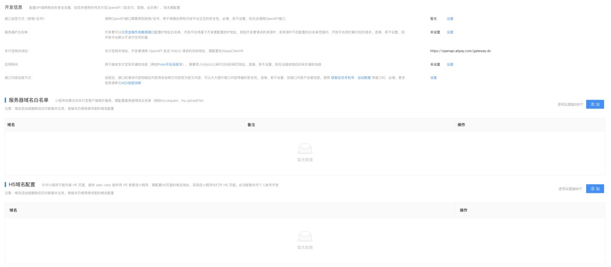

#### 接口加签方式

**必填。**用于防止数据篡改，保障应用和支付宝交互的安全性，可查看 [接口加签方式](https://opendocs.alipay.com/common/02mriz)。

**说明**：若产品涉及 [资金支出的接口](https://opendocs.alipay.com/common/02kg66) 必须 [设置证书加签方式](https://opendocs.alipay.com/common/02kdnc#公钥证书方式_2)。

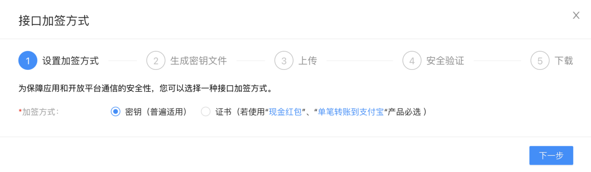

#### 服务器 IP 白名单

**选填。**用于提高应用访问开放平台的安全性，避免因应用私钥泄漏等原因导致业务受损，保障用户资金安全，可查看 [服务器 IP 白名单](https://opendocs.alipay.com/common/02kg65)。

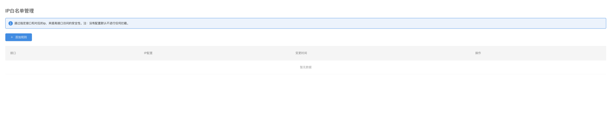

#### 支付宝网关

**必填。**开发者调用 OpenAPI 发送 http(s) 请求至支付宝的目标地址（gateway），固定为 `https://openapi.alipay.com/gateway.do`。

#### 应用网关

**必填。**用于接收支付宝异步通知消息，需要传入 http(s) 公网可访问网页地址，可查看 [应用网关](https://opendocs.alipay.com/common/02qibh)。

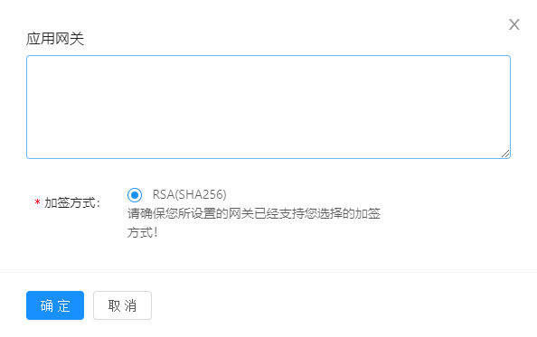

#### 接口内容加密方式

**选填。**用于加 / 解密 OpenAPI bizContent 报文内容，可大幅提升接口内容传输的安全性。可查看 [接口内容加密方式](https://opendocs.alipay.com/common/02mse3)。

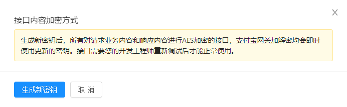

#### 服务器域名白名单

**选填**。**小程序** 若需要获取客户端域外资源（例如获取图片、服务端数据等），需要配置服务器域名白名单。

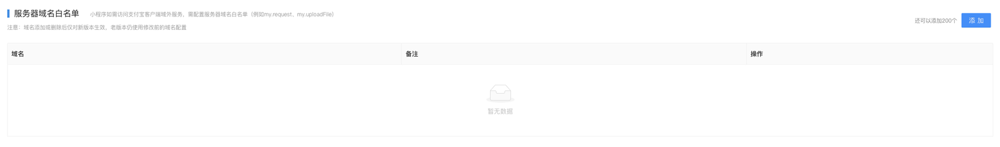


### 2 配置主营行业（开放平台）

进入小程序详情页 > **基础设置** > **小程序信息，**点击 **编辑** 按钮补充 **主营行业**。

**说明：**不同小程序主营行业展示的模板库列表不同。

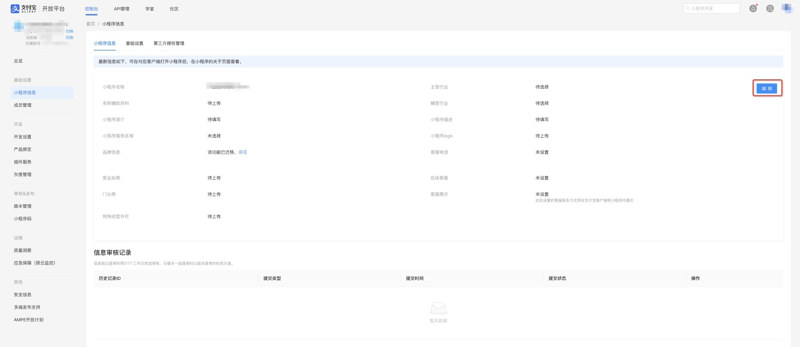


### 3 绑定产品（开放平台）

1. 创建应用后，在 **开发** > **产品绑定** > **绑定产品** > 找到 **小程序**，点击 **修改**。
   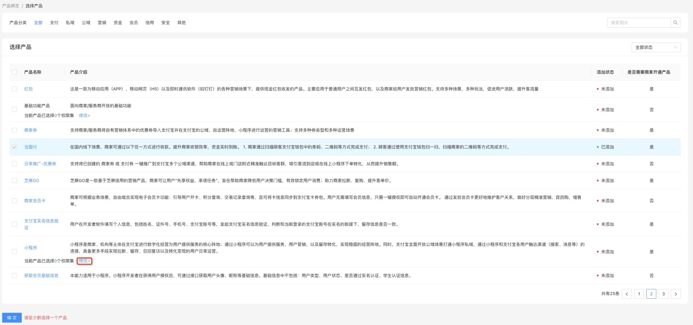
2. 在权限集中勾选 **消息**，点击 **确定**。
   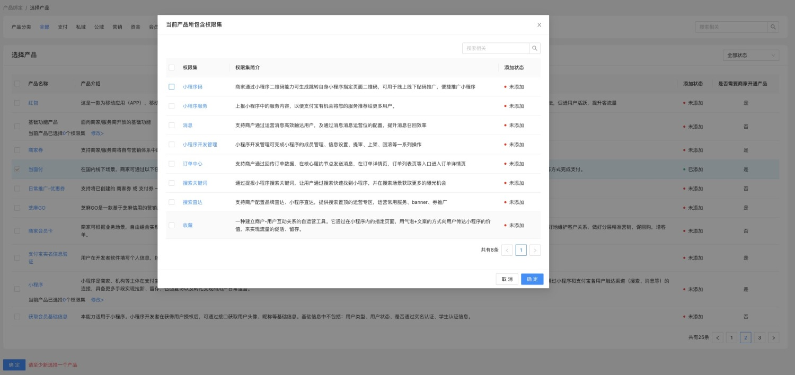
3. 在选择产品页面，点击 **确定**，完成产品绑定。
   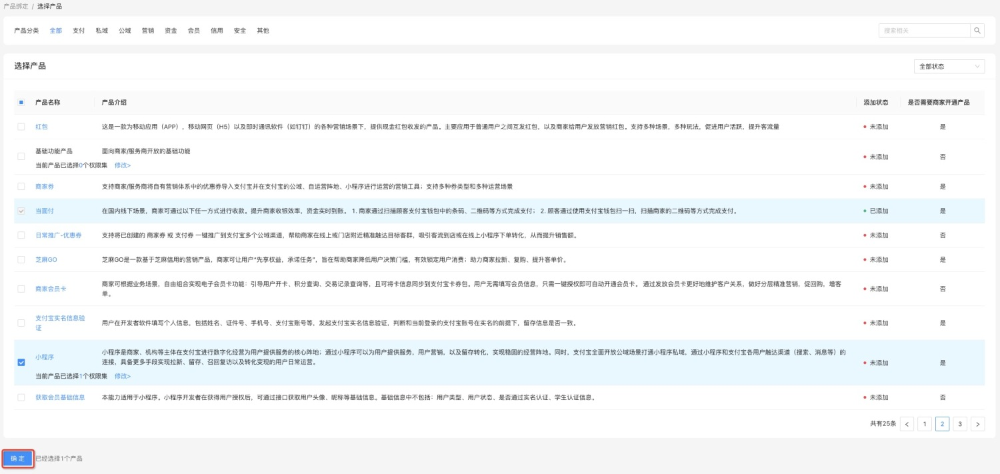


### 4 配置消息模板（商家平台）

1. 登录 **支付宝商家平台** > **运营中心** > [小程序](https://mrchportalweb.alipay.com/operation/console/apps)，在 **我的小程序** 点击需要接入消息的小程序。 
   
2. 点击左侧 **召回** > **消息**，进入小程序消息页面选择接入订阅消息，点击 **去接入**。
   
3. 进入接入订阅消息模板页面，可根据自身行业类型选择对应 **行业** 下的消息模板，也可根据订阅类型 **一次性订阅**、**长期订阅** 来选择消息模板，还可在搜索框中搜索所需模板关键字，查询相关消息模板。若无合适的模板也可点击 **创建模板**，申请新模板，审核通过后也可做领用。**注意**：小程序不同主营行业展示的模板库列表不同，例如：银行行业不会展示取餐提醒模板。
   
4. 选择模板后，配置关键词及顺序。
   **说明**：右侧示例图会实时展示该订阅消息在用户界面效果。
   
5. 完成消息模板配置后，可点击 **立即接入**，进行技术对接。
   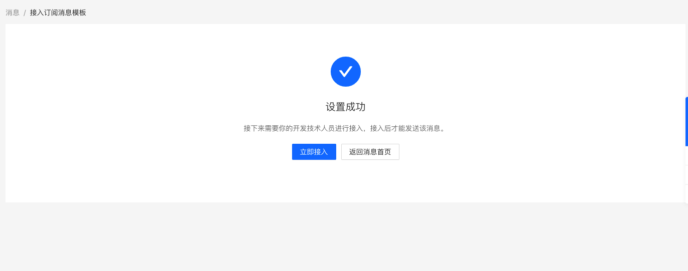


### 5 API调用（小程序）

#### 代码示例

`my.requestSubscribeMessage(Object object)`

```js
my.requestSubscribeMessage({
  entityIds: [
    'ac768fca1ce245ccae9404bb5243c49b',
    '9aa357acb7c6434aba294aded1cdfb7c',
  ],
  success: res => {
    console.log('接口调用成功的回调', res);
  },
  fail: err => {
    console.log('接口调用失败的回调', err);
  }
});
```

`success` 参数

```json
{
  "success": true,
  "stat": "ok",
  "behavior": "subscribe",
  "result": {
    "subscribeEntityIds": [
      "cbc3487d54a648e0b38e334b2b047dd3"
    ],
    "subscribedEntityIds": [
      "cbc3487d54a648e0b38e334b2b047dd3"
    ],
    "unsubscribedEntityIds": [],
    "currentSubscribedEntityIds": [
      "cbc3487d54a648e0b38e334b2b047dd3"
    ]
  },
  "show": true,
  "keep": false,
  "refuse": false,
  "cbc3487d54a648e0b38e334b2b047dd3": "accept"
}
```

`fail` 参数

```json
{
  "success": false,
  "stat": "ok",
  "behavior": "cancel",
  "result": {
    "entityList": [
      "cbc3487d54a648e0b38e334b2b047dd3"
    ], 
    "subscribedEntityIds": [],
    "unsubscribedEntityIds": [
      "cbc3487d54a648e0b38e334b2b047dd3"
    ],
    "currentSubscribedEntityIds": []
  },
  "show": true,
  "keep": true,
  "refuse": false,
  "error": 11,
  "errorCode": 11,
  "errorMessage": "用户取消订阅",
  "cbc3487d54a648e0b38e334b2b047dd3": "accept"
}
```

> entityList 是传入的模板 id 集合，仅在取消订阅场景下返回。


### 6 发送消息（服务端）

#### 发送订阅消息

当小程序用户基于消息订阅接口产生订阅行为后，开发者可调用 [alipay.open.app.mini.templatemessage.send（小程序发送模板消息）](https://opendocs.alipay.com/mini/6430ce5a_alipay.open.app.mini.templatemessage.send)，向订阅模板的用户发送模板消息。

**说明**：针对内容一致、可以普发给用户的消息，还支持免代码开发的方式发送，商家可在 [消息运营](https://mrchportalweb.alipay.com/operation/mini/ops/publicmsg/msgTemplateV2/myTemplate) > **消息接入** > **订阅消息** > **批量发送** 进行操作。

##### 调用流程图

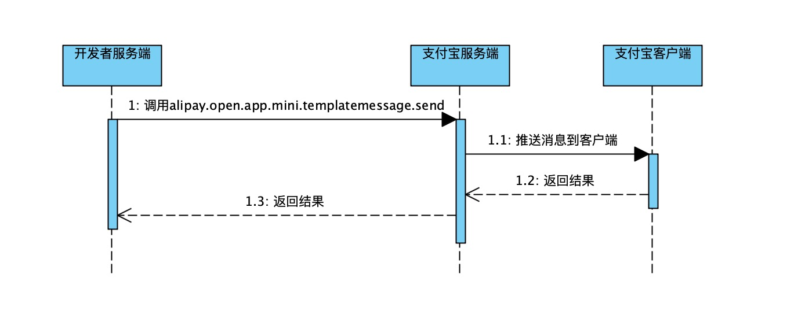

##### 示例代码

```java
package com.java.sdk.demo;

import com.alipay.api.AlipayApiException;
import com.alipay.api.AlipayClient;
import com.alipay.api.DefaultAlipayClient;
import com.alipay.api.CertAlipayRequest;
import com.alipay.api.AlipayConfig;
import com.alipay.api.domain.AlipayOpenAppMiniTemplatemessageSendModel;
import com.alipay.api.response.AlipayOpenAppMiniTemplatemessageSendResponse;
import com.alipay.api.request.AlipayOpenAppMiniTemplatemessageSendRequest;
import com.alipay.api.FileItem;
import java.util.Base64;
import java.util.ArrayList;
import java.util.List;

public class AlipayOpenAppMiniTemplatemessageSend {

    public static void main(String[] args) throws AlipayApiException {
        String privateKey = "<-- 请填写您的应用私钥，例如：MIIEvQIBADANB ... ... -->";
        String alipayPublicKey = "<-- 请填写您的支付宝公钥，例如：MIIBIjANBg... -->";
        AlipayConfig alipayConfig = new AlipayConfig();
        alipayConfig.setServerUrl("https://openapi.alipay.com/gateway.do");
        alipayConfig.setAppId("<-- 请填写您的AppId，例如：2019091767145019 -->");
        alipayConfig.setPrivateKey(privateKey);
        alipayConfig.setFormat("json");
        alipayConfig.setAlipayPublicKey(alipayPublicKey);
        alipayConfig.setCharset("UTF8");
        alipayConfig.setSignType("RSA2");
        AlipayClient alipayClient = new DefaultAlipayClient(alipayConfig);
        AlipayOpenAppMiniTemplatemessageSendRequest request = new AlipayOpenAppMiniTemplatemessageSendRequest();
        AlipayOpenAppMiniTemplatemessageSendModel model = new AlipayOpenAppMiniTemplatemessageSendModel();
        model.setFormId("2017010100000000580012345678");
        model.setData("{\"keyword1\": {\"value\" : \"12:00\"},\"keyword2\": {\"value\" : \"20180808\"},\"keyword3\": {\"value\" : \"支付宝\"}}");
        model.setPage("page/component/index");
        model.setUserTemplateId("MDI4YzIxMDE2M2I5YTQzYjUxNWE4MjA4NmU1MTIyYmM=");
        model.setToUserId("2088102122458832");
        request.setBizModel(model);
        AlipayOpenAppMiniTemplatemessageSendResponse response = alipayClient.execute(request);
        System.out.println(response.getBody());
        if (response.isSuccess()) {
            System.out.println("调用成功");
        } else {
            System.out.println("调用失败");
            // sdk版本是"4.38.0.ALL"及以上,可以参考下面的示例获取诊断链接
            // String diagnosisUrl = DiagnosisUtils.getDiagnosisUrl(response);
            // System.out.println(diagnosisUrl);
        }
    }
}
```

重要入参说明：

- to_user_id：必填，接收模板消息用户支付宝 user_id，可通过 [用户授权](https://opendocs.alipay.com/mini/api/openapi-authorize) 获取。
- user_template_id：必填，消息模板 ID。登录 [运营中心                                                               ](https://business.alipay.com/) 进入消息运营添加订阅信息后点详情即可看到，详情可查看上文 **选用消息模板**。
- page：必填，模板消息 **进入小程序查看** 按钮跳转的小程序页面地址。
- data：必填，开发者需要发送模板消息中的自定义部分来替换模板的占位符

> 注意：占位符必须和申请模板时的关键词一一匹配（包括顺序）。

#### 查询消息订阅关系

开发者可调用 [alipay.open.app.messagetemplate.subscribe.query（模板订阅关系查询）](https://opendocs.alipay.com/mini/69b7fd23_alipay.open.app.messagetemplate.subscribe.query)，提前查询用户对指定消息模板的订阅关系，再根据订阅关系引导用户进行订阅和精准触达消息。

**说明**：若开发者想实现去订阅类型的引导功能，可以通过本接口进行订阅关系判断，根据响应结果展示引导文案。

##### 示例代码

```java
package com.java.sdk.demo;

import com.alipay.api.AlipayApiException;
import com.alipay.api.AlipayClient;
import com.alipay.api.DefaultAlipayClient;
import com.alipay.api.CertAlipayRequest;
import com.alipay.api.AlipayConfig;
import com.alipay.api.domain.AlipayOpenAppMessagetemplateSubscribeQueryModel;
import com.alipay.api.response.AlipayOpenAppMessagetemplateSubscribeQueryResponse;
import com.alipay.api.request.AlipayOpenAppMessagetemplateSubscribeQueryRequest;
import com.alipay.api.FileItem;
import java.util.Base64;
import java.util.ArrayList;
import java.util.List;

public class AlipayOpenAppMessagetemplateSubscribeQuery {

    public static void main(String[] args) throws AlipayApiException {
        String privateKey = "<-- 请填写您的应用私钥，例如：MIIEvQIBADANB ... ... -->";
        String alipayPublicKey = "<-- 请填写您的支付宝公钥，例如：MIIBIjANBg... -->";
        AlipayConfig alipayConfig = new AlipayConfig();
        alipayConfig.setServerUrl("https://openapi.alipay.com/gateway.do");
        alipayConfig.setAppId("<-- 请填写您的AppId，例如：2019091767145019 -->");
        alipayConfig.setPrivateKey(privateKey);
        alipayConfig.setFormat("json");
        alipayConfig.setAlipayPublicKey(alipayPublicKey);
        alipayConfig.setCharset("UTF8");
        alipayConfig.setSignType("RSA2");
        AlipayClient alipayClient = new DefaultAlipayClient(alipayConfig);
        AlipayOpenAppMessagetemplateSubscribeQueryRequest request = new AlipayOpenAppMessagetemplateSubscribeQueryRequest();
        AlipayOpenAppMessagetemplateSubscribeQueryModel model = new AlipayOpenAppMessagetemplateSubscribeQueryModel();
        List<String> templateIdList = new ArrayList<String>();
        templateIdList.add("6511999536b14ba5830e3a0289ea69a");
        templateIdList.add("0b1fcca882aa435382ae98641e14d37");
        templateIdList.add("a3b396be6fd345579221af5dea35028");
        model.setTemplateIdList(templateIdList);
        model.setUserId("2088202882050410");
        request.setBizModel(model);
        AlipayOpenAppMessagetemplateSubscribeQueryResponse response = alipayClient.execute(request);
        System.out.println(response.getBody());
        if (response.isSuccess()) {
            System.out.println("调用成功");
        } else {
            System.out.println("调用失败");
        }
    }
}
```

##### 重要入参说明

- user_id：必填，接收模板消息的用户支付宝 user_id，可通过 [my.getAuthCode](https://opendocs.alipay.com/mini/api/openapi-authorize) 获取。
- template_id_list：消息模板 id 列表，最多不超过 3 个。模板 id 需要保持同一个应用主体，并且展示在同一个订阅窗口中的模板 id。

## 遇到的问题

### ISV权限不足

去开放平台绑定产品：消息

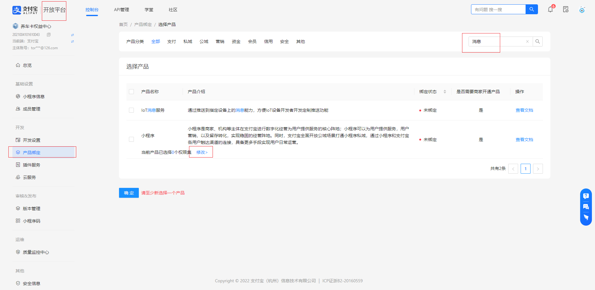

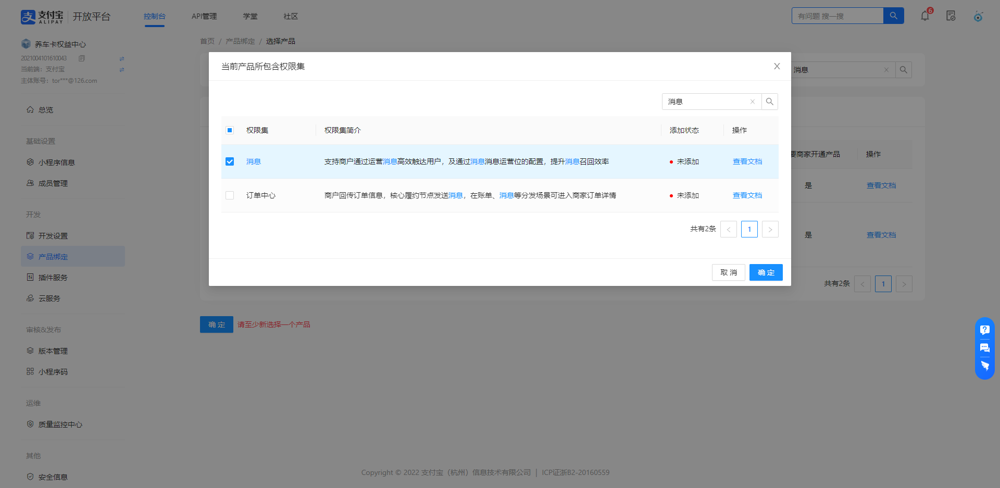

