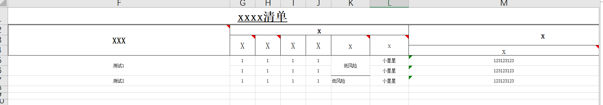
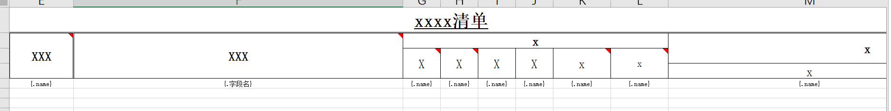

# EasyExcel导出复杂表格到邮箱

## 📔 千寻简笔记介绍

千寻简文库已开源，Gitee与GitHub搜索`chihiro-doc`，包含笔记源文件`.md`，以及PDF版本方便阅读，文库采用精美主题，阅读体验更佳，如果文章对你有帮助请帮我点一个`Star`～

更新：`支持在线阅读文章，根据发布日期分类。`

@[toc]

## 简介

在企业开发中，我们经常需要面对复杂的Excel导出，本文基于EasyExcel，自定义单元格合并策略，达到我们需要导出的效果。

邮箱配置可以参考主页的`ruoyi-vue-plus 配置邮箱`。

### 效果图



### 版本

```xml
        <dependency>
            <groupId>com.alibaba</groupId>
            <artifactId>easyexcel</artifactId>
            <version>3.3.2</version>
        </dependency>
```

### 本文关键词

`自定义单元格合并策略`、`调用示例`、`工具类Bo`、` Excel 模板导出工具类`、`Vo配置`、`效果图`、`MailUtils`、`模板配置`

## 实现步骤

### 导出到邮箱

#### 1 调用示例

- 模板存放位置`src/main/resources/templates` 目录下。
- `templateName`只传文件名:`WorkSafetyReportTemplate.xlsx`。
- `setMergeRowIndex`：从哪一行开始合并0开始。
- `setUniqueColumnIndex`：唯一标识列。
- `setMergeColumnIndex`：需要合并的列。
- `setList`：导出的数据。
- `MailUtils.sendText`：使用ruoyi提供的MailUtils工具发送邮件。

```java
    /***
     * 1 根据模板的生成对应excel文件
     * 2.使用ruoyi提供的MailUtils工具发送邮件，附件为生成的excel文件
     * **/
    public Boolean exportExcelToEmail(XXXX bo) {
        // 省略业务查询
        List<Xxxxxx> dataList = iRiskXxxxxxService.queryList();

        EasyExcelExportBo exportBo = new EasyExcelExportBo();
        exportBo.setTemplateName("WorkXxxxxTemplate.xlsx");
        exportBo.setMergeRowIndex(1);
        exportBo.setUniqueColumnIndex(1);
        exportBo.setMergeColumnIndex(Sets.newHashSet(1,2,3,11));
        exportBo.setList(dataList);
        // 返回文件路径
        String filePath = new EasyExcelExportUtil().export(exportBo);
        File file = new File(filePath);
        MailUtils.sendText(bo.getEmail(), "导出附件", "导出测试清单", file);
        return true;
    }
```

#### 2 工具类Bo

- 用于传输导出必要参数。

`EasyExcelExportBo.java`

```java
import lombok.Data;
import java.util.List;
import java.util.Set;

/**
 * 导出必要参数
 * @author Star
 */
@Data
public class EasyExcelExportBo {
    /**
     * 唯一标识列(该列cell内容一定是全局唯一的,当cell的值相等时才能进行下一列合并)
     */
    private Integer uniqueColumnIndex;

    /**
     * 从哪一行开始合并,从0开始
     */
    private Integer mergeRowIndex;

    /**
     * 合并列编号,从0开始：需要合并的列
     */
    private Set<Integer> mergeColumnIndex;

    /**
     * 模板文件名
     *
     * 默认存放在src/main/resources/templates 目录下
     * templateName只传文件名:WorkSafetyReportTemplate.xlsx
     */
    private String templateName;

    /**
     * 导出数据Vo
     */
    private List<?> list;
}
```

#### 3 Excel 模板导出工具类

- 封装的Excel 模板导出工具类。

`EasyExcelExportUtil.java`

```java
import cn.hutool.core.io.resource.ResourceUtil;
import com.alibaba.excel.EasyExcel;
import com.alibaba.excel.ExcelWriter;
import com.alibaba.excel.support.ExcelTypeEnum;
import com.alibaba.excel.write.metadata.WriteSheet;
import com.google.common.collect.Sets;
import com.ruoyi.common.exception.ServiceException;
import com.ruoyi.papp.model.EasyExcelExportBo;
import com.ruoyi.project.domain.vo.RiskAssessmentVo;
import org.slf4j.Logger;
import org.slf4j.LoggerFactory;

import java.io.IOException;
import java.io.InputStream;
import java.util.ArrayList;

/**
 * Excel 模板导出工具类
 * @author Star
 */
public class EasyExcelExportUtil {
    private static Logger logger = LoggerFactory.getLogger(EasyExcelExportUtil.class);

    /**
     * 获取resources路径
     * @return
     */
    public static String getPath() {
        return EasyExcelExportUtil.class.getResource("/").getPath();
    }


    /**
     * 导出方法
     * @param paramet
     * @return 文件路径
     */
    public String export(EasyExcelExportBo paramet){
        if (paramet.getTemplateName() == null) {
            throw new ServiceException("请填写模板文件名");
        }
        if (paramet.getMergeRowIndex() == null) {
            throw new ServiceException("请填写合并行");
        }
        if (paramet.getUniqueColumnIndex() == null) {
            throw new ServiceException("请填写唯一标识列");
        }
        if (paramet.getList() == null || paramet.getList().size() == 0) {
            throw new ServiceException("请填充导出的数据");
        }
        if (paramet.getMergeColumnIndex() == null || paramet.getMergeColumnIndex().size() == 0) {
            throw new ServiceException("请输入需要合并的列");
        }

        //处理文件导出
        InputStream template = null;
        try {
            // 模板路径
            template = ResourceUtil.getStream("classpath:templates/"+paramet.getTemplateName());
            // 导出文件名称
            String fileName = getPath() + "templateWrite" + System.currentTimeMillis() + ".xlsx";

            //读取Excel
            ExcelWriter excelWriter = EasyExcel.write(fileName)
                .withTemplate(template)
                .excelType(ExcelTypeEnum.XLSX)
                .registerWriteHandler(new CellMergeStrategy(paramet.getUniqueColumnIndex(), paramet.getMergeRowIndex(), paramet.getMergeColumnIndex()))
                .build();
            WriteSheet writeSheet = EasyExcel.writerSheet().build();

            //list map 是查询并需导出的数据，并且里面的字段和excel需要导出的字段对应
            // 直接写入Excel数据
            excelWriter.fill(paramet.getList(), writeSheet);
            excelWriter.finish();
            logger.info("文件导出完毕，路径："+fileName);
            return fileName;
        } catch (Exception e) {
            System.out.println(e.getMessage());
            throw new RuntimeException("导出文件错误");
        } finally {
            if (template != null) {
                try {
                    template.close();
                } catch (IOException e) {
                    e.printStackTrace();
                }
            }
        }
    }

}
```

#### 4 自定义单元格合并策略（重点）

- 自定义单元格合并策略，可以指定某一个唯一列`uniqueColumnIndex`做为合并的条件。

`CellMergeStrategy.java`

```java
import com.alibaba.excel.metadata.Head;
import com.alibaba.excel.write.merge.AbstractMergeStrategy;
import com.google.common.collect.Lists;
import org.apache.poi.ss.usermodel.Cell;
import org.apache.poi.ss.usermodel.CellType;
import org.apache.poi.ss.usermodel.Sheet;
import org.apache.poi.ss.util.CellRangeAddress;

import java.util.List;
import java.util.Set;


/**
 * 自定义单元格合并策略：推荐使用
 * @author Star
 */
public class CellMergeStrategy extends AbstractMergeStrategy {

    /** 唯一标识列(该列cell内容一定是全局唯一的,当cell的值相等时才能进行下一列合并) */
    private Integer uniqueColumnIndex;
    /** 从哪一行开始合并 */
    private Integer mergeRowIndex = 0;
    /** 合并列编号,从0开始 */
    private List<Integer> mergeColumnIndex = Lists.newArrayList();

    private CellMergeStrategy() {
    }

    /**
     * @param uniqueColumnIndex 唯一标识列(该列cell内容一定是全局唯一的,当cell的值相等时才能进行下一列合并)
     * @param mergeRowIndex 从哪一行开始合并
     * @param mergeColumnIndex 合并列编号,从0开始：需要合并的列
     */
    public CellMergeStrategy(Integer uniqueColumnIndex, Integer mergeRowIndex, Set<Integer> mergeColumnIndex) {
        mergeColumnIndex.stream().forEach(item -> {
            this.mergeColumnIndex.add(item);
        });
        this.mergeColumnIndex.stream().sorted();

        if (null == uniqueColumnIndex) {
            this.uniqueColumnIndex = this.mergeColumnIndex.get(0);
        } else {
            this.uniqueColumnIndex = uniqueColumnIndex;
        }
        this.mergeRowIndex = mergeRowIndex;
    }

    @Override
    protected void merge(Sheet sheet, Cell cell, Head head, Integer relativeRowIndex) {
        int curColIndex = cell.getColumnIndex();
        int curRowIndex = cell.getRowIndex();

        // 判断该列是否需要合并
        if (!mergeColumnIndex.contains(curColIndex)) {
            return;
        }

        if (curRowIndex > mergeRowIndex) {
            for (int i = 0; i < mergeColumnIndex.size(); i++) {
                if (curColIndex == mergeColumnIndex.get(i)) {
                    this.mergeRow(sheet, cell, curRowIndex, curColIndex, uniqueColumnIndex);
                    break;
                }
            }
        }
    }

    /**
     * 向上合并单元格
     * @param cell              当前单元格
     * @param rowIndex          当前行
     * @param colIndex          当前列
     * @param uniqueColIndex    唯一标识列(该列cell内容一定是全局唯一的,当cell的值相等时才能进行下一列合并)
     */
    private void mergeRow(Sheet sheet, Cell cell, int rowIndex, int colIndex, int uniqueColIndex) {
        Object curCellValue = getCellValue(cell);
        Object preCellValue = getCellValue(cell.getSheet().getRow(rowIndex - 1).getCell(colIndex));
        boolean cellEqual = preCellValue.equals(curCellValue);

        boolean baseCellEqual = true;
        if (colIndex >= uniqueColIndex) {
            Object baseCellValue = getCellValue(cell.getRow().getCell(uniqueColIndex));
            Object preBaseCellValue = getCellValue(cell.getSheet().getRow(rowIndex - 1).getCell(uniqueColIndex));
            baseCellEqual = baseCellValue.equals(preBaseCellValue);
        }

        /**
         * 合并条件
         * 1. 将当前单元格数据与上一个单元格数据比较,相同则执行合并逻辑
         * 2. 唯一标识列内容相同，才能进行下一列合并
         */
        if (!(cellEqual && baseCellEqual)) {
            return;
        }

        List<CellRangeAddress> mergeRegionList = sheet.getMergedRegions();
        boolean isMerged = false;
        for (int i = 0; i < mergeRegionList.size() && !isMerged; i++) {
            CellRangeAddress cellRange = mergeRegionList.get(i);
            // 若上一个单元格已经被合并，则先移出原有的合并单元，再重新添加合并单元
            if (cellRange.isInRange(rowIndex - 1, colIndex)) {
                sheet.removeMergedRegion(i);
                cellRange.setLastRow(rowIndex);
                sheet.addMergedRegion(cellRange);
                isMerged = true;
            }
        }
        // 若上一个单元格未被合并，则新增合并单元
        if (!isMerged) {
            CellRangeAddress cellRange = new CellRangeAddress(rowIndex - 1, rowIndex, colIndex, colIndex);
            sheet.addMergedRegion(cellRange);
        }
    }

    private Object getCellValue(Cell baseCell) {
        return CellType.STRING.equals(baseCell.getCellType()) ? baseCell.getStringCellValue() : baseCell.getNumericCellValue();
    }

}
```

#### 5 Vo配置

- 业务的数据

- `@ColumnWidth(100 / 8)`：列宽
- `@HeadStyle(horizontalAlignment = HorizontalAlignmentEnum.CENTER)`：表头样式 居中
- `@ContentStyle(horizontalAlignment = HorizontalAlignmentEnum.CENTER,verticalAlignment = VerticalAlignmentEnum.CENTER)`：主题样式：水平垂直居中

```java
import com.alibaba.excel.annotation.ExcelProperty;
import com.alibaba.excel.annotation.write.style.ColumnWidth;
import com.alibaba.excel.annotation.write.style.ContentStyle;
import com.alibaba.excel.annotation.write.style.HeadStyle;
import com.alibaba.excel.enums.poi.HorizontalAlignmentEnum;
import com.alibaba.excel.enums.poi.VerticalAlignmentEnum;
import lombok.Data;
import lombok.EqualsAndHashCode;
import lombok.experimental.Accessors;

/**
 * 测试使用
 */
@Data
@ColumnWidth(100 / 8)
@HeadStyle(horizontalAlignment = HorizontalAlignmentEnum.CENTER)//表头样式
@ContentStyle(horizontalAlignment = HorizontalAlignmentEnum.CENTER,verticalAlignment = VerticalAlignmentEnum.CENTER)
public class WuYeDemo {
    @ExcelProperty(value = "属地")
    private String possession;

    @ExcelProperty(value = "风险点")
    private String riskPoint;

    @ExcelProperty(value = "风险点分类")
    private String riskPointClassification;

    @ExcelProperty(value = "风险场景")
    private String riskScenario;

    @ExcelProperty(value = "风险等级\n" +
        "（风险点）")
    private String riskGrade;
}
```

#### 6 模板配置

- {.字段名}：固定导出数据的位置



#### 7 效果图

文件导出路径：`target/classes/templateWrite1693195524899.xlsx`


