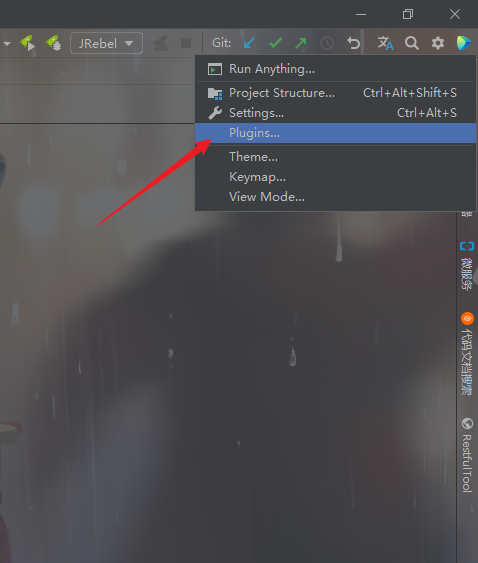
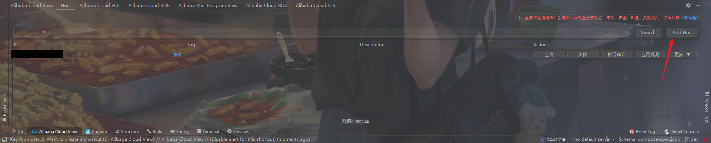
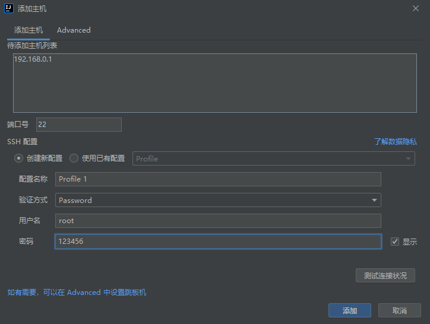
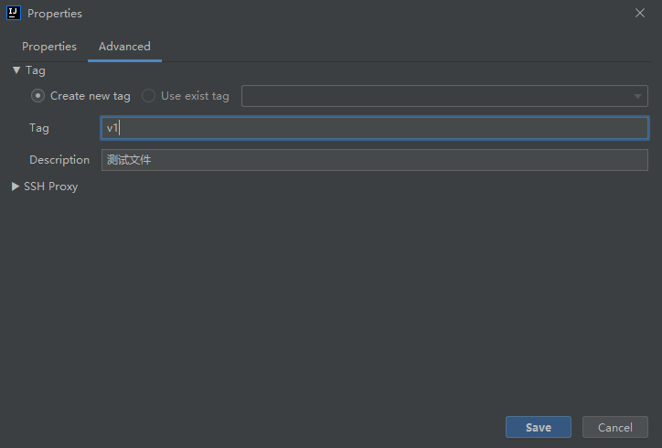
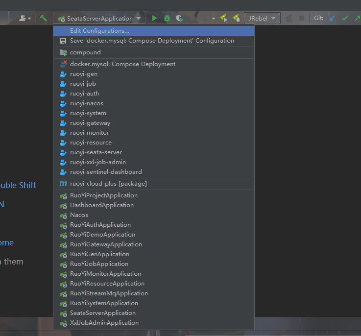
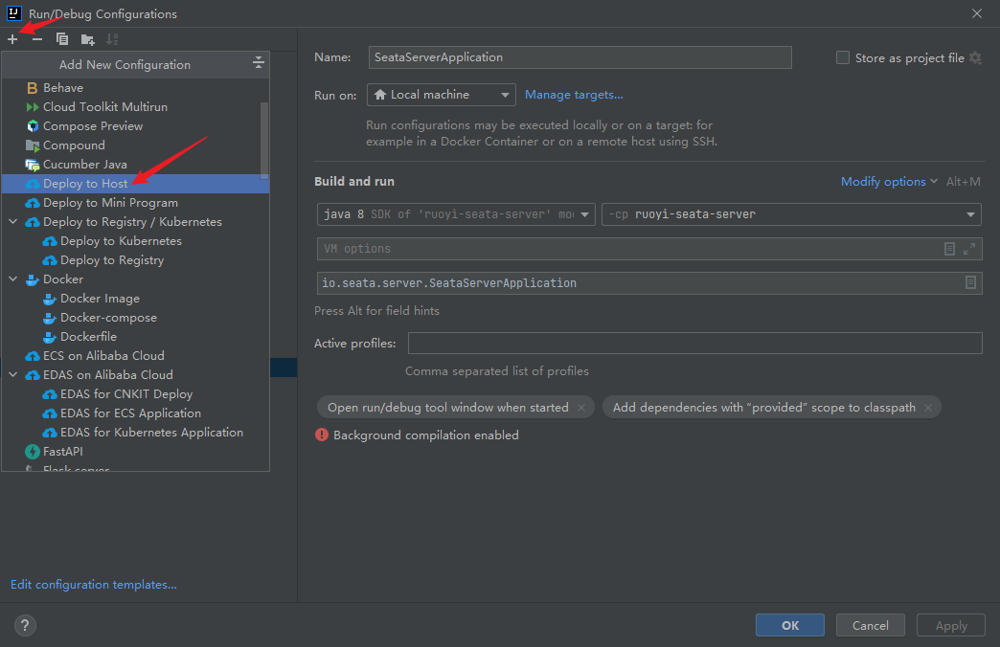
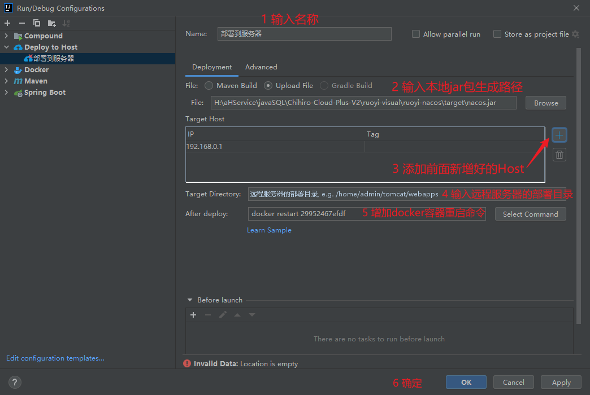
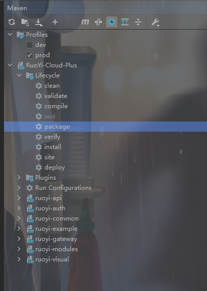

# IDea快速部署Docker应用到服务器

## 📔 千寻简笔记介绍

千寻简文库已开源，Gitee与GitHub搜索`chihiro-doc`，包含笔记源文件`.md`，以及PDF版本方便阅读，文库采用精美主题，阅读体验更佳，如果文章对你有帮助请帮我点一个`Star`～

更新：`支持在线阅读文章，根据发布日期分类。`

@[toc]

## 简介

使用到的环境：

- IntelliJ IDEA 2021.3.3
- Alibaba Cloud Toolkit:：阿里云工具包,本期主要介绍部署的部分

### Alibaba Cloud Toolkit五个使用场景，简单便捷，快速上手

- 托管代码。使用此插件，您可以轻松关联远程代码存储库、执行代码审查、合并请求等。
- 使用阿里云日志服务（SLS）。通过该插件，您可以轻松查询分析阿里云日志服务中的应用日志。
- 部署到ECS。无需在Maven、Git等运维脚本和工具之间切换，开发者可以通过图形界面进行配置，可持续、便捷地将应用部署到ECS。
- 部署到 EDAS。企业分布式应用服务 EDAS 是一个面向应用程序和微服务的 PaaS 平台，提供广泛的应用程序交付和轻量级微服务解决方案。对于阿里云EDAS开发者来说，插件上已经开放了本地应用和云端部署。
- 部署到 Kubernetes。容器服务 Kubernetes Edition 提供高性能、可扩展的容器应用管理能力，支持企业级 Kubernetes 容器化应用的全生命周期管理。对于阿里云Kubernetes开发者来说，插件上已经开放了本地应用和云端部署。

### 本文关键词

`安装插件`、`配置服务器信息`、` 配置运行实例`、`Deplpy to Host` 、`使用案例`

## 实现步骤

### 1 安装插件

步骤：点击Idea右上角设置图标 -> 点击`Plugins...` -> `Marketplace` -> 搜索`Alibaba Cloud Toolkit` -> `Insert`

### 2 配置`Host`

步骤：`Add Host` -> 添加主机 

增加描述

### 3 配置运行实例`Deplpy to Host` 

步骤：增加一个`Deplpy to Host` -> 按照图片步骤进行配置

1. 输入名称。
2. 输入本地jar包生成的路径。
3. 添加前面新增好的Host。
4. 输入远程服务器的部署目录。
5. 增加docker容器重启命令。
6. 确定。

### 4 使用

步骤：maven构建完jar包 -> 点击运行我们刚刚创建的实例即可完成部署

