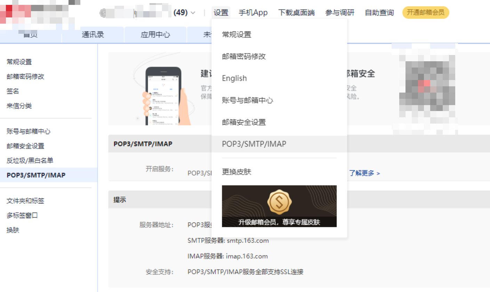
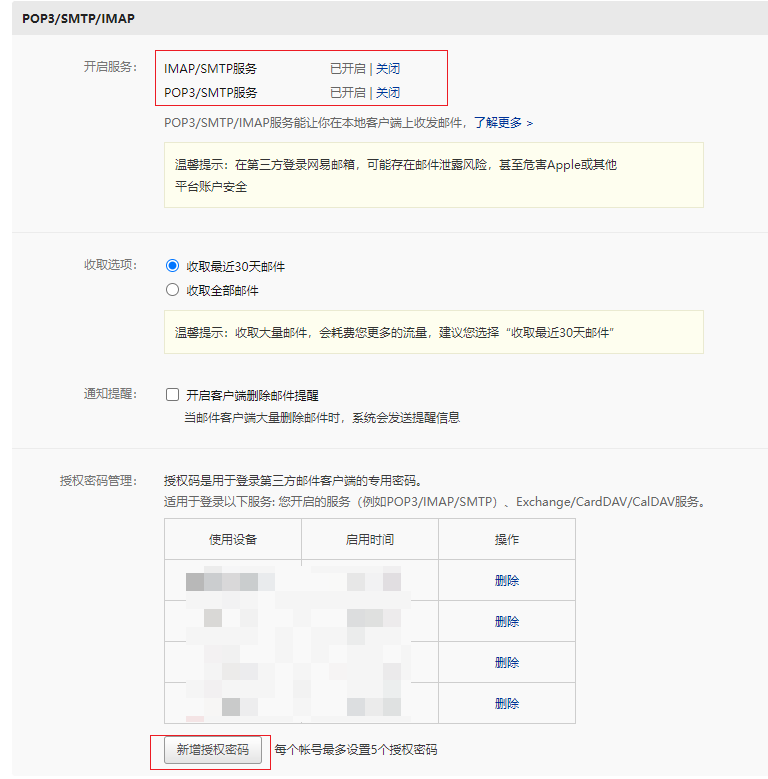

# ruoyi-vue-plus 配置邮箱

## 📔 千寻简笔记介绍

千寻简文库已开源，Gitee与GitHub搜索`chihiro-doc`，包含笔记源文件`.md`，以及PDF版本方便阅读，文库采用精美主题，阅读体验更佳，如果文章对你有帮助请帮我点一个`Star`～

更新：`支持在线阅读文章，根据发布日期分类。`

@[toc]

## 简介

本文使用163邮箱进行配置，其他邮箱也可相似操作。

本文使用版本参考

```xml
<groupId>com.ruoyi</groupId>
<artifactId>ruoyi-vue-plus</artifactId>
<version>4.2.0</version>
```

### 本文关键词

`配置SMTP服务`、`开启IMAP/SMTP服务`、`新增授权码`、`修改配置文件`、`发送邮箱方法`

## 实现步骤

### 1 配置SMTP服务

#### 1.1 打开163邮箱 --> 设置--> POP3/SMTP/IMAP



#### 1.2 开启IMAP/SMTP服务 --> 新增授权码 --> 短信验证  --> 获取到授权密码



### 2 修改配置文件

`application-prod.yml`配置

```yml
--- # mail 邮件发送
mail:
  enabled: true
  host: smtp.163.com
  port: 465
  # 是否需要用户名密码验证
  auth: true
  # 发送方，遵循RFC-822标准
  from: 自定义名字 <xxx@163.com>
  # 用户名（注意：如果使用foxmail邮箱，此处user为qq号）
  user: xxx@163.com
  # 密码（注意，某些邮箱需要为SMTP服务单独设置密码，详情查看相关帮助）
  pass: xxxxxxxxxx
  # 使用 STARTTLS安全连接，STARTTLS是对纯文本通信协议的扩展。
  starttlsEnable: true
  # 使用SSL安全连接
  sslEnable: true
  # SMTP超时时长，单位毫秒，缺省值不超时
  timeout: 0
  # Socket连接超时值，单位毫秒，缺省值不超时
  connectionTimeout: 0
```

### 3 调用发送邮箱方法

```java
    /**
     * 使用配置文件中设置的账户发送文本邮件，发送给单个或多个收件人<br>
     * 多个收件人可以使用逗号“,”分隔，也可以通过分号“;”分隔
     *
     * @param to      收件人
     * @param subject 标题
     * @param content 正文
     * @param files   附件列表
     * @return message-id
     * @since 3.2.0
     */
    public static String sendText(String to, String subject, String content, File... files) {
        return send(to, subject, content, false, files);
    }
```


