# 微信小程序备案流程

## 📔 千寻简笔记介绍

千寻简文库已开源，Gitee与GitHub搜索`chihiro-doc`，包含笔记源文件`.md`，以及PDF版本方便阅读，文库采用精美主题，阅读体验更佳，如果文章对你有帮助请帮我点一个`Star`～

更新：`支持在线阅读文章，根据发布日期分类。`

@[toc]

## 简介

文章截取微信官方：[小程序备案操作指引](https://developers.weixin.qq.com/miniprogram/product/record_guidelines.html)

### 备案期限要求

1、若微信小程序未上架，自 2023 年 9 月 1 日起，微信小程序须完成备案后才可上架；

2、若微信小程序已上架，请于 2024 年 3 月 31 日前完成备案，逾期未完成备案，平台将按照备案相关规定于 2024 年 4 月 1 日起进行清退处理。

### 本文关键词

`备案入口`、`备案类型`、`备案材料准备`、`备案信息填写`、`个人备案`、`非个人备案`

## 小程序备案操作指引

## 一、小程序备案法律法规参考

1、《中华人民共和国反电信网络诈骗法》 第二十三条 设立移动互联网应用程序应当按照国家有关规定向电信主管部门办理许可或者备案手续。

2、《互联网信息服务管理办法》 第四条 国家对经营性互联网信息服务实行许可制度；对非经营性互联网信息服务实行备案制度。未取得许可或者未履行备案手续的，不得从事互联网信息服务。
第五条 从事新闻、出版、教育、医疗保健、药品和医疗器械等互联网信息服务，依照法律、行政法规以及国家有关规定须经有关主管部门审核同意的，在申请经营许可或者履行备案手续前，应当依法经有关主管部门审核同意。

3、《非经营性互联网信息服务备案管理办法》 第五条 在中华人民共和国境内提供非经营性互联网信息服务，应当依法履行备案手续。未经备案，不得在中华人民共和国境内从事非经营性互联网信息服务。
第十一条 拟从事新闻、出版、教育、医疗保健、药品和医疗器械、文化、广播电影电视节目等互联网信息服务，根据法律、行政法规以及国家有关规定应经有关主管部门审核同意的，在履行备案手续时，还应向其住所所在地省通信管理局提交相关主管部门审核同意的文件。
第十三条 非经营性互联网信息服务提供者应当在其网站开通时在主页底部的中央位置标明其备案编号，并在备案编号下方按要求链接信息产业部备案管理系统网址，供公众查询核对。
非经营性互联网信息服务提供者应当在其网站开通时，按照信息产业部备案管理系统的要求，将备案电子验证标识放置在其网站的指定目录下。

## 二、备案前准备

### （一）备案入口

1、未上架小程序

开发者可在小程序首页点击【去备案】即可进入备案流程

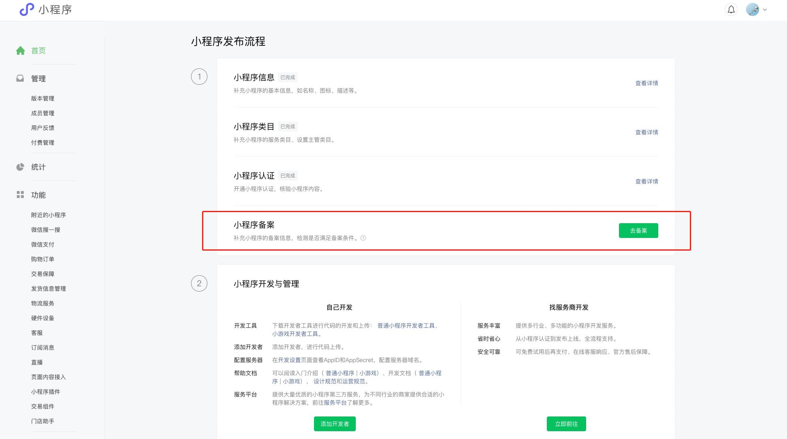

2、已上架小程序
[小程序管理后台](https://mp.weixin.qq.com/)顶部会提示“小程序需补充备案信息”的提醒，点击【去备案】即可进入备案流程
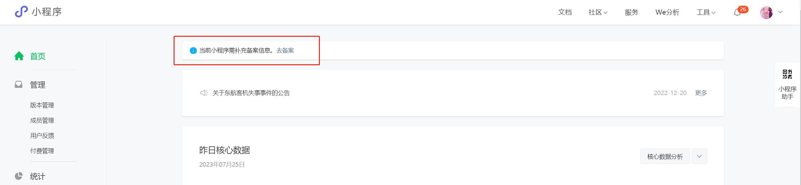
也可以在小程序管理后台设置模块-小程序备案，点击【去备案】进入备案流程
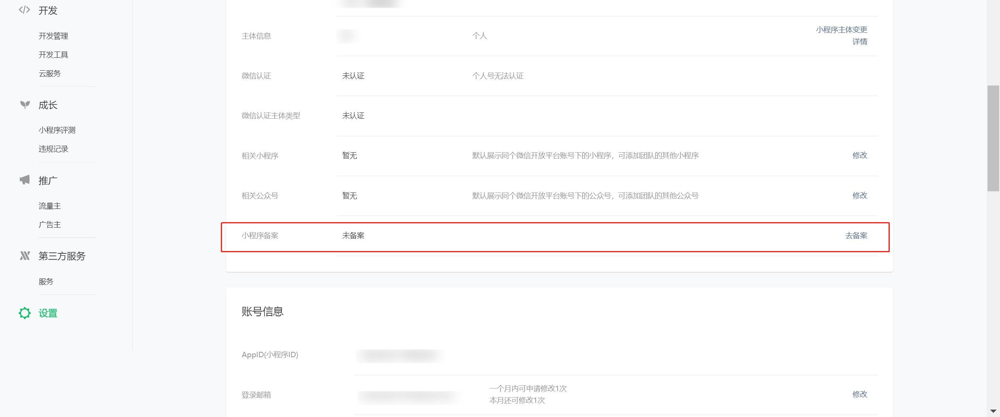

### （二）备案类型

新增备案（首次备案）：主体（个人、单位）首次向省通信管理局提出备案申请
变更备案：更新已经完成备案的主体、小程序信息
注销小程序：注销已经完成备案的备案记录，包括注销主体、注销小程序和取消接入

### （三）备案材料准备

#### 1、小程序备案材料

| **小程序备案材料**                                           | **提供方式**                   |
| :----------------------------------------------------------- | :----------------------------- |
| 主办单位证件                                                 | 开发者准备                     |
| 主体负责人证件                                               | 开发者准备                     |
| 小程序负责人证件                                             | 开发者准备                     |
| 前置审批/专项审批                                            | 开发者准备                     |
| 补充材料：根据规则提供包括但不限于授权书、党建证明、居住证、情况说明、承诺书等 | 开发者准备                     |
| 小程序负责人核验现场拍摄照片电子件                           | 开发者在平台操作备案时完成     |
| 互联网信息服务承诺书                                         | 开发者在平台操作备案时阅读确认 |
| 小程序备案真实性核验单                                       | 平台提供                       |

#### 2、前置审批材料

如你的小程序从事新闻、出版、药品和医疗器械、网约车等需须经有关主管部门审核同意的互联网信息服务，在履行备案手续时，应提供业务对应前置审批文件。相关类目参考如下：

| 前置审批类目     | 对应材料                                                     | 办理部门（参考）                          | 法律法规依据（参考）                                         |
| :--------------- | :----------------------------------------------------------- | :---------------------------------------- | :----------------------------------------------------------- |
| 出版             | 【游戏】 根据国家新闻出版署和省、自治区、直辖市出版行政主管部门的规范要求，提供相关材料。 | 国家新闻出版署 省级新闻出版部门           | 《网络出版服务管理规定》 第二十七条 网络游戏上网出版前，必须向所在地省、自治区、直辖市出版行政主管部门提出申请，经审核同意后，报国家新闻出版广电总局审批。 |
|                  | 【网络出版】 网络出版服务许可证                              | 国家新闻出版署 省级新闻出版部门           | 《网络出版服务管理规定》 第七条 从事网络出版服务，必须依法经过出版行政主管部门批准，取得《网络出版服务许可证》。 |
| 广播电影电视节目 | 信息网络传播视听节目许可证                                   | 省级广播电视局                            | 《互联网视听节目服务管理规定》 第七条 从事互联网视听节目服务，应当依照本规定取得广播电影电视主管部门颁发的《信息网络传播视听节目许可证》（以下简称《许可证》）或履行备案手续。 未按照本规定取得广播电影电视主管部门颁发的《许可证》或履行备案手续，任何单位和个人不得从事互联网视听节目服务。 |
| 药品和医疗器械   | 互联网药品信息服务资格证书                                   | 省级药品监督管理局                        | 《互联网药品信息服务管理办法》 第五条 拟提供互联网药品信息服务的网站，应当在向国务院信息产业主管部门或者省级电信管理机构申请办理经营许可证或者办理备案手续之前，按照属地监督管理的原则，向该网站主办单位所在地省、自治区、直辖市食品药品监督管理部门提出申请，经审核同意后取得提供互联网药品信息服务的资格。 |
| 文化             | 网络文化经营许可证                                           | 省级文化和旅游部门                        | 《互联网文化管理暂行规定》 第六条 文化部负责制定互联网文化发展与管理的方针、政策和规划，监督管理全国互联网文化活动。 省、自治区、直辖市人民政府文化行政部门对申请从事经营性互联网文化活动的单位进行审批，对从事非经营性互联网文化活动的单位进行备案。 |
| 新闻             | 互联网新闻服务许可证                                         | 国家互联网信息办公室 省级互联网信息办公室 | 《互联网新闻信息服务管理规定》 第五条 通过互联网站、应用程序、论坛、博客、微博客、公众账号、即时通信工具、网络直播等形式向社会公众提供互联网新闻信息服务，应当取得互联网新闻信息服务许可，禁止未经许可或超越许可范围开展互联网新闻信息服务活动。 前款所称互联网新闻信息服务，包括互联网新闻信息采编发布服务、转载服务、传播平台服务。 |
| 网络预约车       | 网络预约出租汽车经营许可证                                   | 省级交通运输主管部门                      | 《网络预约出租汽车经营服务管理暂行办法》 第十条 网约车平台公司应当在取得相应《网络预约出租汽车经营许可证》并向企业注册地省级通信主管部门申请互联网信息服务备案后，方可开展相关业务。备案内容包括经营者真实身份信息、接入信息、出租汽车行政主管部门核发的《网络预约出租汽车经营许可证》等。涉及经营电信业务的，还应当符合电信管理的相关规定。 网约车平台公司应当自网络正式联通之日起30日内，到网约车平台公司管理运营机构所在地的省级人民政府公安机关指定的受理机关办理备案手续。 |
| 校外培训         | 教育部门允许开展校外培训的审批文件                           | 省级教育部门                              | 《关于进一步减轻义务教育阶段学生作业负担和校外培训负担的意见》 四、坚持从严治理，全面规范校外培训行为 坚持从严审批机构。各地不再审批新的面向义务教育阶段学生的学科类校外培训机构，现有学科类培训机构统一登记为非营利性机构。对原备案的线上学科类培训机构，改为审批制。各省（自治区、直辖市）要对已备案的线上学科类培训机构全面排查，并按标准重新办理审批手续。未通过审批的，取消原有备案登记和互联网信息服务业务经营许可证（ICP）。对非学科类培训机构，各地要区分体育、文化艺术、科技等类别，明确相应主管部门，分类制定标准、严格审批。依法依规严肃查处不具备相应资质条件、未经审批多址开展培训的校外培训机构。 |
| 宗教             | 省级以上人民政府宗教事务部门审核同意文件                     | 省级宗教事务部门                          | 《互联网宗教信息服务管理办法》 第六条 通过互联网站、应用程序、论坛、博客、微博客、公众账号、即时通信工具、网络直播等形式，以文字、图片、音视频等方式向社会公众提供宗教教义教规、宗教知识、宗教文化、宗教活动等信息的服务，应当取得互联网宗教信息服务许可。 |
| 互联网金融       | 金融监管部门审批许文件                                       | 省级金融监管部门                          | 《关于促进互联网金融健康发展的指导意见》 （十三）互联网行业管理。任何组织和个人开设网站从事互联网金融业务的，除应按规定履行相关金融监管程序外，还应依法向电信主管部门履行网站备案手续，否则不得开展互联网金融业务。工业和信息化部负责对互联网金融业务涉及的电信业务进行监管，国家互联网信息办公室负责对金融信息服务、互联网信息内容等业务进行监管，两部门按职责制定相关监管细则。 |

#### 3、个人备案

- 必需材料：个人有效身份证件。

| 资料类型             | 单位性质 | 证件类型               |
| :------------------- | :------- | :--------------------- |
| 主体证件、负责人证件 | 个人     | 居民身份证             |
|                      |          | 护照                   |
|                      |          | 台湾居民来往大陆通行证 |
|                      |          | 港澳居民来往内地通行证 |
|                      |          | 外国人永久居留身份证   |
|                      |          | 港澳居民居住证         |
|                      |          | 台湾居民居住证         |

#### 4、非个人备案

- 必需材料：单位有效证件、个人有效身份证件。

| 资料类型   | 单位性质         | 证件类型                                 |
| ---------- | :--------------- | :--------------------------------------- |
| 主体证件   | 企业             | 营业执照（个人或企业）                   |
|            |                  | 外国企业常驻代表机构登记证               |
|            | 政府机关         | 统一社会信用代码证书                     |
|            |                  | 组织机构代码证                           |
|            | 事业单位         | 事业单位法人证书                         |
|            |                  | 组织机构代码证                           |
|            | 社会团体         | 社会团体法人登记证书                     |
|            |                  | 组织机构代码证                           |
|            | 民办非企业单位   | 民办非企业单位登记证书                   |
|            |                  | 社会服务机构登记证书                     |
|            |                  | 民办学校办学许可证                       |
|            | 公证机构         | 公证机构执业证                           |
|            | 国防机构         | 部队代号                                 |
|            |                  | 军队单位对外有偿服务许可证               |
|            | 基金会           | 基金会法人登记证书                       |
|            | 集体经济         | 农村集体经济组织登记证                   |
|            | 境外机构         | 境外机构证件                             |
|            | 律师执业机构     | 律师事务所执业许可证                     |
|            | 群众性团体组织   | 统一社会信用代码证书                     |
|            | 司法鉴定机构     | 司法鉴定许可证                           |
|            | 外国在华文化中心 | 外国在华文化中心登记证                   |
|            |                  | 外国政府旅游部门常驻代表机构批准登记证   |
|            |                  | 北京市外国驻华使馆人员子女学校办学许可证 |
|            | 医疗机构         | 医疗机构执业许可证                       |
|            | 仲裁机构         | 仲裁委员会登记证                         |
|            | 宗教团体         | 宗教活动场所登记证                       |
| 负责人证件 | 个人             | 居民身份证                               |
|            |                  | 护照                                     |
|            |                  | 台湾居民来往大陆通行证                   |
|            |                  | 港澳居民来往内地通行证                   |
|            |                  | 外国人永久居留身份证                     |
|            |                  | 港澳居民居住证                           |
|            |                  | 台湾居民居住证                           |

- 其他材料：根据各省通信管理要求，上传对应补充材料。

## 三、备案整体流程

备案整体流程总共分为五个环节：备案信息填写、平台初审、工信部短信核验、通管局审核和备案成功。

**小程序备案整体流程**
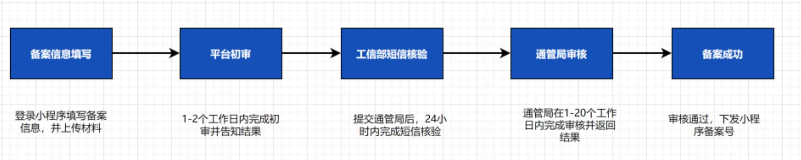

### （一）备案信息填写

#### 1、主体信息填写

非个人主体：
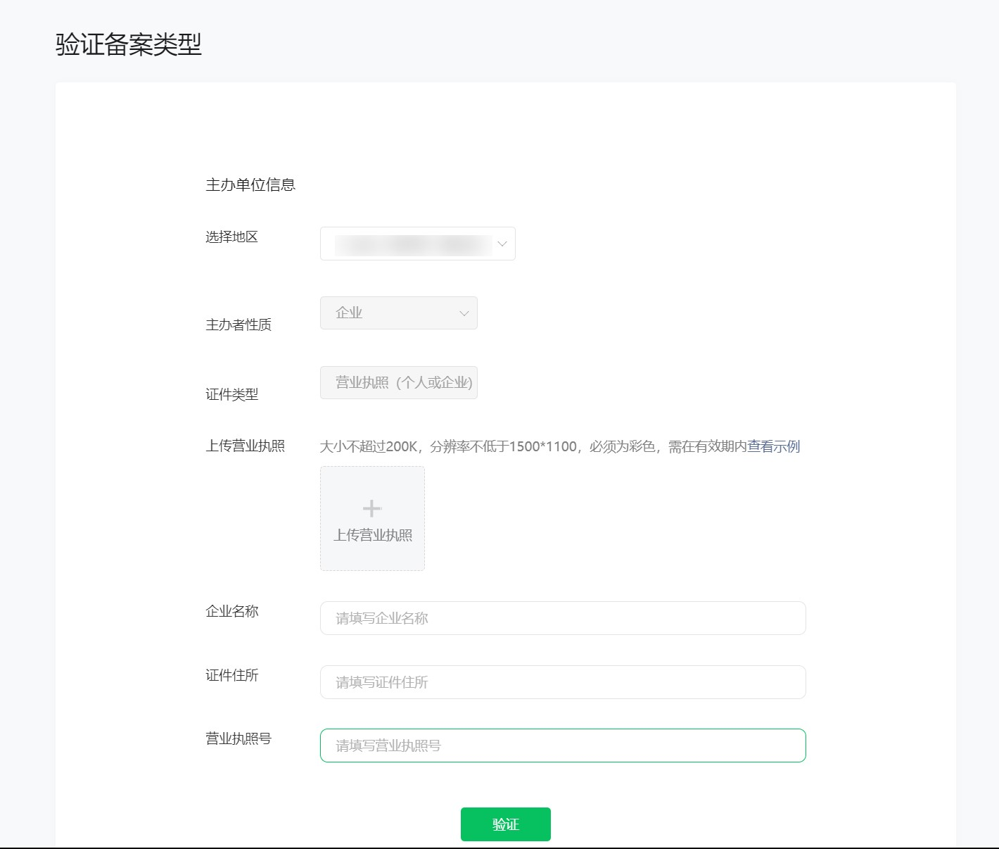
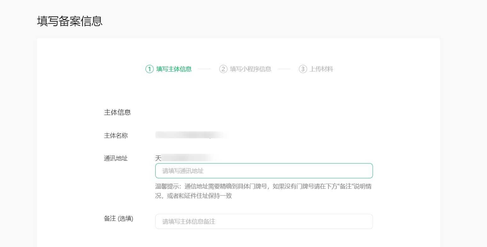

个人主体：
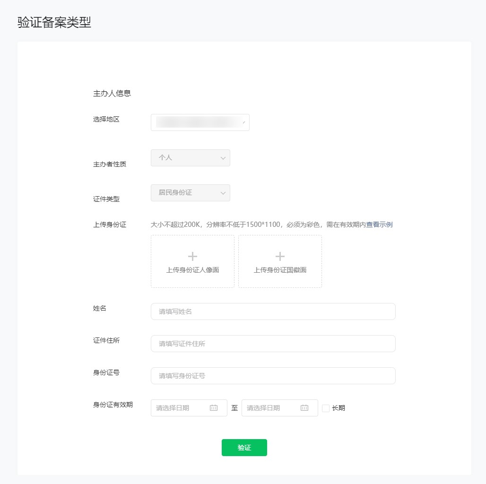
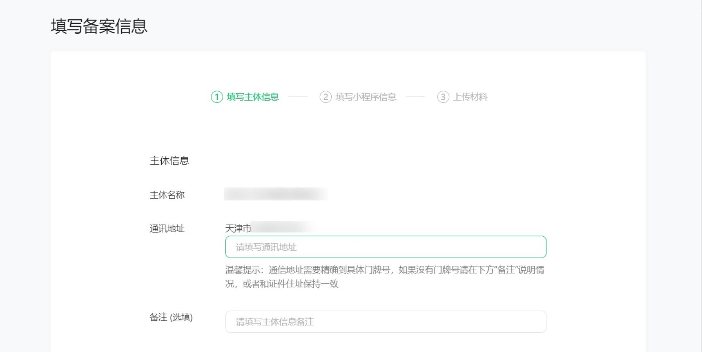

> 提示：选择地区、详细地址，请填写实际通讯地址。
> 上传有效证件原件的彩色扫描件或拍照件，请保持图片清晰完整、不遮挡关键信息/图像、边角齐全，证件有效期大于1个月。
> 请对照证件信息如实选择、填写备案信息。

#### 2、主体负责人信息填写

非个人主体、个人主体：
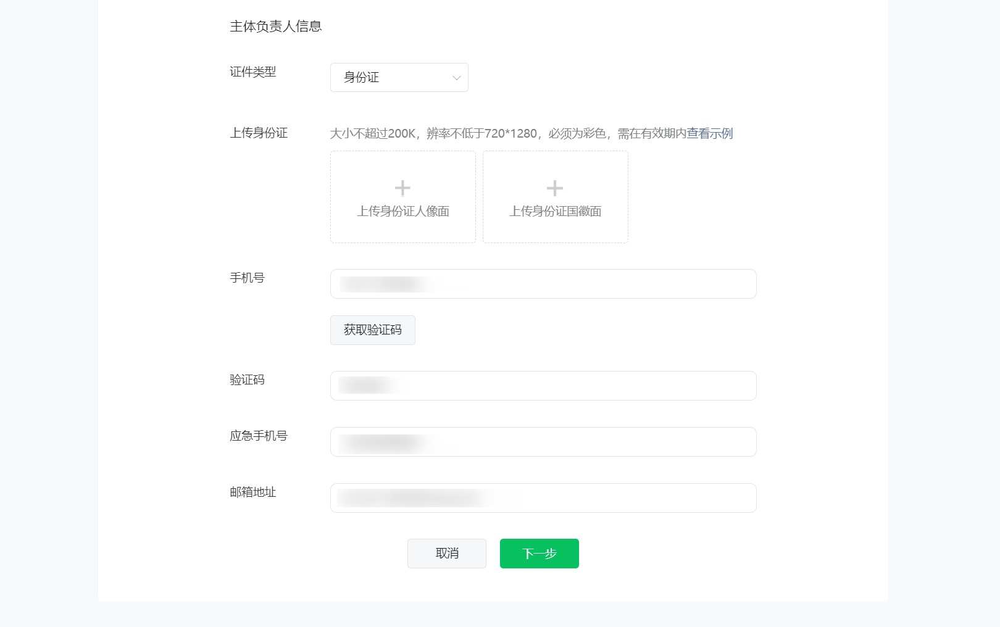

> 提示：手机号码请填写主体负责人、应急联系人本人使用的有效手机号码，需保持电话畅通，不同人不能使用同一个号码。

#### 3、小程序信息填写

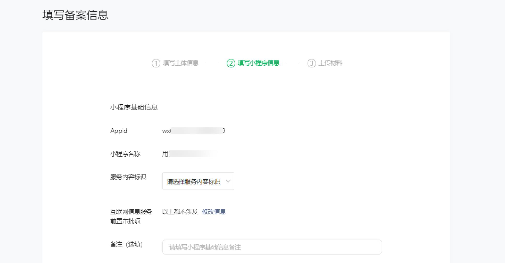

> 提示：如你的小程序内容涉及前置审批相关信息，请上传有效前置审批文件并填写审批号/文件名。

#### 4、小程序负责人信息填写及人脸核身

非个人/个人主体-默认复用主体负责人信息
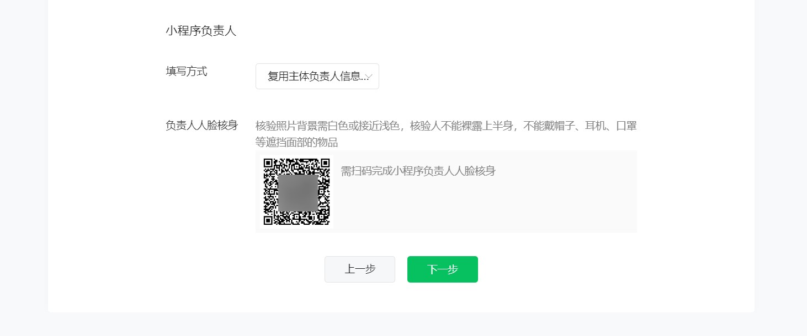
非个人主体-手动填写小程序负责人信息
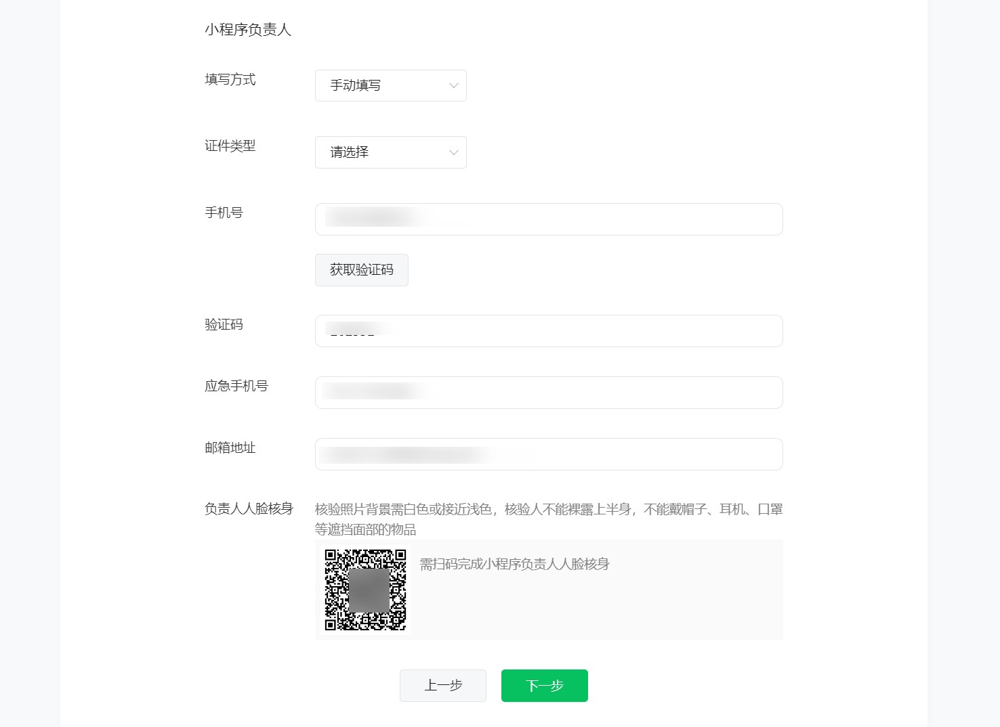

> 提示：人脸核身时，请确认背景为纯白色，保持表情自然、无闭眼，穿着得体，不遮挡面部。

### （二）平台初审

开发者在微信公众平台提交小程序备案信息后，平台将会在1-2个工作日内完成初审（具体请以实际审核时间为准），审核结果将以站内信、模板消息等形式通知管理员。 在平台初审的过程中，请备案相关人员保持电话畅通，以便平台对你提交的备案信息进行核验。

> 提示：你可在微信公众平台内查看备案进度。

### （三）工信部短信核验

根据工信部的要求，小程序备案需完成短信核验。你的备案初审通过后，会收到工信部发送的核验短信（发送号码：12381），请在收到短信的24小时内登录[工信部备案官网首页](https://beian.miit.gov.cn/#/Integrated/index)完成短信核验，短信核验成功后备案申请进入通管局审核流程。
若核验时提示验证码错误或无效，你可触发一次短信重发；24小时内未核验成功，备案将被工信部系统自动驳回，你需到微信公众平台重新提交备案申请。

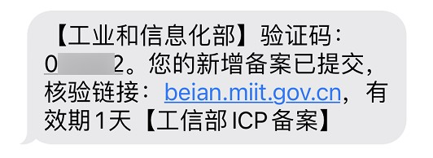
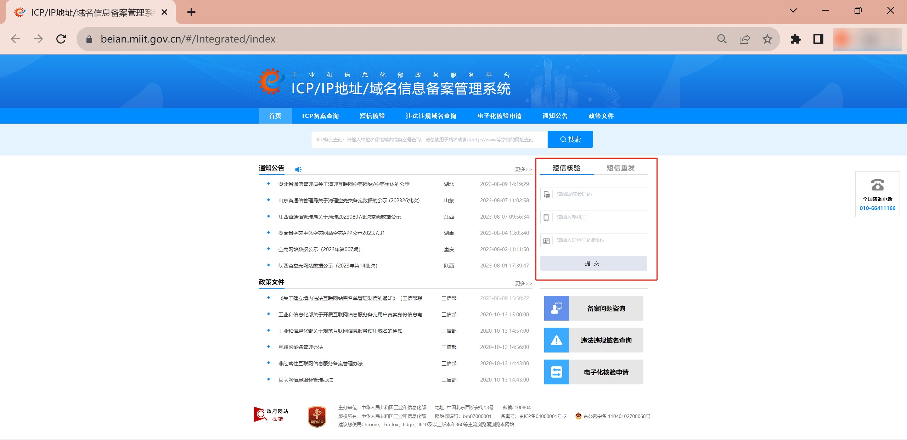

### （四）通管局审核

各省通信管理局将在1-20个工作日内（具体以实际审核时间为准）完成审核，审核结果以站内信、模板消息、短信等形式通知。

### （五）备案成功

管局审核通过后，将下发的小程序备案号，代表你的小程序已完成备案，可以进入下一步版本发布等流程。
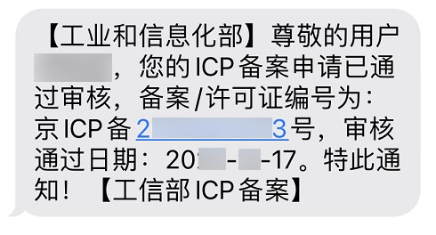