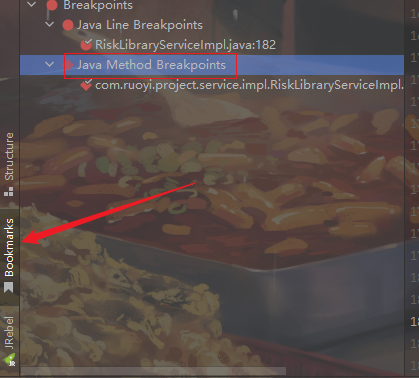

# IDEA、Debug、断点、卡死

## 📔 千寻简笔记介绍

千寻简文库已开源，Gitee与GitHub搜索`chihiro-doc`，包含笔记源文件`.md`，以及PDF版本方便阅读，文库采用精美主题，阅读体验更佳，如果文章对你有帮助请帮我点一个`Star`～

更新：`支持在线阅读文章，根据发布日期分类。`

@[toc]

## 简介

千万千万不要在方法上断点！！

### 本文关键词

`标签`、`标签`、`标签`、`标签`、`标签`、`标签`、`标签`、`标签`、`标签`、`标签`、`标签`、`标签`、`标签`、`标签`、`标签`

## 实现步骤

找到书签，查看断点，将方法中的断点取消

