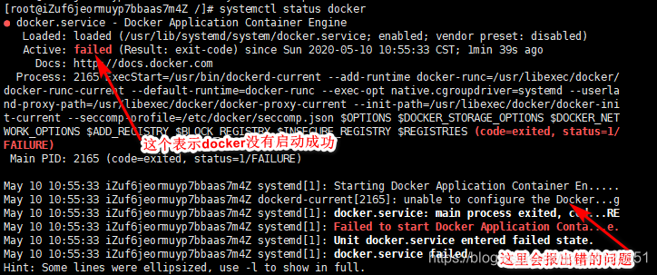

# Mac运行Docker报错

## 📔 千寻简笔记介绍

千寻简文库已开源，Gitee与GitHub搜索`chihiro-doc`，包含笔记源文件`.md`，以及PDF版本方便阅读，文库采用精美主题，阅读体验更佳，如果文章对你有帮助请帮我点一个`Star`～

更新：`支持在线阅读文章，根据发布日期分类。`

@[toc]


## 简介

### 本文关键词

`Job for docker.service failed because the control process exited with error code.
See "systemctl status docker.service" and "journalctl -xeu docker.service" for details.`、`Job for docker.service failed because the control process exited with error code`、`systemctl status docker.service" and "journalctl -xeu docker.service`

## 实现步骤

### 1. 启动docker报错

```cmd
root@primary:/service/java/docker# systemctl start docker.service
Job for docker.service failed because the control process exited with error code.
See "systemctl status docker.service" and "journalctl -xeu docker.service" for details.
```

#### 1.1 systemctl status docker.service查看docker服务的状态

- 使用docker时，遇到 docker.service的作业失败，因为控制进程已退出，并返回错误代码。
- 有关详细信息，请参阅“systemctl status docker.service”和“journalctl -xe”时，不一定要重装 docker。

```cmd
systemctl status docker.service
# 报错信息
× docker.service - Docker Application Container Engine
     Loaded: loaded (/lib/systemd/system/docker.service; enabled; vendor preset: enabled)
     Active: failed (Result: exit-code) since Tue 2023-05-30 23:04:30 CST; 5min ago
TriggeredBy: × docker.socket
       Docs: https://docs.docker.com
    Process: 925 ExecStart=/usr/bin/dockerd -H fd:// --containerd=/run/containerd/containerd.sock (code=exited, status>
   Main PID: 925 (code=exited, status=1/FAILURE)
        CPU: 60ms

May 30 23:04:27 primary systemd[1]: docker.service: Main process exited, code=exited, status=1/FAILURE
May 30 23:04:27 primary systemd[1]: docker.service: Failed with result 'exit-code'.
May 30 23:04:27 primary systemd[1]: Failed to start Docker Application Container Engine.
May 30 23:04:30 primary systemd[1]: docker.service: Scheduled restart job, restart counter is at 3.
May 30 23:04:30 primary systemd[1]: Stopped Docker Application Container Engine.
May 30 23:04:30 primary systemd[1]: docker.service: Start request repeated too quickly.
May 30 23:04:30 primary systemd[1]: docker.service: Failed with result 'exit-code'.
May 30 23:04:30 primary systemd[1]: Failed to start Docker Application Container Engine.
```



#### 1.2 journalctl -xe 查看报错信息

```cmd
root@primary:/etc/docker# journalctl -xe
Journal file /var/log/journal/8c1bf4cc93844889a4cf1a8b67be1748/user-1000@0005fa7b9a7766ed-645e5933b08e3d15.journal~ is truncated, ignoring file.
May 30 23:24:03 primary rsyslogd[594]: action 'action-3-builtin:omfile' (module 'builtin:omfile') message lost, could not be processed. Check for additional error messages before>
```

分析错误：` No space left on devic>`	设备上没有剩余空间，在错误日志中我们发现是docker安装目录满了。

解决方案：

1. 查看目录下剩余空间

```cmd
df -hl /var/lib/docker
# 显示的信息：使用已经百分百
Filesystem      Size  Used Avail Use% Mounted on
/dev/sda1       4.7G  4.7G     0 100% /
```

2. 查看分区容量

```cmd
df -h
# 显示的信息
Filesystem      Size  Used Avail Use% Mounted on
tmpfs            97M   11M   86M  12% /run
/dev/sda1       4.7G  4.7G     0 100% /
tmpfs           482M     0  482M   0% /dev/shm
tmpfs           5.0M     0  5.0M   0% /run/lock
/dev/sda15       98M  6.3M   92M   7% /boot/efi
tmpfs            97M  4.0K   97M   1% /run/user/1000
```

3. 知道是磁盘不足，由于我们现在docker启动不了，星辰推荐先扩容，后面在对容器和镜像进行优化。

> 我是在Mac虚拟机（multipass）上运行的docker，默认磁盘5G，所以我们调整一下磁盘大小就可以，下面有我找到的一个博主的参考。

```cmd
# 打开终端
xingchen@star-2 ~ % multipass ls
Name                    State             IPv4             Image
primary                 Stopped           --               Ubuntu 22.04 LTS

# 扩容命令,等号左右不能有空格
# 要修改其中一个属性，请先停止实例，然后发出命令set。例如：
multipass set local.primary.disk=10G

xingchen@star-2 ~ % multipass set local.primary.disk=10G
xingchen@star-2 ~ % 
# 可以使用命令查询这些属性get。不必为此停止实例。例如：
multipass get local.primary.disk


# 扩容完毕我们启动虚拟机在查看容量
df -h
root@primary:/home/ubuntu# df -h
# 显示的信息
Filesystem      Size  Used Avail Use% Mounted on
tmpfs            97M   11M   86M  12% /run
/dev/sda1       4.7G  4.7G     0 100% /
tmpfs           482M     0  482M   0% /dev/shm
tmpfs           5.0M     0  5.0M   0% /run/lock
/dev/sda15       98M  6.3M   92M   7% /boot/efi
tmpfs            97M  4.0K   97M   1% /run/user/1000

# 发现一个问题，multipass 扩容以后系统磁盘不变
# 扩展完磁盘后使用lsblk查看的结果变了而使用df -h结果大小却没变，这是因为前者查看的是磁盘的大小而后者查看的是文件系统的大小。磁盘和文件系统在不严格区分时可视为同一个东西，但追究起来确实是两样东西。
root@primary:/home/ubuntu# fdisk -l
Disk /dev/loop0: 43.18 MiB, 45277184 bytes, 88432 sectors
Units: sectors of 1 * 512 = 512 bytes
Sector size (logical/physical): 512 bytes / 512 bytes
I/O size (minimum/optimal): 512 bytes / 512 bytes


Disk /dev/loop1: 59.12 MiB, 61988864 bytes, 121072 sectors
Units: sectors of 1 * 512 = 512 bytes
Sector size (logical/physical): 512 bytes / 512 bytes
I/O size (minimum/optimal): 512 bytes / 512 bytes


Disk /dev/loop2: 868 KiB, 888832 bytes, 1736 sectors
Units: sectors of 1 * 512 = 512 bytes
Sector size (logical/physical): 512 bytes / 512 bytes
I/O size (minimum/optimal): 512 bytes / 512 bytes


Disk /dev/loop3: 43.19 MiB, 45289472 bytes, 88456 sectors
Units: sectors of 1 * 512 = 512 bytes
Sector size (logical/physical): 512 bytes / 512 bytes
I/O size (minimum/optimal): 512 bytes / 512 bytes


Disk /dev/loop4: 4 KiB, 4096 bytes, 8 sectors
Units: sectors of 1 * 512 = 512 bytes
Sector size (logical/physical): 512 bytes / 512 bytes
I/O size (minimum/optimal): 512 bytes / 512 bytes


Disk /dev/loop5: 59.09 MiB, 61960192 bytes, 121016 sectors
Units: sectors of 1 * 512 = 512 bytes
Sector size (logical/physical): 512 bytes / 512 bytes
I/O size (minimum/optimal): 512 bytes / 512 bytes


Disk /dev/loop6: 109.61 MiB, 114929664 bytes, 224472 sectors
Units: sectors of 1 * 512 = 512 bytes
Sector size (logical/physical): 512 bytes / 512 bytes
I/O size (minimum/optimal): 512 bytes / 512 bytes


Disk /dev/vda: 52 KiB, 53248 bytes, 104 sectors
Units: sectors of 1 * 512 = 512 bytes
Sector size (logical/physical): 512 bytes / 512 bytes
I/O size (minimum/optimal): 512 bytes / 512 bytes
GPT PMBR size mismatch (10485759 != 20971519) will be corrected by write.
The backup GPT table is not on the end of the device.


Disk /dev/sda: 10 GiB, 10737418240 bytes, 20971520 sectors
Disk model: QEMU HARDDISK   
Units: sectors of 1 * 512 = 512 bytes
Sector size (logical/physical): 512 bytes / 512 bytes
I/O size (minimum/optimal): 512 bytes / 512 bytes
Disklabel type: gpt
Disk identifier: 377B9709-DEFE-4067-8E1D-220FD9F66D56

Device      Start      End  Sectors  Size Type
/dev/sda1  206848 10485726 10278879  4.9G Linux filesystem
/dev/sda15   2048   204800   202753   99M EFI System

Partition table entries are not in disk order.
root@primary:/home/ubuntu# 


# 关于“linux磁盘扩容成功文件系统大小却没变化”问题详细解决方案
https://blog.csdn.net/qq_41999034/article/details/111030811
```


