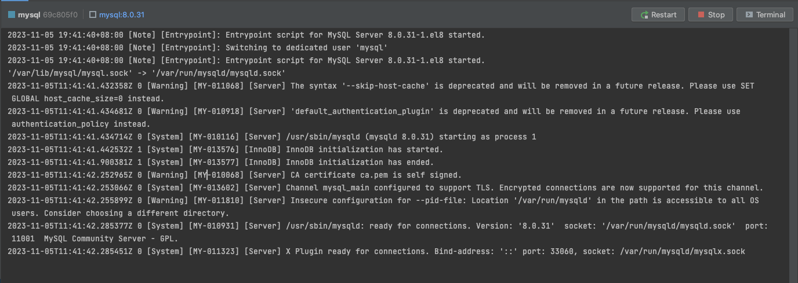

# Docker-compose运行MySQL连接不上

## 📔 千寻简笔记介绍

千寻简文库已开源，Gitee与GitHub搜索`chihiro-doc`，包含笔记源文件`.md`，以及PDF版本方便阅读，文库采用精美主题，阅读体验更佳，如果文章对你有帮助请帮我点一个`Star`～

更新：`支持在线阅读文章，根据发布日期分类。`

@[toc]

## 简介

在服务器部署 mysql 遇到了一个问题，起初根据文档去启动 MySQL，正常启动后发现，远程连接不上，起初怀疑是服务器防护墙没关，后来我把服务器防火墙关闭以及放行云服务器厂商的防火墙，还是连接不上 MySQL，但是在容器内部是可以进入的，后来我去查看容器的启动日志发现，日志打印了一个警告。

```sh
mysqld: [Warning] World-writable config file '/etc/mysql/conf.d/my.cnf' is ignored.
```

这个错误是MySQL创建容器没有使用上我们的配置文件`my.conf`，`my.conf`其中指定的 MySQL 的端口，但是由于没有加载成功，所以映射端口不一致导致远程连接不上数据库。

导致问题产生的原因是，MySQL8 加载配置文件需要该文件`不可写入`的，我在之前的时候给整个 docker 文件夹赋了全部权限，导致的问题的发生。

### 本文关键词

`mysqld: [Warning] World-writable config file '/etc/mysql/conf.d/my.cnf' is ignored.`、`MySQL 连接不上`、`MySQL8`、`docker-compose`、`docker`

## 实现步骤

### 1 重新分配权限

我们知道了问题出在哪里就比较好解决了。

将配置文件设置可读的权限，重启 docker-compose 容器

```sh
chmod go-w /etc/my.cnf
```

使用 `down` 命令停止运行的容器，并且会删除已停止的容器以及已创建的所有网络

```sh
docker-compose down mysql
```

重新启动容器

```
docker-compose up -d mysql
```


