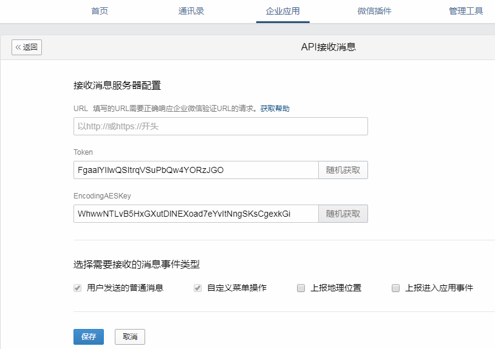

# 企业微信开启接收消息+验证URL有效性

## 📔 千寻简笔记介绍

千寻简文库已开源，Gitee与GitHub搜索`chihiro-doc`，包含笔记源文件`.md`，以及PDF版本方便阅读，文库采用精美主题，阅读体验更佳，如果文章对你有帮助请帮我点一个`Star`～

更新：`支持在线阅读文章，根据发布日期分类。`

@[toc]

## 简介

前期准备

- 一个备案的域名。
- 可线上部署的应用，与域名对应。

2.3使用到的示例代码来源企业微信-开发者中心

- 访问地址：

  ```java
  https://developer.work.weixin.qq.com/document/path/90468
  ```

- 示例代码下载链接：

  ```java
  https://open.work.weixin.qq.com/wwopen/downloadfile/java.zip
  ```

关于企业微信的开启接收信息的文档

```java
https://developer.work.weixin.qq.com/document/10514
```

### 本文关键词

`企业微信开启接收消息`、`验证URL有效性`、`SHA1`、`提供接收和推送给企业微信消息的加解密接口`、`计算消息签名接口`

## 实现步骤

### 1 开启接收消息

#### 1.1 设置接收消息的参数

在企业的管理端后台，进入需要设置接收消息的目标应用，点击“接收消息”的“设置API接收”按钮，进入配置页面。



用的URL、Token、EncodingAESKey三个参数

- URL是企业后台接收企业微信推送请求的访问协议和地址，支持http或https协议。
- Token可由企业任意填写，用于生成签名。
- EncodingAESKey用于消息体的加密，是AES密钥的Base64编码。

这三个参数需要在下面代码中使用到。

### 2 验证URL有效性

#### 2.1 官方说明

当点击“保存”提交以上信息时，企业微信会发送一条验证消息到填写的URL，发送方法为**GET**。
企业的接收消息服务器接收到验证请求后，需要作出正确的响应才能通过URL验证。

假设接收消息地址设置为：`http://api.3dept.com/`，企业微信将向该地址发送如下验证请求：

**请求方式：GET**
**请求地址**：

```java
http://api.3dept.com/?msg_signature=ASDFQWEXZCVAQFASDFASDFSS&timestamp=13500001234&nonce=123412323&echostr=ENCRYPT_STR
```

**参数说明**

| 参数          | 必须 | 说明                                                         |
| ------------- | ---- | ------------------------------------------------------------ |
| msg_signature | 是   | 企业微信加密签名，msg_signature结合了企业填写的token、请求中的timestamp、nonce参数、加密的消息体 |
| timestamp     | 是   | 时间戳                                                       |
| nonce         | 是   | 随机数                                                       |
| echostr       | 是   | 加密的字符串。需要解密得到消息内容明文，解密后有random、msg_len、msg、CorpID四个字段，其中msg即为消息内容明文 |

企业后台收到请求后，需要做如下操作：

1. 对收到的请求做Urldecode处理
2. 通过参数msg_signature对请求进行校验，确认调用者的合法性。
3. 解密echostr参数得到消息内容(即msg字段)
4. 在1秒内原样返回明文消息内容(不能加引号，不能带bom头，不能带换行符)

#### 2.2 Java代码

##### 控制器层代码：`QYWeiXinLoginController.java`

```java
package com.ruoyi.project.controller;


import com.ruoyi.project.tx.qyweixin.service.IQYWeiXinLoginService;
import org.springframework.web.bind.annotation.RequestMapping;
import org.springframework.web.bind.annotation.RequestMethod;
import org.springframework.web.bind.annotation.RequestParam;
import org.springframework.web.bind.annotation.RestController;

import javax.annotation.Resource;
import javax.servlet.http.HttpServletResponse;
import java.io.IOException;


@RestController
@RequestMapping("/wechat/info")
public class QYWechatInfoController {

    @Resource
    private IQYWeiXinLoginService qyWeiXinLoginService;

    /**
     * 验证URL有效性
     *
     */
    @RequestMapping(value = "/verifyURLValidity", method = RequestMethod.GET)
    public void verifyURLValidity(@RequestParam(value = "msg_signature", required = true) String msgSignature,
                                  @RequestParam(value = "timestamp", required = true) String timestamp,
                                  @RequestParam(value = "nonce", required = true) String nonce,
                                  @RequestParam(value = "echostr", required = true) String echostr,
                                  HttpServletResponse response) {
        String msg = qyWeiXinLoginService.verifyURLValidity(msgSignature, timestamp, nonce, echostr);
        try {
            response.getWriter().print(msg);
        } catch (IOException e) {
            throw new RuntimeException(e);
        }
    }

}
```

##### 业务接口：`IQYWeiXinLoginService.java`

```java
package com.ruoyi.project.tx.qyweixin.service;


public interface IQYWeiXinLoginService {
    String verifyURLValidity(String msgSignature, String timestamp, String nonce, String echostr);
}
```

##### 业务接口实现：`QYWeiXinLoginServiceImpl.java`

```java
package com.ruoyi.project.tx.qyweixin.service.impl;


import com.ruoyi.project.tx.qyweixin.service.IQYWeiXinLoginService;
import com.ruoyi.project.utils.aes.AesException;
import com.ruoyi.project.utils.aes.WXBizMsgCrypt;
import org.slf4j.Logger;
import org.slf4j.LoggerFactory;
import org.springframework.stereotype.Service;

@Service
public class QYWeiXinLoginServiceImpl implements IQYWeiXinLoginService {
    private static final Logger logger = LoggerFactory.getLogger(QYWeiXinLoginServiceImpl.class);

    @Override
    public String  verifyURLValidity(String msgSignature, String timestamp, String nonce, String echostr) {
        logger.info("企业微信登录获取到的参数：msgSignature:{},timestamp:{},nonce:{},echostr:{}:",msgSignature,timestamp,nonce,echostr);
        //token
        String TOKEN = "xxxxxxxxxxxxxxxxxxxxxxxxxxxxxxxxxxxxxxxxxxxxxxxx";
        // encodingAESKey
        String ENCODINGAES_KEY = "xxxxxxxxxxxxxxxxxxxxxxxxxxxxxxxxxxxxxxxxxxxxxxxx";
        //企业ID
        String CORP_ID = "xxxxxxxxxxxxxxxxxxxxxxxxxxxxxxxxxxxxxxxxxxxxxxxx";

        // 通过检验msg_signature对请求进行校验，若校验成功则原样返回echostr，表示接入成功，否则接入失败
        String result = null;
        try {
            WXBizMsgCrypt wxcpt = new WXBizMsgCrypt(TOKEN, ENCODINGAES_KEY, CORP_ID);
            result = wxcpt.VerifyURL(msgSignature, timestamp, nonce, echostr);
        } catch (AesException e) {
            e.printStackTrace();
        }
        logger.info("----------微信接口访问结束----------");
        return result;
    }
}


```

#### 2.3 使用到的示例代码

##### 提供接收和推送给企业微信消息的加解密接口：`WXBizMsgCrypt.java`

```java
/**
 * 对企业微信发送给企业后台的消息加解密示例代码.
 *
 * @copyright Copyright (c) 1998-2014 Tencent Inc.
 */

// ------------------------------------------------------------------------

/**
 * 针对org.apache.commons.codec.binary.Base64，
 * 需要导入架包commons-codec-1.9（或commons-codec-1.8等其他版本）
 * 官方下载地址：http://commons.apache.org/proper/commons-codec/download_codec.cgi
 */
package com.ruoyi.project.utils.aes;

import java.nio.charset.Charset;
import java.util.Arrays;
import java.util.Random;

import javax.crypto.Cipher;
import javax.crypto.spec.IvParameterSpec;
import javax.crypto.spec.SecretKeySpec;

import org.apache.commons.codec.binary.Base64;

/**
 * 提供接收和推送给企业微信消息的加解密接口(UTF8编码的字符串).
 * <ol>
 * 	<li>第三方回复加密消息给企业微信</li>
 * 	<li>第三方收到企业微信发送的消息，验证消息的安全性，并对消息进行解密。</li>
 * </ol>
 * 说明：异常java.security.InvalidKeyException:illegal Key Size的解决方案
 * <ol>
 * 	<li>在官方网站下载JCE无限制权限策略文件（JDK7的下载地址：
 *      http://www.oracle.com/technetwork/java/javase/downloads/jce-7-download-432124.html</li>
 * 	<li>下载后解压，可以看到local_policy.jar和US_export_policy.jar以及readme.txt</li>
 * 	<li>如果安装了JRE，将两个jar文件放到%JRE_HOME%\lib\security目录下覆盖原来的文件</li>
 * 	<li>如果安装了JDK，将两个jar文件放到%JDK_HOME%\jre\lib\security目录下覆盖原来文件</li>
 * </ol>
 */
public class WXBizMsgCrypt {
	static Charset CHARSET = Charset.forName("utf-8");
	Base64 base64 = new Base64();
	byte[] aesKey;
	String token;
	String receiveid;

	/**
	 * 构造函数
	 * @param token 企业微信后台，开发者设置的token
	 * @param encodingAesKey 企业微信后台，开发者设置的EncodingAESKey
	 * @param receiveid, 不同场景含义不同，详见文档
	 *
	 * @throws AesException 执行失败，请查看该异常的错误码和具体的错误信息
	 */
	public WXBizMsgCrypt(String token, String encodingAesKey, String receiveid) throws AesException {
		if (encodingAesKey.length() != 43) {
			throw new AesException(AesException.IllegalAesKey);
		}

		this.token = token;
		this.receiveid = receiveid;
		aesKey = Base64.decodeBase64(encodingAesKey + "=");
	}

	// 生成4个字节的网络字节序
	byte[] getNetworkBytesOrder(int sourceNumber) {
		byte[] orderBytes = new byte[4];
		orderBytes[3] = (byte) (sourceNumber & 0xFF);
		orderBytes[2] = (byte) (sourceNumber >> 8 & 0xFF);
		orderBytes[1] = (byte) (sourceNumber >> 16 & 0xFF);
		orderBytes[0] = (byte) (sourceNumber >> 24 & 0xFF);
		return orderBytes;
	}

	// 还原4个字节的网络字节序
	int recoverNetworkBytesOrder(byte[] orderBytes) {
		int sourceNumber = 0;
		for (int i = 0; i < 4; i++) {
			sourceNumber <<= 8;
			sourceNumber |= orderBytes[i] & 0xff;
		}
		return sourceNumber;
	}

	// 随机生成16位字符串
	String getRandomStr() {
		String base = "ABCDEFGHIJKLMNOPQRSTUVWXYZabcdefghijklmnopqrstuvwxyz0123456789";
		Random random = new Random();
		StringBuffer sb = new StringBuffer();
		for (int i = 0; i < 16; i++) {
			int number = random.nextInt(base.length());
			sb.append(base.charAt(number));
		}
		return sb.toString();
	}

	/**
	 * 对明文进行加密.
	 *
	 * @param text 需要加密的明文
	 * @return 加密后base64编码的字符串
	 * @throws AesException aes加密失败
	 */
	String encrypt(String randomStr, String text) throws AesException {
		ByteGroup byteCollector = new ByteGroup();
		byte[] randomStrBytes = randomStr.getBytes(CHARSET);
		byte[] textBytes = text.getBytes(CHARSET);
		byte[] networkBytesOrder = getNetworkBytesOrder(textBytes.length);
		byte[] receiveidBytes = receiveid.getBytes(CHARSET);

		// randomStr + networkBytesOrder + text + receiveid
		byteCollector.addBytes(randomStrBytes);
		byteCollector.addBytes(networkBytesOrder);
		byteCollector.addBytes(textBytes);
		byteCollector.addBytes(receiveidBytes);

		// ... + pad: 使用自定义的填充方式对明文进行补位填充
		byte[] padBytes = PKCS7Encoder.encode(byteCollector.size());
		byteCollector.addBytes(padBytes);

		// 获得最终的字节流, 未加密
		byte[] unencrypted = byteCollector.toBytes();

		try {
			// 设置加密模式为AES的CBC模式
			Cipher cipher = Cipher.getInstance("AES/CBC/NoPadding");
			SecretKeySpec keySpec = new SecretKeySpec(aesKey, "AES");
			IvParameterSpec iv = new IvParameterSpec(aesKey, 0, 16);
			cipher.init(Cipher.ENCRYPT_MODE, keySpec, iv);

			// 加密
			byte[] encrypted = cipher.doFinal(unencrypted);

			// 使用BASE64对加密后的字符串进行编码
			String base64Encrypted = base64.encodeToString(encrypted);

			return base64Encrypted;
		} catch (Exception e) {
			e.printStackTrace();
			throw new AesException(AesException.EncryptAESError);
		}
	}

	/**
	 * 对密文进行解密.
	 *
	 * @param text 需要解密的密文
	 * @return 解密得到的明文
	 * @throws AesException aes解密失败
	 */
	String decrypt(String text) throws AesException {
		byte[] original;
		try {
			// 设置解密模式为AES的CBC模式
			Cipher cipher = Cipher.getInstance("AES/CBC/NoPadding");
			SecretKeySpec key_spec = new SecretKeySpec(aesKey, "AES");
			IvParameterSpec iv = new IvParameterSpec(Arrays.copyOfRange(aesKey, 0, 16));
			cipher.init(Cipher.DECRYPT_MODE, key_spec, iv);

			// 使用BASE64对密文进行解码
			byte[] encrypted = Base64.decodeBase64(text);

			// 解密
			original = cipher.doFinal(encrypted);
		} catch (Exception e) {
			e.printStackTrace();
			throw new AesException(AesException.DecryptAESError);
		}

		String xmlContent, from_receiveid;
		try {
			// 去除补位字符
			byte[] bytes = PKCS7Encoder.decode(original);

			// 分离16位随机字符串,网络字节序和receiveid
			byte[] networkOrder = Arrays.copyOfRange(bytes, 16, 20);

			int xmlLength = recoverNetworkBytesOrder(networkOrder);

			xmlContent = new String(Arrays.copyOfRange(bytes, 20, 20 + xmlLength), CHARSET);
			from_receiveid = new String(Arrays.copyOfRange(bytes, 20 + xmlLength, bytes.length),
					CHARSET);
		} catch (Exception e) {
			e.printStackTrace();
			throw new AesException(AesException.IllegalBuffer);
		}

		// receiveid不相同的情况
		if (!from_receiveid.equals(receiveid)) {
			throw new AesException(AesException.ValidateCorpidError);
		}
		return xmlContent;

	}

	/**
	 * 将企业微信回复用户的消息加密打包.
	 * <ol>
	 * 	<li>对要发送的消息进行AES-CBC加密</li>
	 * 	<li>生成安全签名</li>
	 * 	<li>将消息密文和安全签名打包成xml格式</li>
	 * </ol>
	 *
	 * @param replyMsg 企业微信待回复用户的消息，xml格式的字符串
	 * @param timeStamp 时间戳，可以自己生成，也可以用URL参数的timestamp
	 * @param nonce 随机串，可以自己生成，也可以用URL参数的nonce
	 *
	 * @return 加密后的可以直接回复用户的密文，包括msg_signature, timestamp, nonce, encrypt的xml格式的字符串
	 * @throws AesException 执行失败，请查看该异常的错误码和具体的错误信息
	 */
	public String EncryptMsg(String replyMsg, String timeStamp, String nonce) throws AesException {
		// 加密
		String encrypt = encrypt(getRandomStr(), replyMsg);

		// 生成安全签名
		if (timeStamp == "") {
			timeStamp = Long.toString(System.currentTimeMillis());
		}

		String signature = SHA1.getSHA1(token, timeStamp, nonce, encrypt);

		// System.out.println("发送给平台的签名是: " + signature[1].toString());
		// 生成发送的xml
		String result = XMLParse.generate(encrypt, signature, timeStamp, nonce);
		return result;
	}

	/**
	 * 检验消息的真实性，并且获取解密后的明文.
	 * <ol>
	 * 	<li>利用收到的密文生成安全签名，进行签名验证</li>
	 * 	<li>若验证通过，则提取xml中的加密消息</li>
	 * 	<li>对消息进行解密</li>
	 * </ol>
	 *
	 * @param msgSignature 签名串，对应URL参数的msg_signature
	 * @param timeStamp 时间戳，对应URL参数的timestamp
	 * @param nonce 随机串，对应URL参数的nonce
	 * @param postData 密文，对应POST请求的数据
	 *
	 * @return 解密后的原文
	 * @throws AesException 执行失败，请查看该异常的错误码和具体的错误信息
	 */
	public String DecryptMsg(String msgSignature, String timeStamp, String nonce, String postData)
			throws AesException {

		// 密钥，公众账号的app secret
		// 提取密文
		Object[] encrypt = XMLParse.extract(postData);

		// 验证安全签名
		String signature = SHA1.getSHA1(token, timeStamp, nonce, encrypt[1].toString());

		// 和URL中的签名比较是否相等
		// System.out.println("第三方收到URL中的签名：" + msg_sign);
		// System.out.println("第三方校验签名：" + signature);
		if (!signature.equals(msgSignature)) {
			throw new AesException(AesException.ValidateSignatureError);
		}

		// 解密
		String result = decrypt(encrypt[1].toString());
		return result;
	}

	/**
	 * 验证URL
	 * @param msgSignature 签名串，对应URL参数的msg_signature
	 * @param timeStamp 时间戳，对应URL参数的timestamp
	 * @param nonce 随机串，对应URL参数的nonce
	 * @param echoStr 随机串，对应URL参数的echostr
	 *
	 * @return 解密之后的echostr
	 * @throws AesException 执行失败，请查看该异常的错误码和具体的错误信息
	 */
	public String VerifyURL(String msgSignature, String timeStamp, String nonce, String echoStr)
			throws AesException {
		String signature = SHA1.getSHA1(token, timeStamp, nonce, echoStr);

		if (!signature.equals(msgSignature)) {
			throw new AesException(AesException.ValidateSignatureError);
		}

		String result = decrypt(echoStr);
		return result;
	}

}

```

##### 加解密异常类：`AesException.java`

```java
package com.ruoyi.project.utils.aes;

/**
 * 加解密异常类
 */
public class AesException extends Exception {
    public final static int OK = 0;
    public final static int ValidateSignatureError = -40001;
    public final static int ParseXmlError = -40002;
    public final static int ComputeSignatureError = -40003;
    public final static int IllegalAesKey = -40004;
    public final static int ValidateCorpidError = -40005;
    public final static int EncryptAESError = -40006;
    public final static int DecryptAESError = -40007;
    public final static int IllegalBuffer = -40008;
//public final static int EncodeBase64Error = -40009;
//public final static int DecodeBase64Error = -40010;
//public final static int GenReturnXmlError = -40011;
    private int code;

    private static String getMessage(int code) {
        switch (code) {
            case ValidateSignatureError:
                return "签名验证错误";
            case ParseXmlError:
                return "xml解析失败";
            case ComputeSignatureError:
                return "sha加密生成签名失败";
            case IllegalAesKey:
                return "SymmetricKey非法";
            case ValidateCorpidError:
                return "corpid校验失败";
            case EncryptAESError:
                return "aes加密失败";
            case DecryptAESError:
                return "aes解密失败";
            case IllegalBuffer:
                return "解密后得到的buffer非法";
//		case EncodeBase64Error:
//			return "base64加密错误";
//		case DecodeBase64Error:
//			return "base64解密错误";
//		case GenReturnXmlError:
//			return "xml生成失败";
            default:
                return null; // cannot be
        }
    }
    public int getCode() {
        return code;
    }
    AesException(int code) {
        super(getMessage(code));
        this.code = code;
    }
}

```

`ByteGroup.java`

```java
package com.ruoyi.project.utils.aes;

import java.util.ArrayList;

class ByteGroup {
	ArrayList<Byte> byteContainer = new ArrayList<Byte>();

	public byte[] toBytes() {
		byte[] bytes = new byte[byteContainer.size()];
		for (int i = 0; i < byteContainer.size(); i++) {
			bytes[i] = byteContainer.get(i);
		}
		return bytes;
	}

	public ByteGroup addBytes(byte[] bytes) {
		for (byte b : bytes) {
			byteContainer.add(b);
		}
		return this;
	}

	public int size() {
		return byteContainer.size();
	}
}
```

##### 提供基于PKCS7算法的加解密接口：`PKCS7Encoder.java`

```java
package com.ruoyi.project.utils.aes;

import java.nio.charset.Charset;
import java.util.Arrays;

/**
 * 提供基于PKCS7算法的加解密接口.
 */
class PKCS7Encoder {
	static Charset CHARSET = Charset.forName("utf-8");
	static int BLOCK_SIZE = 32;

	/**
	 * 获得对明文进行补位填充的字节.
	 *
	 * @param count 需要进行填充补位操作的明文字节个数
	 * @return 补齐用的字节数组
	 */
	static byte[] encode(int count) {
		// 计算需要填充的位数
		int amountToPad = BLOCK_SIZE - (count % BLOCK_SIZE);
		if (amountToPad == 0) {
			amountToPad = BLOCK_SIZE;
		}
		// 获得补位所用的字符
		char padChr = chr(amountToPad);
		String tmp = new String();
		for (int index = 0; index < amountToPad; index++) {
			tmp += padChr;
		}
		return tmp.getBytes(CHARSET);
	}

	/**
	 * 删除解密后明文的补位字符
	 *
	 * @param decrypted 解密后的明文
	 * @return 删除补位字符后的明文
	 */
	static byte[] decode(byte[] decrypted) {
		int pad = (int) decrypted[decrypted.length - 1];
		if (pad < 1 || pad > 32) {
			pad = 0;
		}
		return Arrays.copyOfRange(decrypted, 0, decrypted.length - pad);
	}

	/**
	 * 将数字转化成ASCII码对应的字符，用于对明文进行补码
	 *
	 * @param a 需要转化的数字
	 * @return 转化得到的字符
	 */
	static char chr(int a) {
		byte target = (byte) (a & 0xFF);
		return (char) target;
	}

}
```

##### 计算消息签名接口：`SHA1.java`

```java
package com.ruoyi.project.utils.aes;

import java.security.MessageDigest;
import java.util.Arrays;
/**
 * 对企业微信发送给企业后台的消息加解密示例代码.
 *
 * @copyright Copyright (c) 1998-2014 Tencent Inc.
 */
/**
 * SHA1 class
 *
 * 计算消息签名接口.
 */
public class SHA1 {

	/**
	 * 用SHA1算法生成安全签名
	 * @param token 票据
	 * @param timestamp 时间戳
	 * @param nonce 随机字符串
	 * @param encrypt 密文
	 * @return 安全签名
	 * @throws AesException
	 */
	public static String getSHA1(String token, String timestamp, String nonce, String encrypt) throws AesException
			  {
		try {
			String[] array = new String[] { token, timestamp, nonce, encrypt };
			StringBuffer sb = new StringBuffer();
			// 字符串排序
			Arrays.sort(array);
			for (int i = 0; i < 4; i++) {
				sb.append(array[i]);
			}
			String str = sb.toString();
			// SHA1签名生成
			MessageDigest md = MessageDigest.getInstance("SHA-1");
			md.update(str.getBytes());
			byte[] digest = md.digest();

			StringBuffer hexstr = new StringBuffer();
			String shaHex = "";
			for (int i = 0; i < digest.length; i++) {
				shaHex = Integer.toHexString(digest[i] & 0xFF);
				if (shaHex.length() < 2) {
					hexstr.append(0);
				}
				hexstr.append(shaHex);
			}
			return hexstr.toString();
		} catch (Exception e) {
			e.printStackTrace();
			throw new AesException(AesException.ComputeSignatureError);
		}
	}
}
```

##### 提供提取消息格式中的密文及生成回复消息格式的接口：`XMLParse.java`

```java
/**
 * 对企业微信发送给企业后台的消息加解密示例代码.
 *
 * @copyright Copyright (c) 1998-2014 Tencent Inc.
 */

// ------------------------------------------------------------------------

package com.ruoyi.project.utils.aes;

import java.io.StringReader;

import javax.xml.parsers.DocumentBuilder;
import javax.xml.parsers.DocumentBuilderFactory;

import org.w3c.dom.Document;
import org.w3c.dom.Element;
import org.w3c.dom.NodeList;
import org.xml.sax.InputSource;

/**
 * XMLParse class
 *
 * 提供提取消息格式中的密文及生成回复消息格式的接口.
 */
class XMLParse {

	/**
	 * 提取出xml数据包中的加密消息
	 * @param xmltext 待提取的xml字符串
	 * @return 提取出的加密消息字符串
	 * @throws AesException
	 */
	public static Object[] extract(String xmltext) throws AesException     {
		Object[] result = new Object[3];
		try {
			DocumentBuilderFactory dbf = DocumentBuilderFactory.newInstance();

			String FEATURE = null;
			// This is the PRIMARY defense. If DTDs (doctypes) are disallowed, almost all XML entity attacks are prevented
			// Xerces 2 only - http://xerces.apache.org/xerces2-j/features.html#disallow-doctype-decl
			FEATURE = "http://apache.org/xml/features/disallow-doctype-decl";
			dbf.setFeature(FEATURE, true);

			// If you can't completely disable DTDs, then at least do the following:
			// Xerces 1 - http://xerces.apache.org/xerces-j/features.html#external-general-entities
			// Xerces 2 - http://xerces.apache.org/xerces2-j/features.html#external-general-entities
			// JDK7+ - http://xml.org/sax/features/external-general-entities
			FEATURE = "http://xml.org/sax/features/external-general-entities";
			dbf.setFeature(FEATURE, false);

			// Xerces 1 - http://xerces.apache.org/xerces-j/features.html#external-parameter-entities
			// Xerces 2 - http://xerces.apache.org/xerces2-j/features.html#external-parameter-entities
			// JDK7+ - http://xml.org/sax/features/external-parameter-entities
			FEATURE = "http://xml.org/sax/features/external-parameter-entities";
			dbf.setFeature(FEATURE, false);

			// Disable external DTDs as well
			FEATURE = "http://apache.org/xml/features/nonvalidating/load-external-dtd";
			dbf.setFeature(FEATURE, false);

			// and these as well, per Timothy Morgan's 2014 paper: "XML Schema, DTD, and Entity Attacks"
			dbf.setXIncludeAware(false);
			dbf.setExpandEntityReferences(false);

			// And, per Timothy Morgan: "If for some reason support for inline DOCTYPEs are a requirement, then
			// ensure the entity settings are disabled (as shown above) and beware that SSRF attacks
			// (http://cwe.mitre.org/data/definitions/918.html) and denial
			// of service attacks (such as billion laughs or decompression bombs via "jar:") are a risk."

			// remaining parser logic
			DocumentBuilder db = dbf.newDocumentBuilder();
			StringReader sr = new StringReader(xmltext);
			InputSource is = new InputSource(sr);
			Document document = db.parse(is);

			Element root = document.getDocumentElement();
			NodeList nodelist1 = root.getElementsByTagName("Encrypt");
			result[0] = 0;
			result[1] = nodelist1.item(0).getTextContent();
			return result;
		} catch (Exception e) {
			e.printStackTrace();
			throw new AesException(AesException.ParseXmlError);
		}
	}

	/**
	 * 生成xml消息
	 * @param encrypt 加密后的消息密文
	 * @param signature 安全签名
	 * @param timestamp 时间戳
	 * @param nonce 随机字符串
	 * @return 生成的xml字符串
	 */
	public static String generate(String encrypt, String signature, String timestamp, String nonce) {

		String format = "<xml>\n" + "<Encrypt><![CDATA[%1$s]]></Encrypt>\n"
				+ "<MsgSignature><![CDATA[%2$s]]></MsgSignature>\n"
				+ "<TimeStamp>%3$s</TimeStamp>\n" + "<Nonce><![CDATA[%4$s]]></Nonce>\n" + "</xml>";
		return String.format(format, encrypt, signature, timestamp, nonce);

	}
}
```

