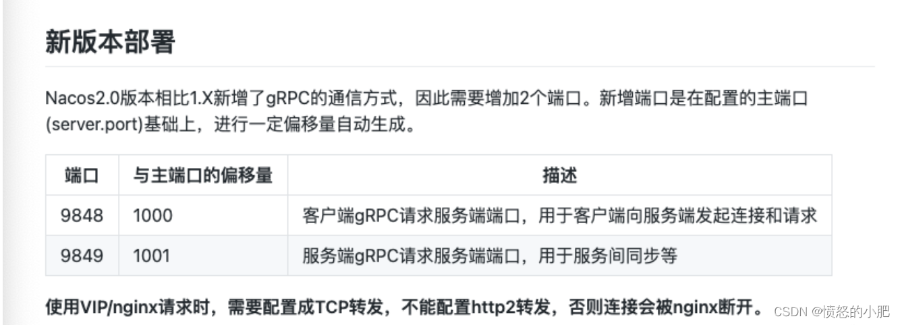

# 服务器部署Nacos获取不到配置浏览器可以访问

## 📔 千寻简笔记介绍

千寻简文库已开源，Gitee与GitHub搜索`chihiro-doc`，包含笔记源文件`.md`，以及PDF版本方便阅读，文库采用精美主题，阅读体验更佳，如果文章对你有帮助请帮我点一个`Star`～

更新：`支持在线阅读文章，根据发布日期分类。`

@[toc]


## 简介

`[Nacos Config] config[dataId=ruoyi-auth.yml，group=DEFAULT_GROUP] is empty`

本文解决方案截取原文：nacos2.X版本无法注册、注册失败的几个原因以及解决方案（踩坑避雷！）#http://t.csdnimg.cn/RXnZQ
端口放行本文就不提了，看到这篇文章估计都试过了，说下博主的情况，博主是改了 nacos 的端口，导致出现这个问题，如果使用 8848，9848，9849 还是不行估计是其他方面的问题。


### 本文关键词

`[Nacos Config] config[dataId=ruoyi-auth.yml，group=DEFAULT_GROUP] is empty`、`Nacos无法注册`、`gRPC`、`端口偏移`

## 实现步骤

### 1 修改端口

图片来源：引用简介原文图片



```
# 由于nacos2.X版本之后新增了gRPC的通信方式，因此需要增加2个端口 分别与主端口偏移 1000跟 1001
```

根据这个图，如果我们自定义的端口是10000那么第二个端口就是 11000，第三个端口是 11001。修完完成重新打包 nacos，重新不熟即可生效。

